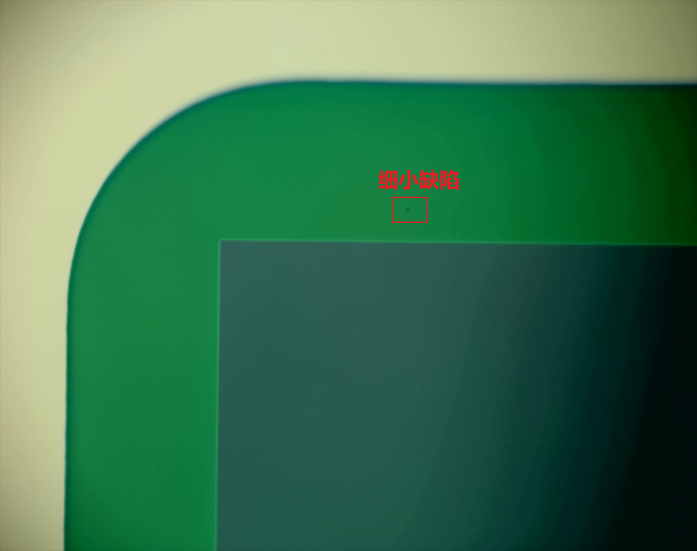
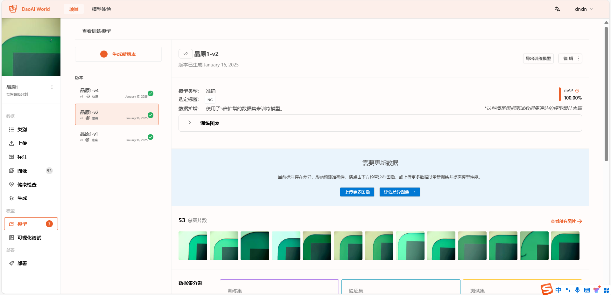
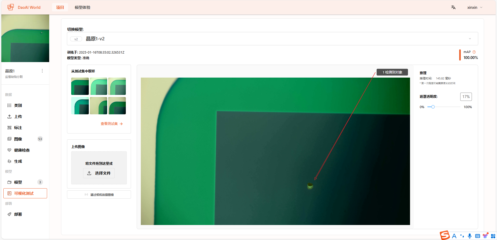
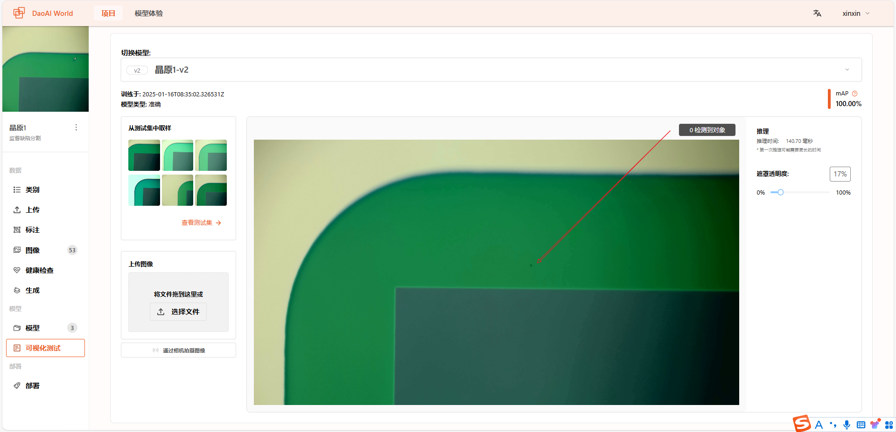
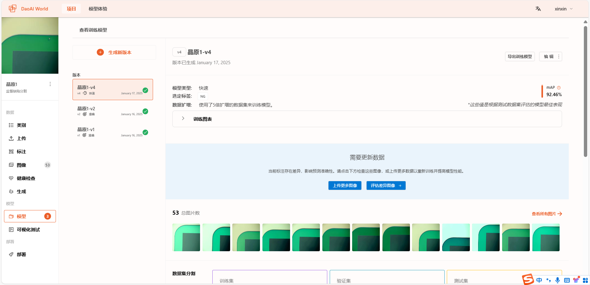
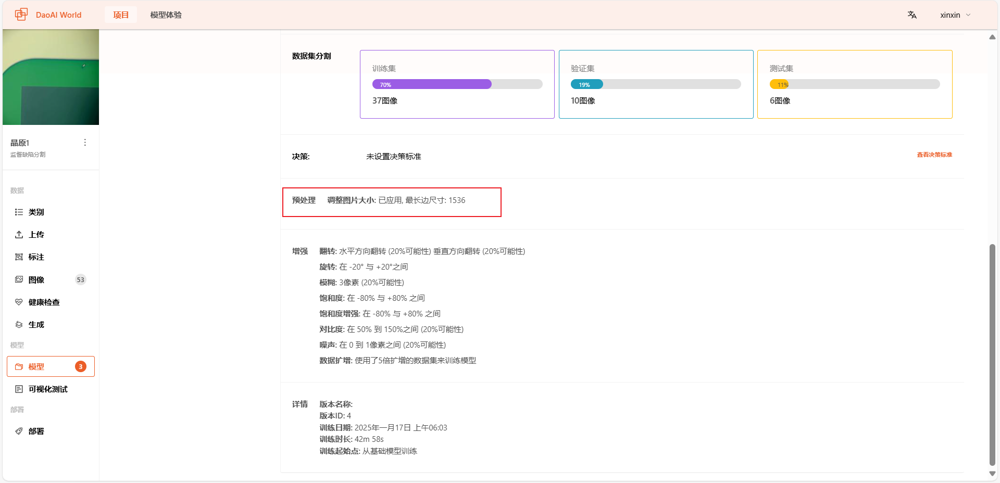
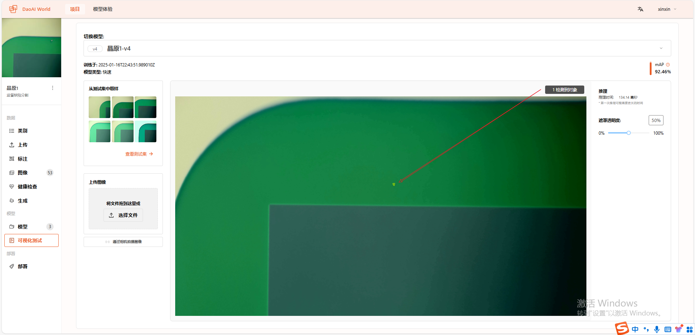

Supervised Defect Segmentation: Fine Defect Detection
--------------------------

In this case, we aim to detect very small defects within the images.

Accurate Supervised Defect Segmentation Model Test
^^^^^^^^^^^^^^^^^^^^^^^^^^^^^^^^^

- The accurate supervised defect segmentation model was trained, validated, and tested on a dataset of 53 images.

Test results for the accurate supervised defect segmentation model:
**********************

From the test results, we can see that the accurate supervised defect segmentation model struggles to detect very small defects.

Fast Supervised Defect Segmentation Model Test
^^^^^^^^^^^^^^^^^^^^^^^^^^^^^^^^^

- The fast supervised defect segmentation model was also trained, validated, and tested on the same 53-image dataset.
  Additionally, a preprocessing step was applied to resize images to 1536 pixels.

Test results for the fast supervised defect segmentation model:
**********************

From the test results, the fast supervised defect segmentation model is capable of detecting even very small defects.

**Conclusion**

- In this case, the fast supervised defect segmentation model demonstrated significantly better performance in detecting fine defects by using a preprocessing step to resize images.
- In practical deployment, the model automatically resizes the input image to the preprocessed resolution to ensure accuracy and consistency.
- Therefore, preprocessing is a key step in improving the performance of supervised defect segmentation models, especially for fine defect detection.
