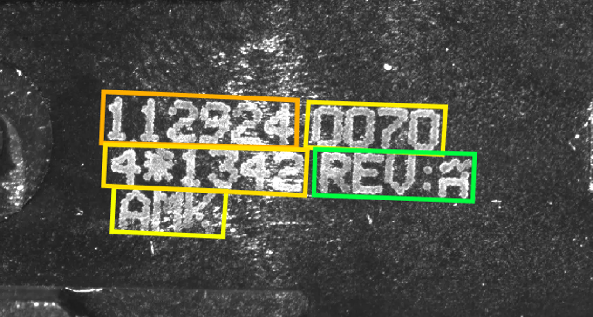
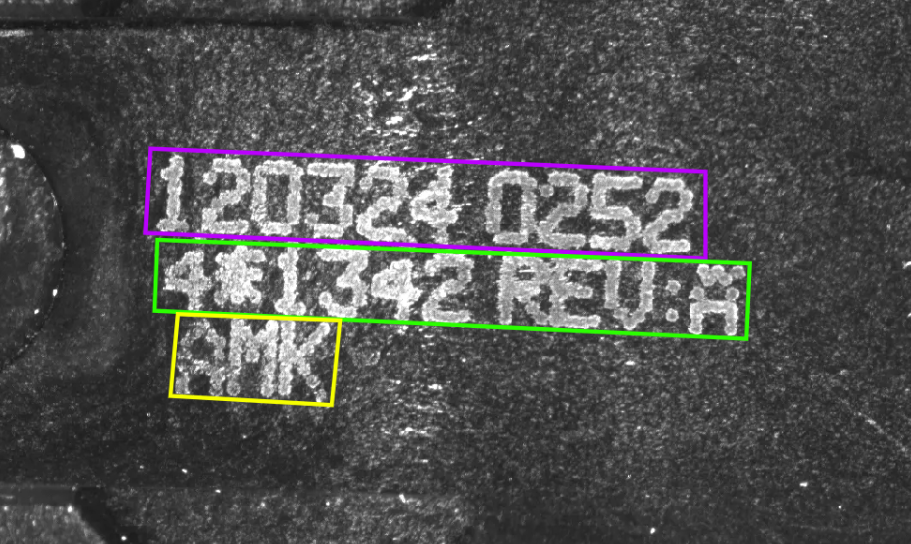
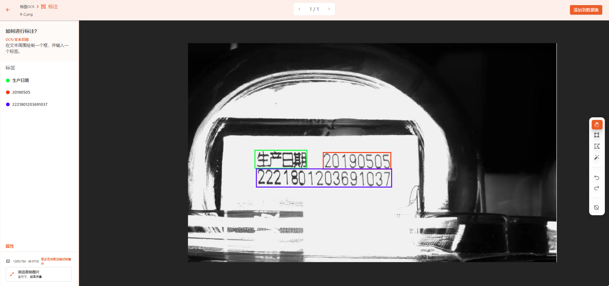

OCR Project: Single-Line Character Annotation Example
----------------------------

- When performing OCR data annotation, correctly marking character boxes is crucial for improving recognition accuracy. This is especially important when characters in a single line are closely spaced.

**Problem Description:**

- In the following OCR dataset, some lines have closely spaced characters. According to annotation rules, these lines should be annotated as a single long box. However, in practice, they were mistakenly marked as two or more separate boxes.

**How to Solve It:**

- Re-annotate the data to ensure that densely packed character lines are correctly marked as one long box to enhance OCR recognition accuracy.

**Annotation for Densely Spaced Characters:**

- When two characters are closely spaced and appear on the same line, they should be annotated as a single box. This helps the OCR engine more accurately recognize and parse the characters, avoiding errors caused by tight spacing.

**Annotation for Multi-Line Characters:**

- If characters span across different lines, each line should be annotated separately. This row-column annotation ensures each line is independently recognized, improving the OCR engine's accuracy when processing multi-line text.

**Annotation for Widely Spaced Characters:**

- When characters on the same line are spaced far apart, they should be annotated as multiple individual boxes. This annotation method helps the OCR engine correctly distinguish between widely spaced characters, preventing them from being mistakenly recognized as a single entity.

**Result:**

- By following the above steps, we successfully updated the data annotations, ensuring all characters are correctly marked. This improved the annotation accuracy and helped enhance OCR model performance.
