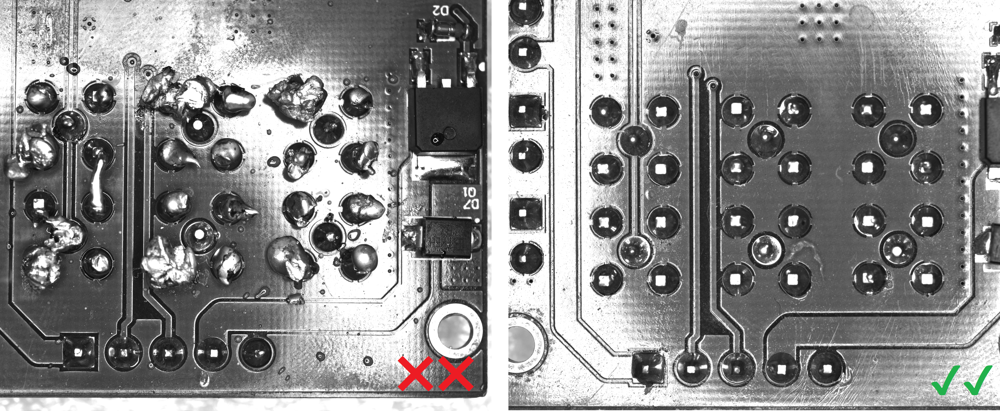
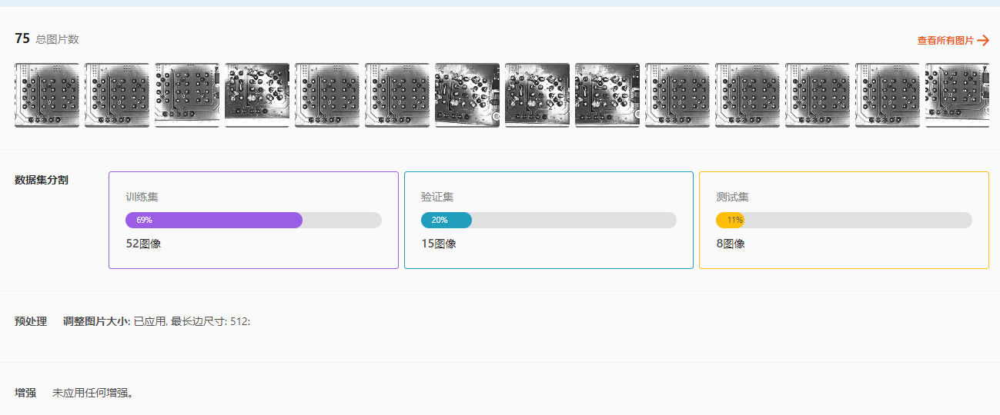
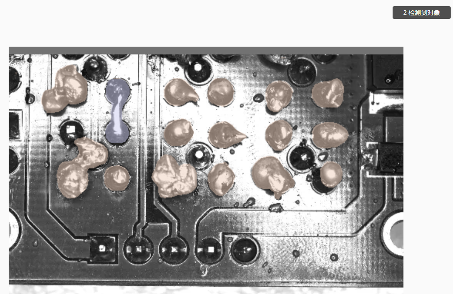
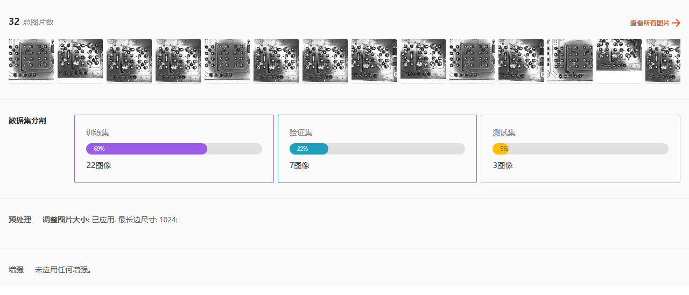
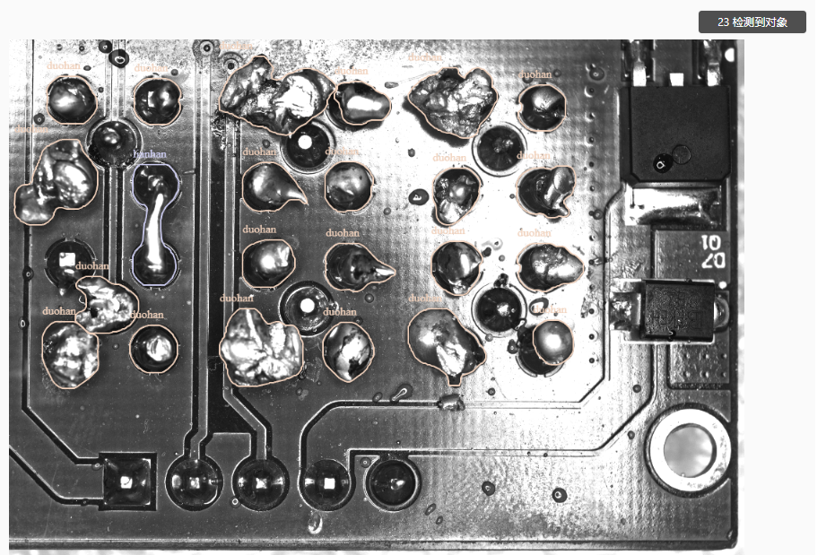

Anomaly Detection: PCB Solder Joint Inspection
--------------------------------------------------------

In this project, we need to inspect the solder joints on PCB boards to determine if they are correctly applied. Additionally, we need to analyze the presence of two types of anomalies:

- Based on the previous example :ref:`Anomaly Detection: PCB Component Damage/Missing` we can exclude the use of anomaly detection models. This is because the images contain numerous interference points, making anomaly detection models less suitable for this task.

- Additionally, we can exclude object detection models because anomalies in solder joints often appear as irregular regions, which are not well-suited for traditional object detection methods.

- So the question is, is a semantic segmentation model the only option?

Using a semantic segmentation model can effectively distinguish whether anomalies are present and can also accurately identify the types of anomalies when they occur.

The semantic segmentation model includes a preprocessing step for resizing images, but no data augmentation was applied. A total of 75 images were used, with 52 images allocated for the training set.

The test results are as follows:

The results from the semantic segmentation model are quite good. However, we could explore if there are better model options, such as instance segmentation models. We can label different types of anomalies as separate categories of segmentation regions and use an instance segmentation model to identify them.

The instance segmentation model includes a preprocessing step for resizing images, but no data augmentation was applied. A total of 32 images were used, with 22 images allocated for the training set.

The test results are as follows:

The instance segmentation model also performs quite well. Compared to the semantic segmentation model, it achieved similar results with less data. Since semantic segmentation models require more non-anomalous data for pixel-level detection, the instance segmentation model has an advantage in this scenario.