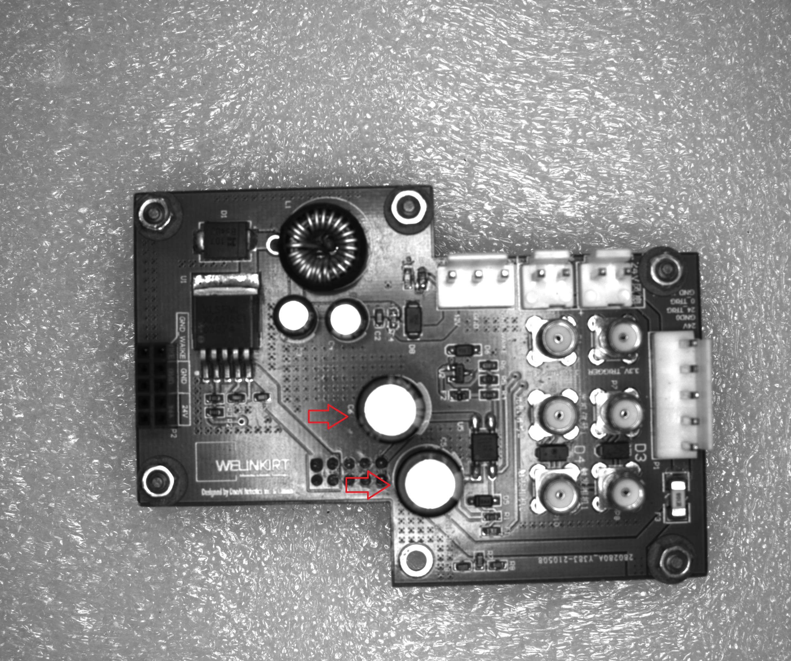
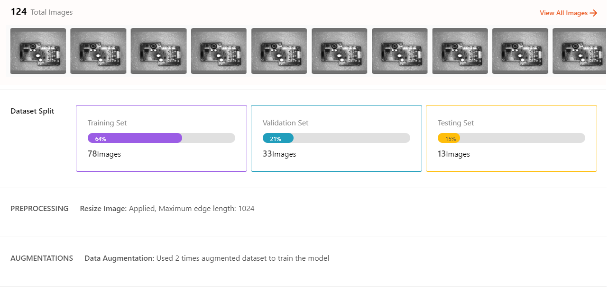
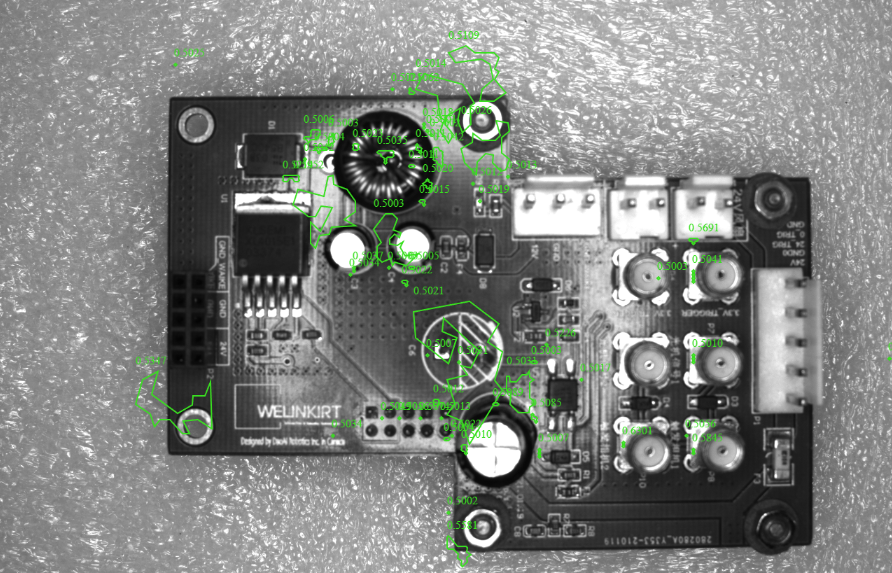
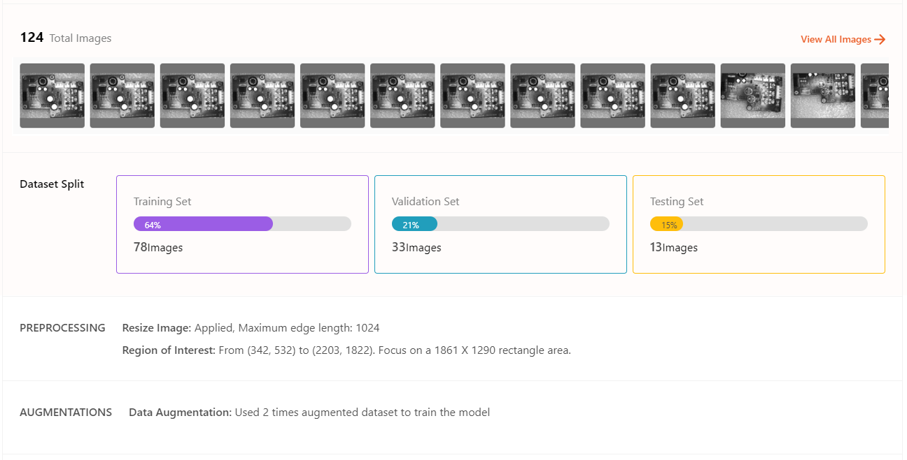
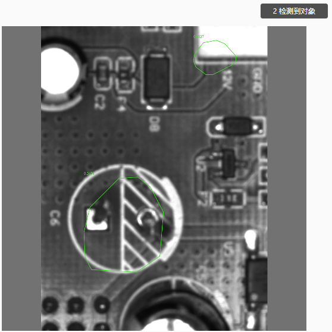
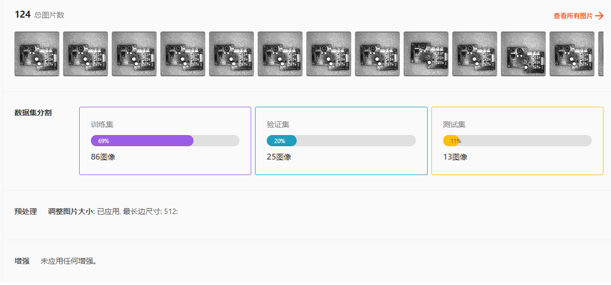
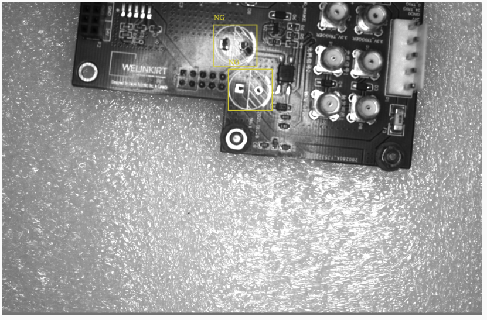

Unsupervised Defect Segmentation: PCB Component Damage/Missing
----------------------------------------------------

In this project, we need to verify whether the PCB board has been correctly assembled by checking if 2 capacitors are installed.

After analyzing the images, our initial inclination might be to use an anomaly detection model since our application involves finding anomalies and defects on the PCB board.

Here, we compare three types of models: anomaly detection models, semantic segmentation models, and object detection models.

.. hint::
   Object detection models can also be used to detect defects and anomalies, with the anomalies being treated as the **objects** that the model needs to identify.

1. Anomaly detection models are typically used to identify abnormalities and defects in objects.

- **v1** : For the anomaly detection model, the first version did not use any preprocessing or data augmentation. A total of 124 images were used, with 78 images allocated for the training set.

The test results are as follows:

The anomaly detection model identified too many surface areas of the objects as defects. This issue arises because the background of the PCB board and other components introduce significant interference. Compared to normal objects, the model detected many areas that differ from defect-free images, resulting in these regions being classified as defects.

- **v2** : The second version of the model included ROI preprocessing, which removed most of the background and left only the PCB board itself. No data augmentation was applied. The same 124 images were used, with 78 images allocated for the training set.

The test results are as follows:

.. image:: images/anomaly_v2_pcb_result.png

The anomaly detection model still identified areas on the PCB board surface and regions similar to capacitors as defects. This result is due to the complexity of the PCB board's contours and images. Compared to normal objects, the model detected many regions that differed from defect-free images, leading these areas to be classified as defects.

.. image:: images/anomaly_v3_pcb_version.png

- **v3** : The third version of the model included ROI preprocessing and focused only on the capacitor portions of the images. No data augmentation was applied. A total of 124 images were used, with 78 images allocated for the training set.

The training images are as follows:

.. image:: images/anomaly_v3_pcb_training.png

The test results are as follows:

The performance of the v3 model is generally better than the previous v1 and v2 models, but the limitations of anomaly detection are still evident. It remains susceptible to background interference and the influence of other components on the PCB board.

**Limitations of Unsupervised Defect Segmentation**

- For anomaly detection models, this approach is suitable for detecting surface defects on single targets. It is important to ensure that only the target of interest is included, avoiding interference from other objects, which could also be detected as anomalies. Additionally, the model reduces all data to 256 x 256 pixels in the background. When the original anomalies are relatively small, further downscaling can make it even more challenging for the model to detect them.

2. Semantic segmentation models are typically used for detecting various types of defects and segmenting objects into different categories. Can semantic segmentation overcome the limitations of anomaly detection models?

.. hint::
    Semantic segmentation models perform pixel-level prediction, which means the model is less affected by background or interference from other objects.

- **v4** : The fourth version of the model uses semantic segmentation with image resizing preprocessing and no data augmentation. A total of 124 images were used, with 86 images allocated for the training set.

The test results are as follows:

.. image:: images/semantic_v4_pcb_result.png

The semantic segmentation model effectively identifies anomaly areas, successfully overcoming background and PCB board interference, and meets our requirements.

3. Object detection models can label anomalies as the targets of interest, allowing the model to identify whether anomalies are present and also count the number of anomalies.

.. warning::
    Using object detection models for anomaly detection is typically effective when the anomalies have regular shapes (e.g., square or, as in this case, circular). This approach doesn't require identifying segmented regions. If precise segmentation of the anomalies is needed, semantic segmentation models would still be necessary.

For this case, the advantages of using an object detection model compared to a semantic segmentation model are:

a. The targets are relatively simple and do not require identifying segmented shapes of anomalies.
b. Object detection is not pixel-level detection, so it can achieve similar results with less data.

.. image:: images/obj_detection_training.png

- **v5** : The v4 of the model includes resizing preprocessing for the object detection model, with no data augmentation applied. A total of 22 images were used, with 15 images allocated for the training set.

The test results are as follows:

The object detection model effectively identifies anomaly areas, successfully overcoming background and PCB board interference, and meets our requirements. More importantly, it achieves comparable results to the semantic segmentation model with only 1/5 of the data.

**Conclusion**

- From this, the conclusion can be drawn: In this project, under the current requirements, the object detection model is the most suitable choice. However, if future developments in the project involve new detection needs on the PCB board, and these new targets require irregular segmented regions, then a semantic segmentation model would be better suited to accommodate these future requirements. Finally, anomaly detection models are not effective for achieving good results in cases with significant interference from other objects.