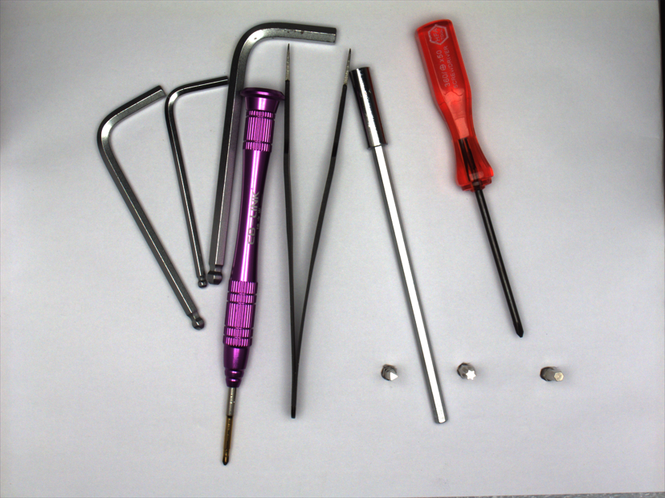
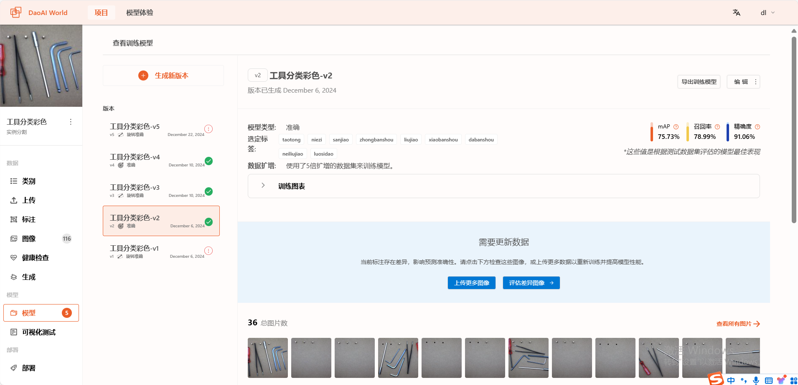
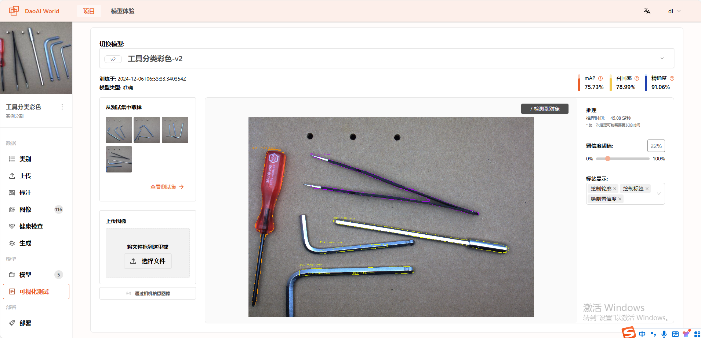
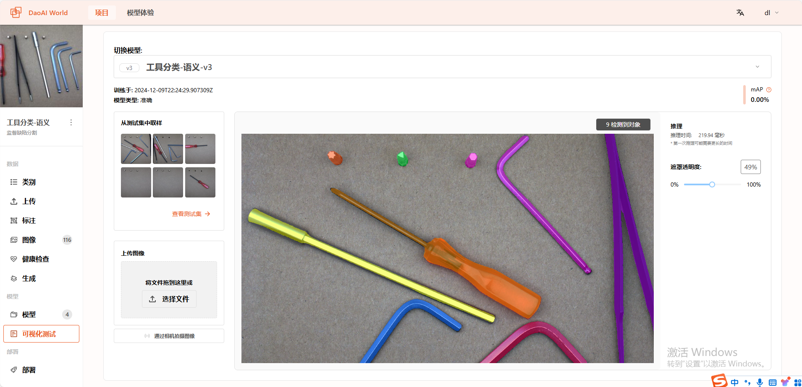

Supervised Defect Segmentation: Tool Classification
--------------------------

In this case, we need to classify various tools in the image and output different labels.

After analyzing the image requirements, let’s filter out which classification models are suitable.

**Classification Model:**
Can classify an image into a specific category or label, which helps in sorting, organizing, and filtering large amounts of visual data. This method identifies the content type within an image.

**Instance Segmentation:**
Can identify and separate individual objects in an image, assigning each a unique label.

**Supervised Defect Segmentation:**
Uses images with and without defects to train the model. The model learns to classify and segment various types of defects and distinguish between different defect categories.

Let’s compare these three models:

**Classification Model:**
This model classifies the entire image, not individual objects within it. Since our dataset contains multiple objects in each image, this model is clearly not suitable for our application.

**Instance Segmentation Model:**
Instance segmentation can identify and separate individual objects in an image, assigning each a unique label. The model locates objects and generates precise segmentation masks. This is commonly used to detect objects with irregular shapes. It is relatively suitable for this case.

**Supervised Defect Segmentation:**
Requires training data with both labeled and unlabeled objects. In real classification applications, there may be empty categories, making this model quite suitable for this case as well.

.. hint::
   Both instance segmentation and supervised defect segmentation models can be used for classification tasks. We can distinguish categories based on their labels.

Instance Segmentation Model Test
^^^^^^^^^^^^^^^^^^^^^^^^^^^^^^^^^

- A total of 116 images were used for training, validation, and testing the instance segmentation model.

Test Results:
**********************

From the results, we see that although the instance segmentation model can classify the tools, the masks it generates are noticeably incomplete.

Supervised Defect Segmentation Model Test
^^^^^^^^^^^^^^^^^^^^^^^^^^^^^^^^^

- A total of 116 images were used for training, validation, and testing the supervised defect segmentation model.

Test Results:
**********************

From the results, we see that the supervised defect segmentation model can not only classify the tools but also generate more complete and accurate masks.

**Summary**

- In this experiment, we compared the performance of instance segmentation and supervised defect segmentation in recognizing slender tools in images. We found that the supervised defect segmentation model performed significantly better.

- Although instance segmentation theoretically suits the task of detecting multiple tool instances in an image, the slender shapes of the tools result in detail loss during image compression in training, degrading performance.

- In contrast, supervised defect segmentation operates at the pixel level and retains geometric information, making it more suitable for detecting irregularly shaped or sized objects, such as defects, scratches, or dents. In this case, using supervised defect segmentation avoids loss of information.

- Therefore, for slender objects, supervised defect segmentation offers a more stable and accurate alternative.
