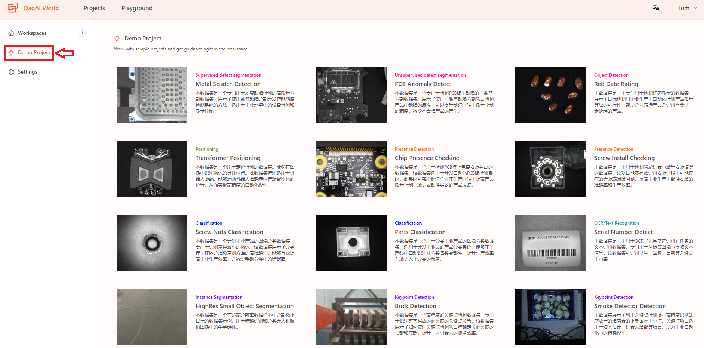
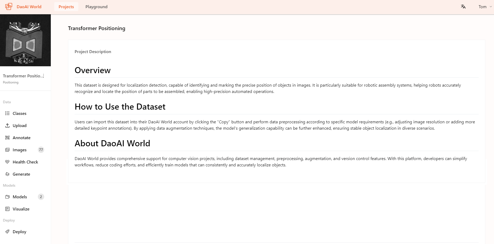
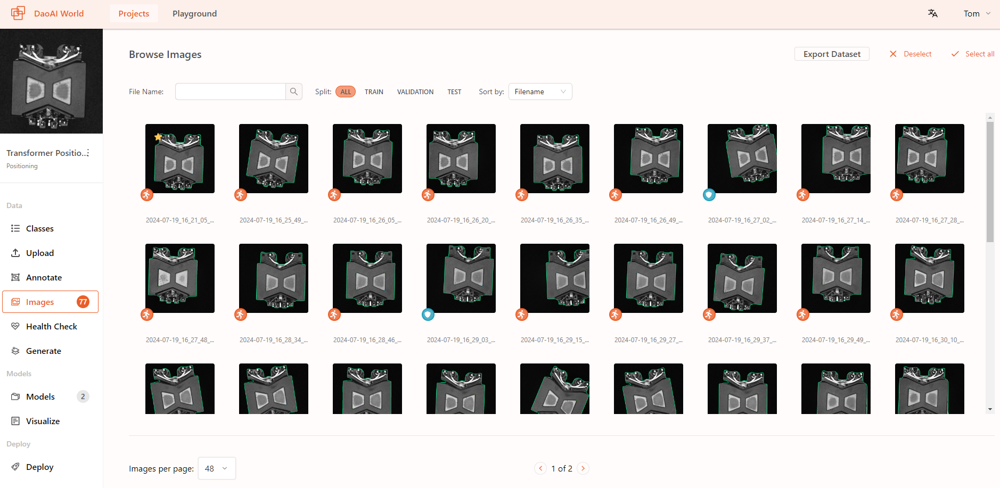
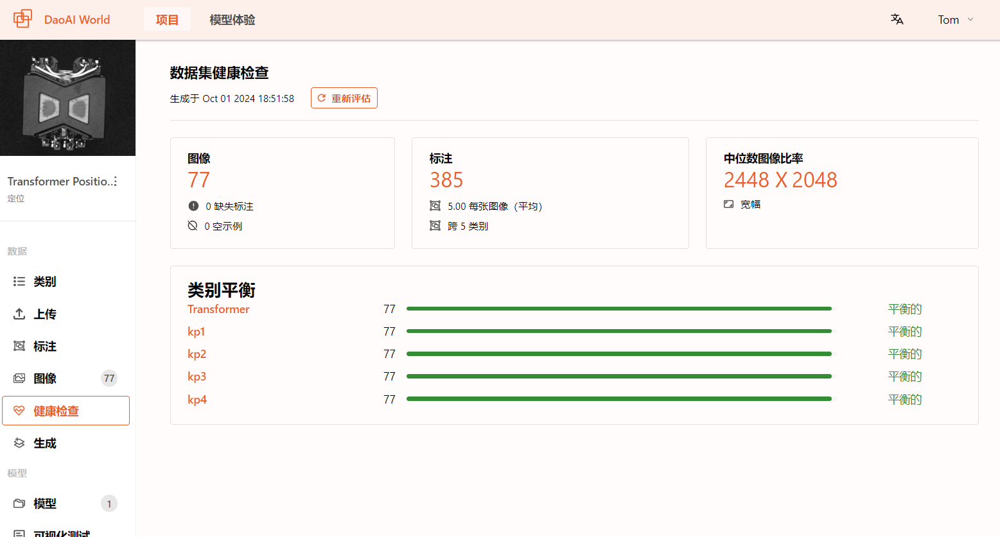
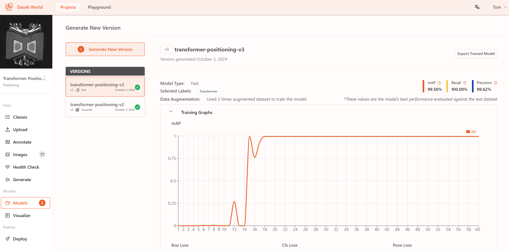
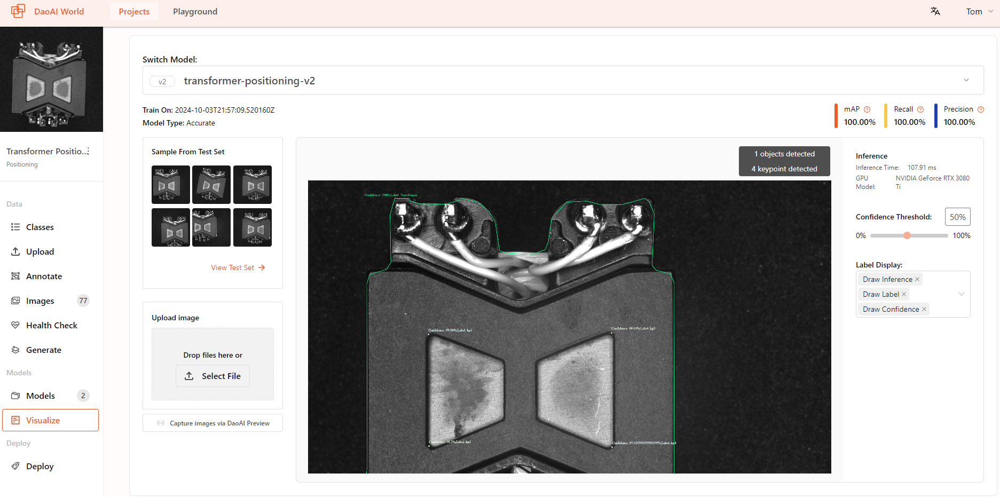
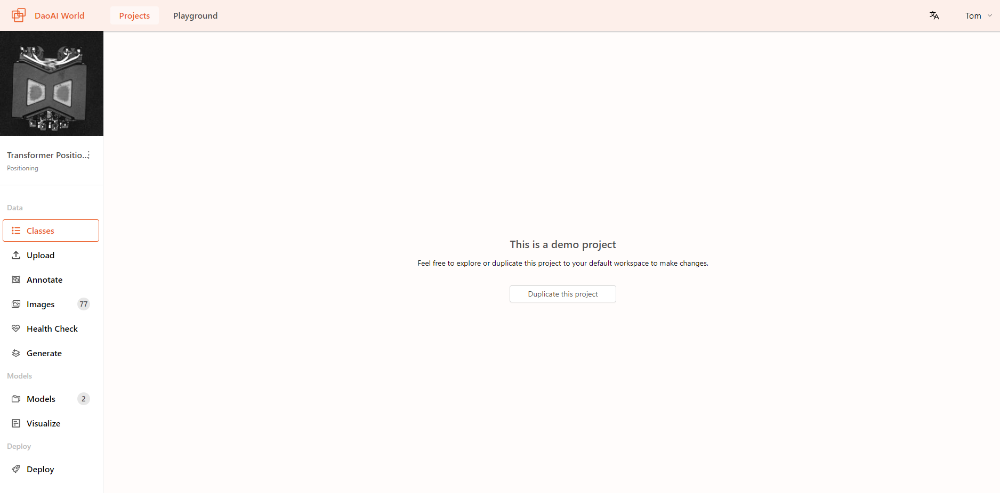
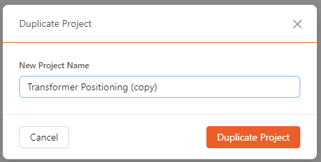
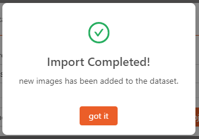
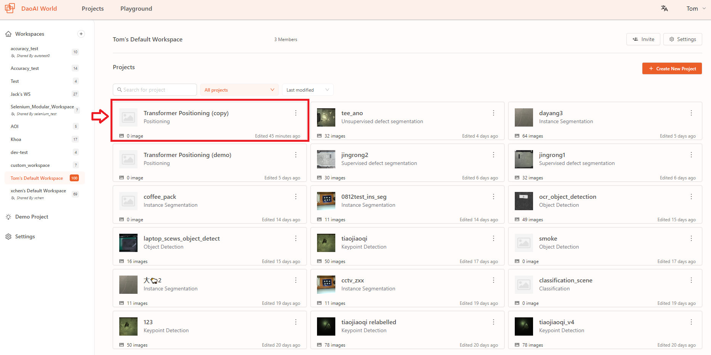

Create a Project
==============================

In **DaoAI World**, a project should include images that need to be annotated.
All images requiring the same type of annotation should be grouped within the same project.
Once images have been annotated, they can be used to create a training set that includes time and annotation content.
This set can then be expanded and processed using your chosen configurations.

Creating a Project
---------------------

    First, go to the DaoAI World homepage, then click "Create New Project":

        .. image:: images/create_project.png
            :width: 800
            :align: center

    In the pop-up window, fill in the relevant project information:

    1. Select the project type. For more details, see :ref:`Select a Model` . 
    2. Add a project name. This name must be unique, and no two projects within the same account should have the same name.
    3. Click "Create Project".

    In the new window, set the project's category label information:
        .. image:: images/create_project1.png
            :width: 800
            :align: center

    Here, depending on the dataset you have, you can choose to add category label information for the data,
    or click Skip and Create an Empty Project to use a dataset with existing category labels,
    or add category label information later. 

    After completing the category information setup, click **Create Project** to finalize the project creation.

    When creating **OCR** project, user should choose dictionary type: which type of language or text should the model detect?

        .. image:: images/create_ocr_project.png
            :align: center

    Here, you can select the language for OCR model recognition based on the specific requirements of the project, or input special characters for support in recognizing unique languages or texts.

Demo Project
---------------------

The demo projects are carefully selected from past DaoAI projects and can be used for demonstration or training purposes.

|

Click to select the project you want to demo or duplicate. Here, we choose the ``Transformer Positioning`` project for demonstration. You can view the project details, including the number of images and other information.

|

Click on ``Images`` to open the image page, you can view the entire dataset, annotation details.

|

Click on ``Health Check`` to open the dataset health check page, where you can view the health check results for the entire dataset.

|

Click on ``Model`` to view the model's training graph, including the preprocessing and data augmentation options that were added during training.

|

Click on ``Visualize`` to view the model's inference results. You can upload images to see the results, adjust the confidence threshold, and explore different outputs.

|

Click on ``Classes`` , ``Upload`` , ``Annotate`` , or ``Generate`` to duplicate this demo project into your account's default workspace.

|

Please be patient while the workspace is being copied and set up.

|

You can check the newly imported project in your account's default workspace.

|

You can add the already annotated data from the demo project to your dataset, or make modifications as needed.

