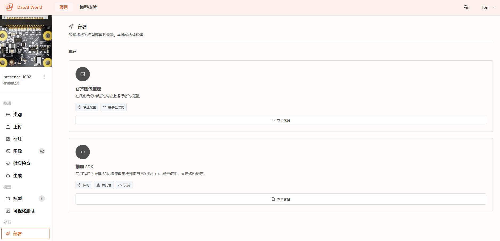
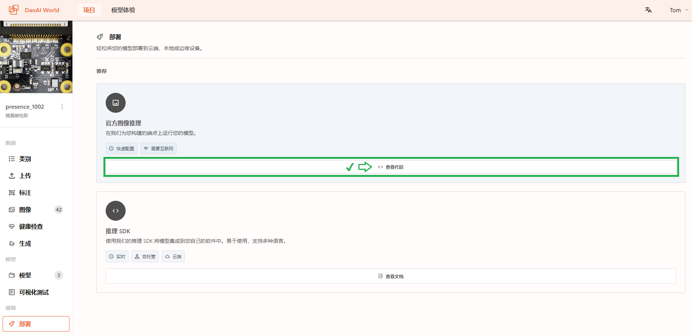
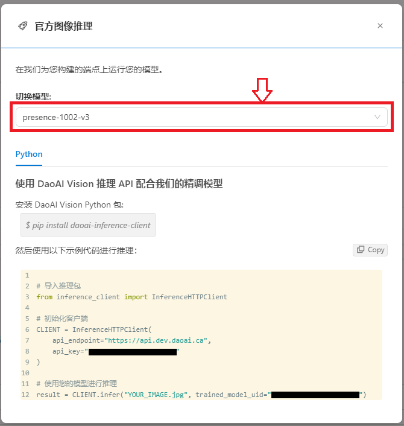
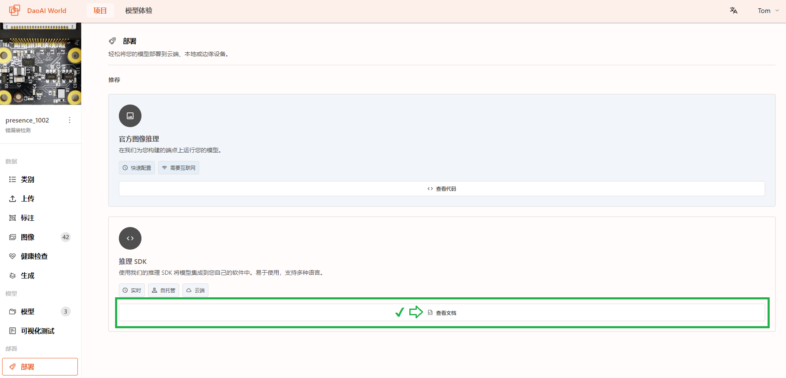

测试并部署
===============================

在DaoAI World中部署并测试模型
--------------------------------------------

    在模型训练完成后，您可以在DaoAI World中测试您的模型。

在验证集里测试模型效果
~~~~~~~~~~~~~~~~~~~~~~

    您可以查看到当前图像的推理时间和模型训练的GPU幸好信息。

    .. image:: Images/inference_time_gpu.png
        :scale: 80%
        :align: center

|

    选择您要测试的模型，然后点击查看测试集。

    .. image:: Images/test_set.png
        :scale: 70%
        :align: center

|

    然后您可以看到 训练集，验证集，和测试集的图片，并且差异集里也统计了所有预测结果和标注有所不同的图片

    .. image:: Images/test_set2.png
        :scale: 70%
        :align: center

|

    在右侧您可以切换实际情况查与模型预测，对比标注状况和实际模型预测结果。

    **实际情况**

    .. image:: Images/test_anno.png
        :scale: 60%
        :align: center

    **模型预测** (您可以拖拽左侧的置信度阈值来过滤过低置信度的模型预测)

    .. image:: Images/test_label.png
        :scale: 60%
        :align: center

上传图片测试模型效果
~~~~~~~~~~~~~~~~~~~~~~~

    在项目侧边栏中选择 **部署/测试** ，进入部署/测试页面，在上方选择您需要部署测试的模型，然后点击选择文件，或者直接拖拽文件到上传图像区域来上传一个图像。

    .. image:: Images/deploy.png
        :width: 800
        :align: center

    上传后，模型会针对上传的图片进行推理，完成后即可在视窗中查看模型识别结果，并在右上角显示处当前图片中的物体数量，关键点数量等信息。

    同时，您也可以通过调整右侧的 ``置信度阈值`` 来过滤过低置信度的识别结果。

对比测试模型识别和标注效果
~~~~~~~~~~~~~~~~~~~~~~~~

    在上侧点击 **同时显示标准图像和模型预测** ，可以切换不同的置顶图层：标注和模型预测。

    .. image:: Images/compare_annotate.png
        :width: 800
        :align: center

    点击 **更改标签样式** ，更换颜色后可以同时比较标注和模型预测的结果。

    .. image:: Images/change_color.png
        :width: 800
        :align: center

在其他应用上部署模型
---------------------------------------------

    模型训练结束后，您可以将训练的模型导出到本地，然后在其他应用中使用。

    .. image:: Images/export_model.png
        :width: 800
        :align: center

    导出的模型文件支持 ``.dwm`` 格式，以及 ``.zip`` 格式,

    DaoAI Wold的模型还可以在DaoAI平台的其他软件中使用，如 **DaoAI InspecTRA** ， 和 **DaoAI VisionPilot** 。

    - ``.dwm`` 格式在 DaoAI World 2.24.6.0 及之后的版本中支持，对应的 DaoAI InspecTRA 版本为 2.24.6.0，DaoAI VisionPilot 版本为 2.24.5.0。
    - ``.zip`` 格式在 DaoAI World 2.24.5.0 及之前的版本中可用，对应的 DaoAI InspecTRA 版本为 2.24.5.0，DaoAI VisionPilot 版本为 2.24.4.3。

模型部署
---------------------------------------------

点击 ``部署``，此页面中可以轻松将您的模型部署到云端、本地或边缘设备。

点击官方图像推理中的 ``查看代码``，可以打开训练好模型的推理页面，可以使用其中的示例代码进行推理。

点击 ``切换模型`` 可以切换不同版本的训练模型，它们的 **trained_model_uid** 是不一样的。

推理返回的结果格式为 **字典**，更详细的信息可以查看 :ref:`服务器图像推理`

点击 ``查看文档`` 可以直接跳转至本文档关于SDK的章节。

