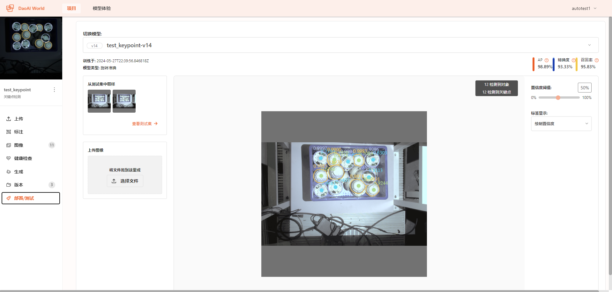
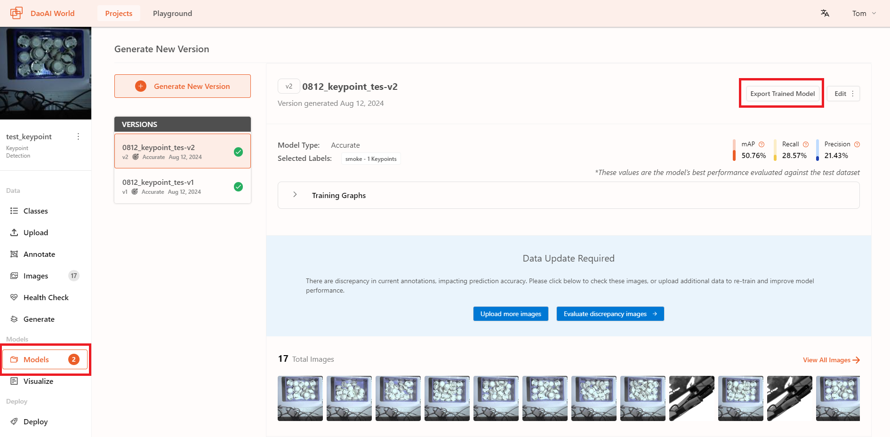

测试并部署
===============================

在DaoAI World中部署并测试模型
--------------------------------------------

在模型训练完成后，您可以在DaoAI World中测试您的模型。

在项目侧边栏中选择 **部署/测试** ，进入部署/测试页面，在上方选择您需要部署测试的模型，然后上传测试图片。

等待模型识别完成后，即可在视窗中查看模型识别结果，并在右上角显示处当前图片中的物体数量，关键点数量等信息。

同时，您也可以通过调整置信度阈值来手动调整识别结果。

在其他应用上部署模型
---------------------------------------------

模型训练结束后，您可以将训练的模型导出到本地，然后在其他应用中使用。

目前DaoAI Wold的模型可以在DaoAI平台的其他软件中使用，如 **DaoAI InspecTRA 2.24.3** ， 和 **DaiAI VisionPilot 2.24.4** 。