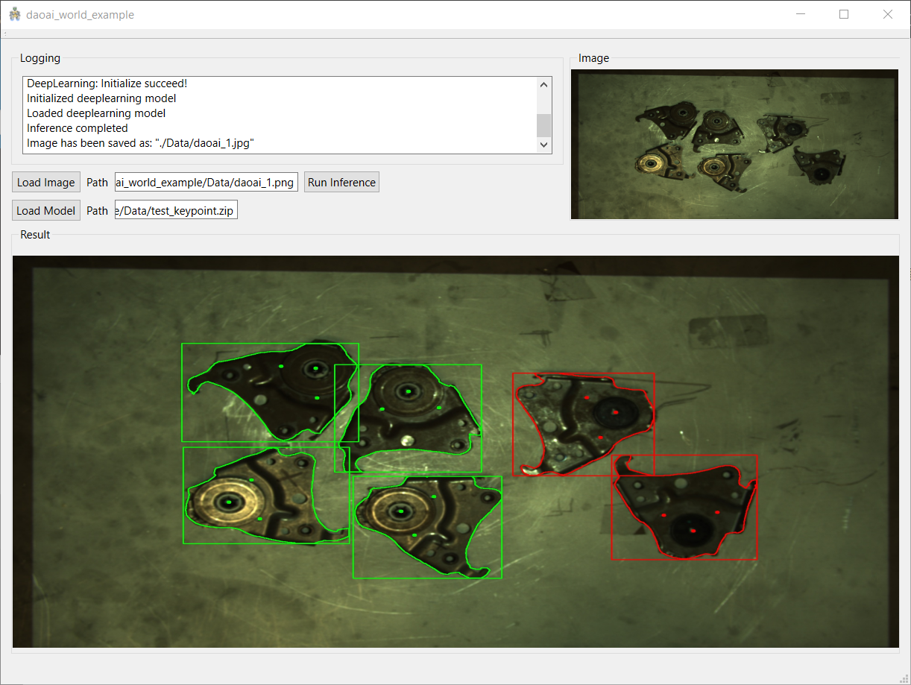
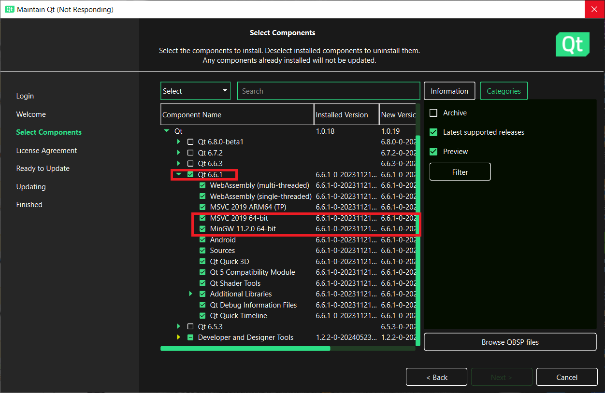
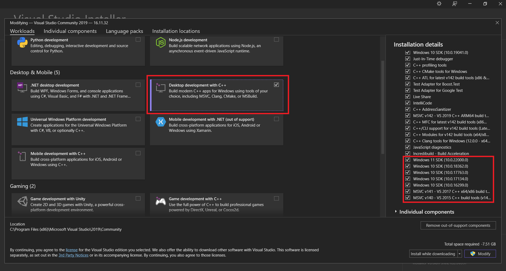
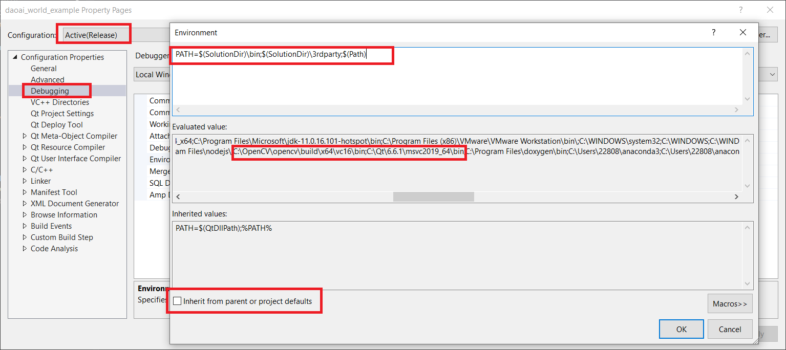
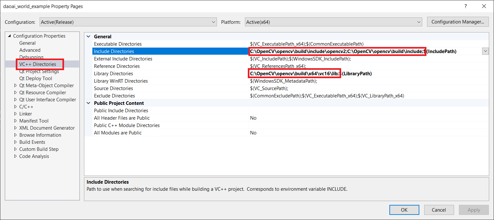
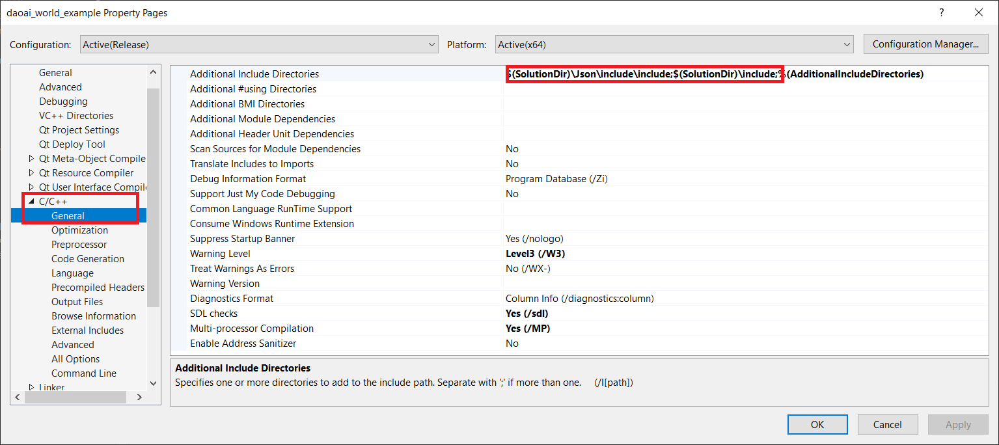
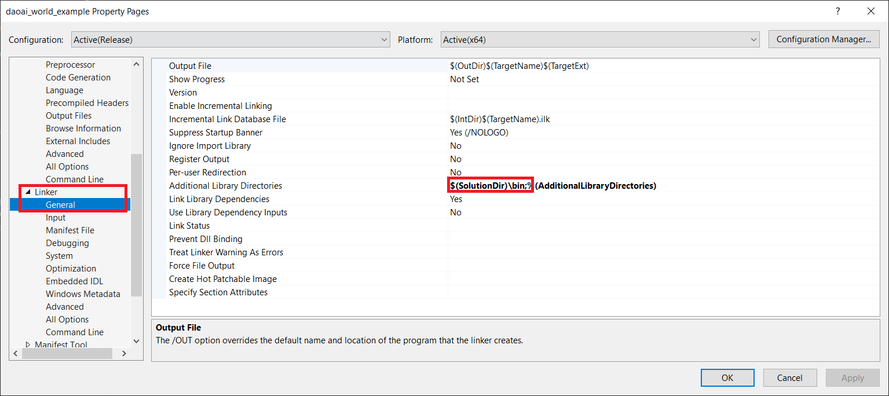
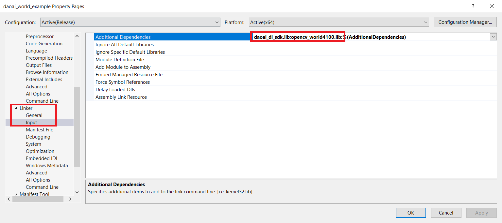
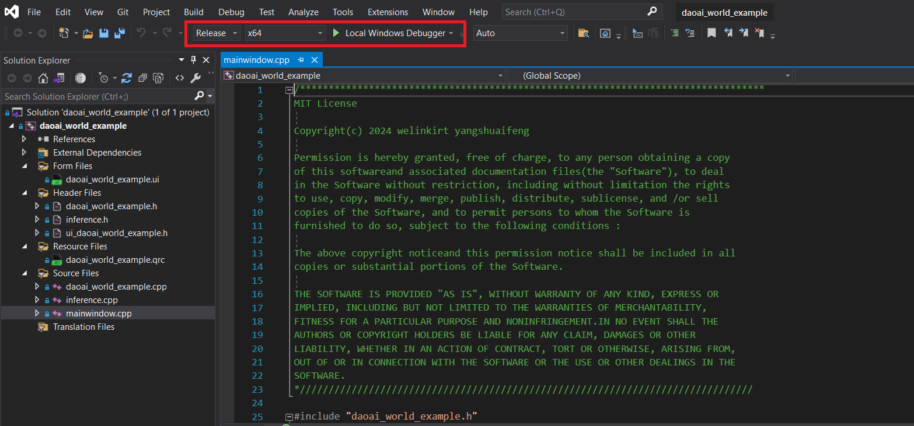

===============
C++ 桌面应用程序
===============

|

--------------------------
项目概述
--------------------------

|

| DaoAI World Example 项目是一个基于Qt的C++应用程序，用于加载、处理和推理图像数据，并将结果可视化。
| 该应用程序使用OpenCV库进行图像处理，使用nlohmann::json库解析和操作JSON数据，并通过DaoAI深度学习SDK进行模型推理。

| :strong:`项目下载请点击：` `DaoAI World Example`_

.. _DaoAI World Example: https://daoairoboticsinc.sharepoint.com/:u:/s/WeLinkirt-2/ES0pzxMxs3pLpqcIMY8g8bUBGUx2t3yqtk_YX7EyHJaQJw?e=5HaFaT

|
|

--------------------------
主要功能
--------------------------

| :strong:`1.` 加载和显示图像：用户可以通过界面加载图像，并在UI上显示。
| :strong:`2.` 加载和显示模型：用户可以加载模型文件，并准备进行推理。
| :strong:`3.` 执行推理：使用指定的模型对图像进行推理，并将结果保存为JSON文件。
| :strong:`4.` 绘制图形：根据推理结果在图像上绘制多边形和关键点，并保存结果图像。
| :strong:`5.` 日志记录：将重要操作记录在日志窗口中，便于用户跟踪和调试。

|

|

--------------------------
文件结构
--------------------------

**************************
头文件
**************************

* :emphasis:`daoai_world_example.h:` 定义了主窗口类daoai_world_example，包含UI组件和槽函数的声明。
* :emphasis:`inference.h:` 声明了图像和模型处理相关的函数。
* :emphasis:`ui_daoai_world_example.h:` 声明了Ui_daoai_world_exampleClass类，构建UI主窗口和控件。

**************************
源文件
**************************

* :emphasis:`daoai_world_example.cpp:` 实现了主窗口类的构造函数、析构函数和槽函数。
* :emphasis:`mainwindow.cpp:` 程序入口，创建并显示主窗口。
* :emphasis:`inference.cpp:` 实现了图像和模型处理相关的函数，包括图像加载、推理、结果绘制和保存。

|

--------------------------
依赖项
--------------------------

| :strong:`1.` Qt 6.x 或更高版本。
| :strong:`2.` OpenCV 4.x 或更高版本。
| :strong:`3.` nlohmann/json 3.x 或更高版本。
| :strong:`4.` DaoAI SDK。

|

--------------------------
使用指南
--------------------------

**************************
环境设置
**************************

| :strong:`1.` 安装Qt和Visual Studio 2019(或更高版本)。
|              下载 `Qt6`_ 和 `Visual Studio 2019`_ ，勾选必要组件，依次进行安装。
.. _Qt6: https://www.qt.io/download-qt-installer-oss?hsCtaTracking=99d9dd4f-5681-48d2-b096-470725510d34%7C074ddad0-fdef-4e53-8aa8-5e8a876d6ab4
.. _Visual Studio 2019: https://visualstudio.microsoft.com/zh-hans/vs/older-downloads/

|
|
|
|
|
|
|
|
|
|
|
|
|
|
|
|
|
.. _OpenCV–4.10.0: https://opencv.org/releases/
| :strong:`2.` 安装OpenCV库。
|              下载 `OpenCV–4.10.0`_ ，解压到C盘根目录，例：C:\\OpenCV\\.
| :strong:`3.` 安装nlohmann/json库。
|              nlohmann/json 已配置在项目根目录下，目标路径：$(SolutionDir)\\Json.
| :strong:`4.` 安装DaoAI SDK。
|              DaoAI SDK 相关文件已配置在项目根目录下，目标路径：$(SolutionDir)\\3rdparty；$(SolutionDir)\\bin；$(SolutionDir)\\include.

**************************
编译和运行
**************************

| :strong:`1.` 打开Visual Studio 2019并加载项目文件。
| :strong:`2.` 配置项目，确保所有依赖库已正确链接。
* |            打开项目属性，配置Debugging，“Inherit from parent or project defaults“ 取消勾选，Environment 目标路径包含：$(SolutionDir)\\bin;$(SolutionDir)\\3rdparty;C:\\OpenCV\\opencv\\build\\x64\\vc16\\bin;C:\\Qt\\6.6.1\\msvc2019_64\\bin。

* |            配置VC++ Directories，Include Directories 目标路径包含：C:\\OpenCV\\opencv\\build\\include\\opencv2;C:\\OpenCV\\opencv\\build\\include。Library Directories 目标路径包含：C:\\OpenCV\\opencv\\build\\x64\\vc16\lib。

* |            配置C/C++ General，Additional Include Directories 目标路径包含：$(SolutionDir)\Json\include\include;$(SolutionDir)\include。

* |            配置Linker General，Additional Library Directories 目标路径包含：$(SolutionDir)\bin。

* |            配置Linker General，Additional Dependencies 目标路径包含：daoai_dl_sdk.lib;opencv_world4100.lib。

| :strong:`3.` X64 release 编译，运行项目。

|

--------------------------
功能说明
--------------------------

**************************
主窗口
**************************

| :strong:`主窗口包含以下组件：`

* | :emphasis:`文本输入框：` 用于输入图像和模型文件路径。
* :emphasis:`按钮：`
* :emphasis:`pushButton:` 触发推理。
* :emphasis:`pushButton_load:` 加载图像文件。
* | :emphasis:`pushButton_load_2:` 加载模型文件。
* :emphasis:`标签：` 显示加载的图像和推理结果。

**************************
图像加载和显示
**************************

* | :emphasis:`on_pushButton_load_clicked:` 打开文件对话框选择图像文件，并在label_3上显示。
* :emphasis:`on_pushButton_load_model_clicked:` 打开文件对话框选择模型文件，并在文本框中显示路径。

**************************
推理
**************************

* :emphasis:`on_pushButton_clicked:` 执行推理流程，调用executeInference函数进行模型推理，并显示结果图像。

**************************
日志记录
**************************

* :emphasis:`appendLog:` 将日志信息添加到日志窗口。

|

--------------------------
源码解析
--------------------------

**************************
inference.cpp/主窗口类
**************************

:strong:`文件包含的库`

        * 该文件包含了标准C++库、OpenCV库、JSON处理库（nlohmann/json）和深度学习SDK（dlsdk）的头文件。

.. code-block:: C++
        :linenos:

        #include <windows.h>
        #include <iostream>
        #include <thread>
        #include <future>
        #include <fstream>
        #include <vector>
        #include <string>
        #include <opencv2/opencv.hpp>
        #include <nlohmann/json.hpp>
        #include <dlsdk/model.h>
        #include "daoai_world_example.h"

:strong:`命名空间`

        * 使用std命名空间和cv命名空间，以便简化代码中的命名。

.. code-block:: C++
        :linenos:

        using namespace std;
        using namespace cv;

:strong:`JSON别名`

        * 为nlohmann的JSON库起别名为json，方便在代码中使用。

.. code-block:: C++
        :linenos:

        // json another name
        using json = nlohmann::json;

:strong:`createDirectory 函数`

        * 此函数用于创建指定路径的目录。它接受两个参数：目录路径和daoai_world_example实例的指针。
          若目录已存在或创建成功，会在控制台和UI日志中记录相关信息。

.. code-block:: C++
        :linenos:

        // Create "./Data" folder
        void createDirectory(const std::string& directoryPath, daoai_world_example* example) {
	        if (!CreateDirectoryA(directoryPath.c_str(), NULL)) {
		        if (GetLastError() == ERROR_ALREADY_EXISTS) {
			        std::cout << "Directory already exists: " << "\"" + directoryPath + "\"" << std::endl;
			        example->appendLog("Directory already exists: " + QString::fromStdString("\"" + directoryPath + "\""));
		        }
		        else {
			        std::cerr << "Failed to create directory: " << GetLastError() << std::endl;
			        example->appendLog("Failed to create directory: " + QString::number(GetLastError()));
		        }
	        }
	        else {
		        std::cout << "Directory created successfully: " << directoryPath << std::endl;
		        example->appendLog("Directory created successfully: " + QString::fromStdString(directoryPath));
	        }
        }

:strong:`drawShapes 函数`

        * 此函数用于在图像上绘制多边形和关键点。它从JSON数据中读取形状信息，并根据形状的标签选择不同颜色进行绘制。

.. code-block:: C++
        :linenos:

        // Draw polygon and keypoint
        void drawShapes(cv::Mat& image, const json& jsonData) {
            for (const auto& shape : jsonData["shapes"]) {
                if (shape["shape_type"] == "polygon") {
                    // Processing polygon
                    std::vector<cv::Point> points;
                    for (const auto& point : shape["points"]) {
                        points.emplace_back(cv::Point(static_cast<int>(point[0]), static_cast<int>(point[1])));
                    }

                    // Select color
                    cv::Scalar color(255, 255, 255);
                    if (shape["label"].is_string() && !shape["label"].empty()) {
                        if (shape["label"] == "fan") {
                            color = cv::Scalar(0, 0, 255); // Red
                        }
                        else if (shape["label"] == "zheng") {
                            color = cv::Scalar(0, 255, 0); // Green
                        }
                        else {
                            color = cv::Scalar(255, 0, 0); // Blue
                        }
                    }

                    // Creates a group of points to draw polygons
                    std::vector<std::vector<cv::Point>> pts = { points };

                    // Draw polygon
                    cv::polylines(image, pts, true, color, 2);
                }
                else if (shape["shape_type"] == "point") {
                    // Processing keypoint
                    cv::Point center(static_cast<int>(shape["points"][0][0]), static_cast<int>(shape["points"][0][1]));

                    // Select color
                    cv::Scalar color(255, 255, 255);
                    if (shape["label"].is_string() && !shape["label"].empty()) {
                        char firstChar = shape["label"].get<std::string>().at(0);
                        if (firstChar == 'z' || firstChar == 'Z') {
                            color = cv::Scalar(0, 255, 0); // Green
                        }
                        else if (firstChar == 'f' || firstChar == 'F') {
                            color = cv::Scalar(0, 0, 255); // Red
                        }
                        else {
                            color = cv::Scalar(255, 0, 0); // Blue
                        }
                    }

                    // Draw keypoint
                    cv::circle(image, center, 5, color, cv::FILLED);
                }
            }
        }

:strong:`drawImage 函数`

        * 此函数负责读取JSON文件和图像文件，调用drawShapes函数在图像上绘制形状，然后将修改后的图像保存到指定路径。

.. code-block:: C++
        :linenos:

        int drawImage(const std::string& jsonPath, const std::string& imagePath, const std::string& savePath, daoai_world_example* example) {
            // Open and parse the JSON file
            std::ifstream inputFile(jsonPath);
            if (!inputFile.is_open()) {
                std::cerr << "Cannot open " << jsonPath << std::endl;
                example->appendLog("Cannot open " + QString::fromStdString(jsonPath));
                return 1;
            }

            json jsonData;
            inputFile >> jsonData;

            // Read image file
            cv::Mat image = cv::imread(imagePath);
            if (image.empty()) {
                std::cerr << "Cannot read " << imagePath << std::endl;
                example->appendLog("Cannot read " + QString::fromStdString(imagePath));
                return 1;
            }

            // Draw shape
            drawShapes(image, jsonData);

            // Display image
            // cv::imshow("Image with Shapes and KeyPoints", image);
            // cv::waitKey(0);

            // Save image
            if (cv::imwrite(savePath, image)) {
                std::cout << "Image has been saved as: " << "\"" + savePath + "\"" << std::endl;
                example->appendLog("Image has been saved as: " + QString::fromStdString("\"" + savePath + "\""));
            }
            else {
                std::cerr << "Cannot save image " << savePath << std::endl;
                example->appendLog("Cannot save image " + QString::fromStdString(savePath));
            }

            return 0;
        }

:strong:`readPngImageFile 函数`

        * 此函数用于读取PNG图像文件并将其转换为uint8_t类型的向量。

.. code-block:: C++
        :linenos:

        /*
         * @brief Reads PNG image file into a vector of uint8_t.
         *
         * @param filePath The path to the PNG file.
         * @return std::vector<uint8_t> A vector containing the uint8 data from the image file.
         *                              Returns an empty vector if the file could not be opened.
         */
        std::vector<uint8_t> readPngImageFile(const std::string& filePath) {
            cv::Mat image = cv::imread(filePath, cv::IMREAD_UNCHANGED);

            /*
            if (image.empty()) {
                std::cerr << "Could not read image file " << filePath << std::endl;
                return {};
            }
            */

            if (image.empty()) {
                throw std::runtime_error("Could not read image file " + filePath);
                return {};
            }

            std::vector<uint8_t> imageBuffer(image.data, image.data + image.total() * image.elemSize());
            return imageBuffer;
        }

:strong:`readImageBinaryFile 函数`

        * 此函数用于读取二进制图像文件并将其转换为uint8_t类型的向量。

.. code-block:: C++
        :linenos:

        /*
         * @brief Reads binary image file into a vector of uint8_t.
         *
         * @param filePath The path to the binary file.
         * @return std::vector<uint8_t> A vector containing the binary data from the image file.
         *                              Returns an empty vector if the file could not be opened.
         */
        std::vector<uint8_t> readImageBinaryFile(const std::string& filePath) {
            std::ifstream inputFile(filePath, std::ios::binary);
            if (!inputFile) {
                std::cerr << "Cannot open " << filePath << "\n";
                return {};
            }

            std::vector<uint8_t> buffer((std::istreambuf_iterator<char>(inputFile)), std::istreambuf_iterator<char>());
            inputFile.close();

            return buffer;
        }

:strong:`inference 函数`

        * 此函数负责初始化深度学习模型，读取图像数据，进行推理并将结果写入JSON文件。

.. code-block:: C++
        :linenos:

        int inference(const std::string& modelPath, const std::string& imagePath, const std::string& jsonPath, daoai_world_example* example) {
            try
            {
                DaoAI::DeepLearning::initialize();
                example->appendLog("DeepLearning: Initialize succeed!");

                ////////////////////////////////////////////////////////////////////////////////////////////////////////////////////////////////////////////////////////////////
                // This part of the code demonstrating on an image from a binary file, you can replace the image_buffer by your own image data (i.e.: data buffer from opencv)
                const int image_height = 1200;
                const int image_width = 1920;

                std::vector<uint8_t> image_buffer = readPngImageFile(imagePath);
                if (image_buffer.size() == 0)
                {
                    std::cerr << "Image buffer is not read properly, returns an empty vector" << std::endl;
                    example->appendLog("Image buffer is not read properly, returns an empty vector");
                    return 1;
                }
                ////////////////////////////////////////////////////////////////////////////////////////////////////////////////////////////////////////////////////////////////

                // init model
                DaoAI::DeepLearning::Model model;
                example->appendLog("Initialized deeplearning model");

                // load model
                model.load(modelPath, DaoAI::DeepLearning::Device_Type::GPU, -1);
                example->appendLog("Loaded deeplearning model");

                DaoAI::DeepLearning::Image daoai_image(image_height, image_width, DaoAI::DeepLearning::Image::Type::BGR, &image_buffer[0]);

                // get inference
                auto prediction = model.inferenceJSON(daoai_image);
                example->appendLog("Inference completed");

                // write to json file
                std::ofstream fout(jsonPath);
                fout << prediction << std::endl;
                fout.close();

                // unload model
                model.unload();
            }
            catch (const std::exception& e)
            {
                std::cerr << e.what() << std::endl;
                return 1;
            }
            return 0;
        }

:strong:`executeInference 函数`

        * 此函数单线程执行推理任务。它创建必要的目录，调用inference函数进行推理，并在图像上绘制结果。

.. code-block:: C++
        :linenos:

        // Single-threaded, may cause the cursor to become unresponsive during inference
        std::string executeInference(const std::string& dataPath, const std::string& modelPath, daoai_world_example* example) {

            example->appendLog("Satrt execute inference");

            // get root path to the model and image
            std::string data_path = dataPath;
            std::string model_zip_path = modelPath;
            std::string root = "./Data";
            std::string json_path = root + "/daoai_1.json";
            std::string image_path = root + "/daoai_1.jpg";

            // The 'example' is a valid pointer to daoai_world_example instance
            //daoai_world_example* example = new daoai_world_example(); // instantiation
            createDirectory(root, example);

            int result = inference(model_zip_path, data_path, json_path, example); // get the return value of inference function

            if (!result) {
                drawImage(json_path, data_path, image_path, example);
            }
            else {
                return "1";
            }

            //delete example; // Delete example
            return image_path;
        }

:strong:`executeInference_multi 函数`

        * 此函数多线程执行推理任务。它通过线程异步执行目录创建和推理过程，并在推理完成后在图像上绘制结果。

.. code-block:: C++
        :linenos:

        // Multi-threaded, the cursor can do other things during inference
        std::string executeInference_multi(const std::string& dataPath, const std::string& modelPath, daoai_world_example* example) {
            // create a promise object
            std::promise<int> promise;

            // getting the future object
            std::future<int> future = promise.get_future();

            example->appendLog("Satrt execute inference");

            // get root path to the model and image
            std::string data_path = dataPath;
            std::string model_zip_path = modelPath;
            std::string root = "./Data";
            std::string json_path = root + "/daoai_1.json";
            std::string image_path = root + "/daoai_1.jpg";

            // The 'example' is a valid pointer to daoai_world_example instance
            //daoai_world_example* example = new daoai_world_example(); // instantiation
            std::thread t_createDirectory(createDirectory, root, example);
            t_createDirectory.join();

            // Create a thread that passes three strings and the daoai_world_example instance
            std::thread t_inference([&promise, model_zip_path, data_path, json_path, example]() {
                int result = inference(model_zip_path, data_path, json_path, example);
                promise.set_value(result); // Set the return value at the end of the thread
                });
            t_inference.join();
            int result = future.get(); // get the return value of a thread function

            if (!result) {
                std::thread t_drawImage(drawImage, json_path, data_path, image_path, example);
                t_drawImage.join();
            }
            else {
                return "1";
            }

            //delete example; // Delete example
            return image_path;
        }

**************************
daoai_world_example.cpp/推理相关函数
**************************

:strong:`文件包含的库`

        * 此文件包含了项目的头文件、Qt库文件和推理功能头文件。

.. code-block:: C++
        :linenos:

        #include "daoai_world_example.h"
        #include "ui_daoai_world_example.h"
        #include <inference.h>
        #include <QFileDialog>
        #include <QPixmap>
        #include <QDebug>
        #include <QEventLoop>
        #include <QTimer>
        #include <string>

:strong:`构造函数与析构函数`

        * 构造函数初始化UI组件，并设置按钮点击事件的连接。析构函数用于清理资源。

.. code-block:: C++
        :linenos:

        daoai_world_example::daoai_world_example(QWidget* parent)
            : QMainWindow(parent), scaleFactor(1.0)
        {
            ui.setupUi(this);

            // Set the window icon
            setWindowIcon(QIcon("icon/01.ico"));

            disconnect(ui.pushButton, &QPushButton::clicked, this, &daoai_world_example::on_pushButton_clicked);
            disconnect(ui.pushButton_load, &QPushButton::clicked, this, &daoai_world_example::on_pushButton_load_clicked);
            disconnect(ui.pushButton_load_2, &QPushButton::clicked, this, &daoai_world_example::on_pushButton_load_model_clicked);
            connect(ui.pushButton, &QPushButton::clicked, this, &daoai_world_example::on_pushButton_clicked);
            connect(ui.pushButton_load, &QPushButton::clicked, this, &daoai_world_example::on_pushButton_load_clicked);
            connect(ui.pushButton_load_2, &QPushButton::clicked, this, &daoai_world_example::on_pushButton_load_model_clicked);

            // initialize the mouse press state
            mousePressed = false;
        }

        daoai_world_example::~daoai_world_example() {
        }

:strong:`appendLog 函数`

        * 此函数将日志消息追加到UI的日志文本框中。

.. code-block:: C++
        :linenos:

        void daoai_world_example::appendLog(const QString& logMessage) {
            ui.textEditLog->append(logMessage);
        }

:strong:`on_pushButton_clicked 函数`

        * 此函数处理推理按钮的点击事件，调用executeInference函数执行推理任务，并显示推理结果图像。

.. code-block:: C++
        :linenos:

        void daoai_world_example::on_pushButton_clicked() {

            qDebug() << "PushButton Clicked";
            QString fileName = QString::fromStdString(executeInference(ui.lineEdit->text().toStdString(), ui.lineEdit_2->text().toStdString(), this));
            if (!fileName.isEmpty()) {

                pixmap.load(fileName);
                if (!pixmap.isNull()) {  // check that the image loaded successfully
                    scaleFactor = 1.0;  // reset the scaling factor
                    ui.label->setPixmap(pixmap);
                    //ui.label->resize(pixmap.size());  // resize the QLabel to the image size
                    ui.label->setScaledContents(true);  // adapt the image to the size of the QLabel
                    ui.label->update(); // Force repaint
                    QEventLoop loop;
                    QTimer::singleShot(0, &loop, &QEventLoop::quit);
                    loop.exec();
                }
                else {
                    appendLog("Inference result failed to load");
                }

            }
            else {
                appendLog("Inference failed");
            }
        }

:strong:`on_pushButton_load_clicked 函数`

        * 此函数处理加载图像按钮的点击事件，打开文件对话框选择图像文件，并显示选择的图像。

.. code-block:: C++
        :linenos:

        void daoai_world_example::on_pushButton_load_clicked() {

            qDebug() << "PushButton Load Clicked ";
            QString fileName = QFileDialog::getOpenFileName(this, "Open Image File", "", "Images (*.png *.xpm *.jpg)");
            if (!fileName.isEmpty()) {
                ui.lineEdit->setText(fileName);  // Displays the file path in QLineEdit

                pixmap.load(fileName);
                if (!pixmap.isNull()) {  // check that the image loaded successfully
                    scaleFactor = 1.0;  // reset the scaling factor
                    ui.label_3->setPixmap(pixmap);
                    //ui.label->resize(pixmap.size());  // resize the QLabel to the image size
                    ui.label_3->setScaledContents(true);  // adapt the image to the size of the QLabel
                    ui.label_3->update(); // Force repaint
                    QEventLoop loop;
                    QTimer::singleShot(0, &loop, &QEventLoop::quit);
                    loop.exec();
                    appendLog("Image loaded successfully");
                }
                else {
                    appendLog("Image loaded fail");
                }

            }
            else {
                // The user is prompted that the image path is invalid
                ui.lineEdit->setText("Invalid image path");
            }

        }

:strong:`on_pushButton_load_model_clicked 函数`

        * 此函数处理加载图像按钮的点击事件，打开文件对话框选择图像文件，并显示选择的图像。

.. code-block:: C++
        :linenos:

        void daoai_world_example::on_pushButton_load_model_clicked() {

            qDebug() << "PushButton Load Model Clicked ";
            QString fileName = QFileDialog::getOpenFileName(this, "Open Model File", "", "Zip Files (*.zip);;Model Files (*.pt)");
            if (!fileName.isEmpty()) {
                ui.lineEdit_2->setText(fileName);  // Displays the file path in QLineEdit
                appendLog("Model loaded successfully");

            }
            else {
                // The user is prompted that the image path is invalid
                ui.lineEdit_2->setText("Invalid image path");
            }

        }

:strong:`鼠标事件处理函数`

        * 这四个函数处理鼠标按下、移动、释放和滚轮事件，实现图像的拖动和缩放功能。

.. code-block:: C++
        :linenos:

        void daoai_world_example::mousePressEvent(QMouseEvent* event) {
            if (event->button() == Qt::LeftButton) {
                lastPos = event->position().toPoint();  // Get the position where the mouse is pressed
                mousePressed = true;
            }
        }

        void daoai_world_example::mouseMoveEvent(QMouseEvent* event) {
            if (mousePressed) {
                QPoint currentPos = event->position().toPoint();  // Get the current position of the mouse
                int dx = currentPos.x() - lastPos.x();
                int dy = currentPos.y() - lastPos.y();
                lastPos = currentPos;

                // Moving image
                QPoint new_pos = ui.label->pos() + QPoint(dx, dy);
                ui.label->move(new_pos);
            }
        }

        void daoai_world_example::mouseReleaseEvent(QMouseEvent* event) {
            if (event->button() == Qt::LeftButton) {
                mousePressed = false;
            }
        }

        void daoai_world_example::wheelEvent(QWheelEvent* event) {
            // Check if the cursor is inside the QLabel and add a buffer
            const int buffer = -100; // Adjust this value to increase the buffer size
            QRect labelGeometry = ui.label->geometry().adjusted(-buffer, -buffer, buffer, buffer);

            QPoint cursorPos = mapFromGlobal(QCursor::pos());
            if (!labelGeometry.contains(cursorPos)) {
                return; // If the cursor is not inside the QLabel or within the buffer, it returns and the wheel event is not handled
            }

            // Get the rolling Angle of the roller in 1/8 degree
            int delta = event->angleDelta().y();

            // zoom factor
            qreal scaleFactorDelta = (delta > 0) ? 1.15 : 1 / 1.15;

            // Update the scaling factor
            qreal newScaleFactor = scaleFactor * scaleFactorDelta;
            newScaleFactor = qMax(0.1, qMin(newScaleFactor, 4.0));

            // Calculate the change in the scaling ratio
            qreal factorChange = newScaleFactor / scaleFactor;

            // Update the scaling factor
            scaleFactor = newScaleFactor;

            // zoom image
            QSize newSize = pixmap.size() * scaleFactor;
            QPixmap scaledPixmap = pixmap.scaled(newSize, Qt::KeepAspectRatio);
            ui.label->setPixmap(scaledPixmap);
            ui.label->resize(scaledPixmap.size());

            // Resize the QLabel to the window size to fit the scaled image
            ui.label->adjustSize();

            // Converts the mouse position from window coordinates to image coordinates
            QPoint imgPos = cursorPos - ui.label->pos();

            // The new image position is computed to keep the cursor position constant in the image part
            QPointF newLabelPos = cursorPos - imgPos * factorChange;
            ui.label->move(newLabelPos.toPoint());
        }

|

--------------------------
示例运行
--------------------------

| :strong:`1.` 启动程序。
| :strong:`2.` 点击“加载图像”按钮选择图像文件。
| :strong:`3.` 点击“加载模型”按钮选择模型文件。
| :strong:`4.` 点击“推理”按钮执行推理，结果将显示在UI上。

.. raw:: html

    

        <video width="80%" height="80%" controls>
            <source src="http://docs.welinkirt.com/static/videos/DW.mp4" type="video/mp4">
        </video>
    

|

--------------------------
日志和错误处理
--------------------------

* 程序会在日志窗口中显示操作日志和错误信息，便于用户跟踪和调试。如遇到问题，可根据日志信息排查原因。

|

--------------------------
许可证
--------------------------

* 此项目遵循MIT许可证。详见LICENSE文件。
* 此项目所引用的DaoAI深度学习SDK需要授权，请联系我们获取授权文件。
