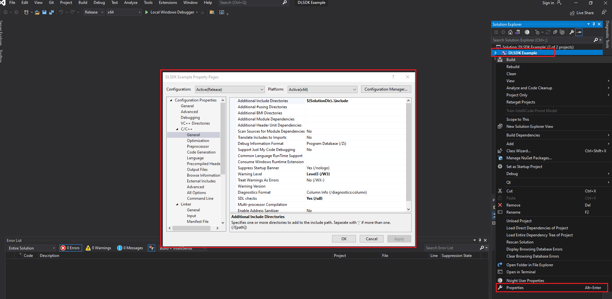
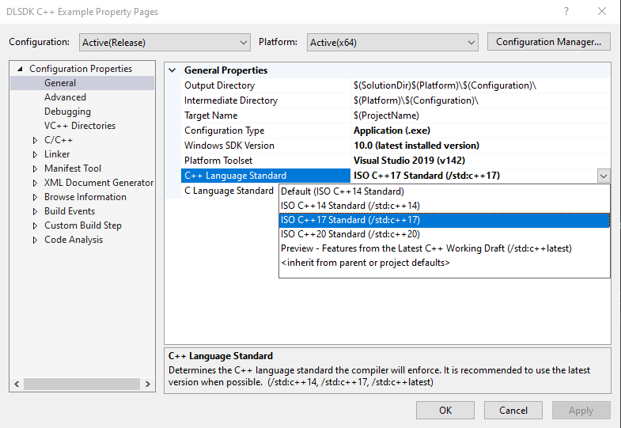
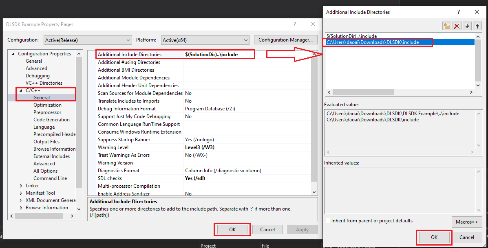
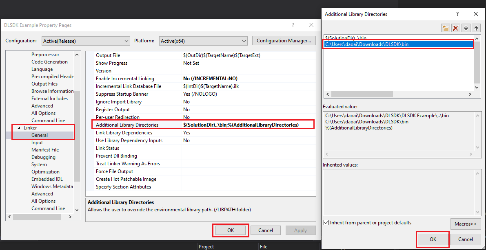
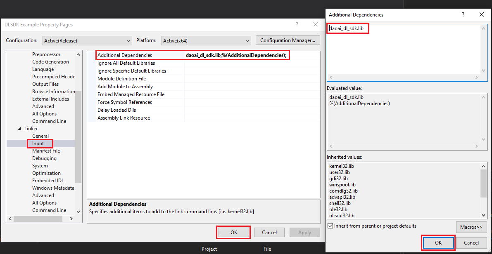
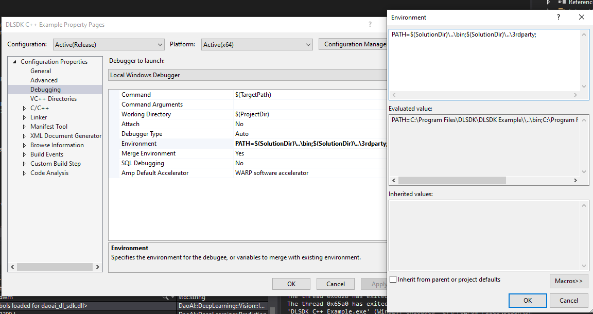

DWSDK C++ Project Configuration
-------------------------------

Project Configuration
~~~~~~~~~~~~~~~~~~~~~~

The steps in the C++ sample project have already been configured. If you need to create a **custom project** or **start from an empty project**, the following configurations are required.

Right-click on the C++ project and open the properties.

In the properties, select C++17.

In the C++ settings, under the General menu, add the include folder path from the DW_SDK root directory to the **Additional Include Directories**.

In the Linker settings, under the General menu, add the bin folder path from the DW_SDK root directory to **Additional Library Directories**.

In the Linker **Input** menu, add `daoai_dl_sdk.lib` to **Additional Dependencies**.

In the Debugging settings, under the Environment menu, add `DWSDK_PATH\\bin` and `DWSDK_PATH\\3rdparty` to the **Path**.

Sample Project
~~~~~~~~~~~~~~

You can refer to the :ref:`C++ Code Example` for using the project.

SDK Interface Documentation
~~~~~~~~~~~~~~~~~~~~~~~~~~~~~

Detailed interface documentation can be found in the `C++ SDK Interface Documentation <../_static/doc_C++/index.html>`_.
