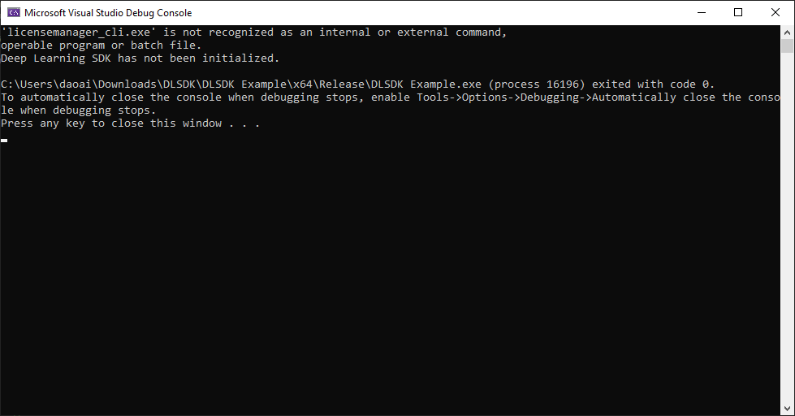
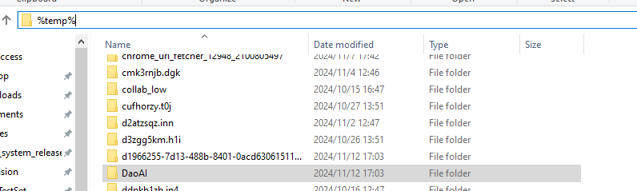

Frequently Asked Questions
==========================

.. contents::
    :local:

License Error: Initialize() Fails to Execute
--------------------------------------------

If you encounter the following error when running a DW SDK project, it indicates that the `licensemanager_cli.exe` is not located in the correct directory:

### Step 1: Restart the Computer
   Sometimes a system restart can resolve the issue. If the problem persists, follow the steps below.

### Check 1:
   If you have previously installed older versions of DWSDK, DaoAI Vision Pilot, or DaoAI Inspectra, those software versions might include outdated License Manager files. Due to environment configuration issues, the system may be using those older License Manager files.

#### Solution 1:
   Search for `license_manager` on your system disk and remove any instances of `licensemanager_cli.exe` and `licensemanager_gui.exe` outside the DWSDK installation directory. Retain only the files located in the `bin` folder under the DWSDK installation directory.

   Example:
   ``C:\Program Files\DaoAI World SDK\DWSDK\bin``

### Check 2:
   Verify that the DWSDK installation directory contains `licensemanager_cli.exe` and `licensemanager_gui.exe`. Ensure your system's environment variable `PATH` includes the correct DWSDK bin path, such as:

   ``C:\Program Files\DaoAI World SDK\DWSDK\bin``

   If the variable is configured using ``%DWSDK_PATH%/bin``, ensure ``%DWSDK_PATH%`` points to the correct installation directory.

#### Solution 2:
   Correct any erroneous system environment variable configurations and ensure the path includes:
   ``C:\Program Files\DaoAI World SDK\DWSDK\bin`` and ``C:\Program Files\DaoAI World SDK\DWSDK\3rdparty`` and is at the top of the path

### Check 3:
   Delete the DaoAI folder in the Windows ``%temp%`` directory and re-run the SDK program.

#### Solution 3:
   If the issue persists, the model being used may be corrupted. Retrain and export the model to ensure it is valid.

Python Windows Example Error: ImportError: No module named cv2
--------------------------------------------------------------

If you encounter the following error while running a Python Windows example:

.. code-block:: console

    ImportError: No module named cv2

Run the following command to install OpenCV:

.. code-block:: console

    pip install opencv-python

Python Windows Example Error: ImportError: DLL load failed while importing dlsdk
---------------------------------------------------------------------------------

If you encounter the following error while running a Python Windows example:

.. code-block:: console

    ImportError: DLL load failed while importing dlsdk: the specified module could not be found.

This issue is caused by the Python version installed from the Windows Store. Remove the Python version from the Windows Store and install Python from the `official Python website <https://www.python.org/downloads/>`_.

Python Linux/Jetson SDK Error: ImportError: libGL.so.1: cannot open shared object file
--------------------------------------------------------------------------------------

If you are using a headless application and encounter the following error:

.. code-block:: console

    ImportError: libGL.so.1: cannot open shared object file: No such file or directory

Install OpenCV for headless environments using the following command:

.. code-block:: console

    pip install opencv-python-headless

Python Linux/Jetson SDK Error: ImportError: libgthread-2.0.so.0: cannot open shared object file
----------------------------------------------------------------------------------------------

If you encounter the following error:

.. code-block:: console

    ImportError: libgthread-2.0.so.0: cannot open shared object file: No such file or directory

Install the missing library using the following commands:

.. code-block:: console

    sudo apt update
    sudo apt install libglib2.0-0
