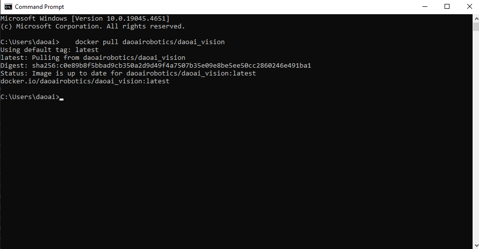

Development
=============

    This chapter provides detailed instructions on configuring and using the DaoAI World Software Development Kit (SDK). 
    The DaoAI World SDK offers a comprehensive set of tools for calling deep learning models, processing outputs, 
    and executing various general functionalities to meet software development needs.

    First, download the `DaoAI World SDK <https://daoairoboticsinc-my.sharepoint.com/:f:/g/personal/nrd_daoai_com/EhJ2c8mQ3yZKuXUno9Vg1ucBCuvQzJZCyAhXnjbQnf7UNg?e=tcEhUe>`_

    - **C++** 和 **C#** : SDK version 2.24.6.0 under C++ and C# SDK.
    - **Python Windows** : SDK version 2.24.6.0 under Windows Python SDK.
    - **Python Linux/Jetson** : SDK version 2.24.6.0 under Linux Jetson Python SDK.

    After installing the **C++** and **C#** package, you can find the example projects under the installation path.

        .. image:: images/install_folder.png
            :scale: 100%

    Open the DLSDK Example.sln project using Visual Studio.

        .. image:: images/example_path.png
            :scale: 100%

        .. image:: images/vs.png
            :scale: 60%

    The project includes **C++** and **C#** projects. Right-click on properties, then select the startup project to choose between running the **C++** or **C#** project.

        .. image:: images/start_up.png
            :scale: 70%

    Next, set the startup configuration to release x64 and click Local Windows Debugger to run the project.

        .. image:: images/run_0.png
            :scale: 60%
            
        .. image:: images/run_1.png
            :scale: 60%

    Using DW_SDK requires a valid software license. Please refer to the :ref:`DW SDK License` for more details. 

DW_SDK Windows Installation Package
-------------------------------------------

Hardware Requirements
~~~~~~~~~~~~~~~~~~~~~~~~~~~~

DaoAI World SDK supports both CPU and GPU modes. So even without a GPU, you can still use DaoAI World’s deep learning models on a CPU for inference.

Using GPU mode significantly speeds up model execution compared to CPU mode.

The minimum requirements for using GPU mode are:

- Graphics Card: **Nvidia 1050Ti with 4GB of VRAM.**

- Graphics Driver: **GeForce Game Ready Driver, version 552.22, released on April 16, 2024.**

Installation
~~~~~~~~~~~~~~~~~~~~~~~~~~~~

First, download the `DaoAI World SDK <https://daoairoboticsinc-my.sharepoint.com/:f:/g/personal/nrd_daoai_com/EhJ2c8mQ3yZKuXUno9Vg1ucBCuvQzJZCyAhXnjbQnf7UNg?e=U1N81x>`_

    Find the 2.24.6.0 installation package under Windows C++ C# SDK directory as a zip file.

    Extract the downloaded zip file, which contains three files: ``dlsdk_2.0_setup.exe`` , ``dlsdk_2.0_setup-1.bin`` , and ``dlsdk_2.0_setup-1.bin`` . Double-click ``dlsdk_2.0_setup.exe`` to begin the installation.
    
    .. image:: images/dlsk_installer_unzip.png
            :scale: 80%

    .. note:: 
        
        The DW_SDK installation package requires more than 6.7GB of free disk space.

    - Choose the installation directory for the DW_SDK package. The default path is: ``C:\Program Files\DW_SDK`` .

    .. image:: images/dlsk_installer_path.png
            :scale: 80%   
    
    - Select ``Create Desktop Shortcut`` to easily manage the SDK license.

    .. image:: images/dlsk_installer_desktop_shortcut.png
            :scale: 80%   

    - Click ``Install`` and wait for the installation process to complete.

    .. image:: images/dlsk_installer_install.png
            :scale: 80%   

    - Once the installation is complete, click ``Finish`` .

    .. image:: images/dlsk_installer_done.png
            :scale: 80%   

DW SDK License
~~~~~~~~~~~~~~~~~~~~~~~~~~~~

Using DW_SDK requires an official software license authorized by `DaoAI` .  
Please contact your support engineer or customer representative to obtain a license. 
You will need to provide the `DaoAI` team with information about your computer:

    - Double-click the ``DW_SDK`` desktop shortcut to open the License Management Center.
    
    .. image:: images/dlsk_installer_icon.png
            :scale: 80%   
    
    - The License Management Center will display the following interface.

    .. image:: images/dlsk_installer_license_manager_gui.png
            :scale: 80%   

    - Click ``File`` and then ``Computer Information`` .
    
    .. image:: images/dlsk_installer_machineid.png
            :scale: 80%  

    - Here, you can view your computer name and machine code. Click ``Copy Machine ID`` to copy the machine code, then send it to `DaoAI` staff for license authorization.
    
    .. image:: images/dlsk_installer_copy_id.png
            :scale: 80%  

Remote License
^^^^^^^^^^^^^^^^^^^^^^

Once you receive the license, you can add it directly in the interface:

    -  Click ``File`` and then ``Add Software License`` .

    .. image:: images/dlsk_installer_add_online_license.png
        :scale: 80%  

    - Enter the valid license code provided by ``DaoAI`` staff. The license is a 32-character alphanumeric activation code. Copy and paste it into the following interface.

    .. image:: images/dlsk_installer_add_online_license_1.png
        :scale: 80%  

    - Click ``View`` to verify the license information.

    .. image:: images/dlsk_installer_online_license_check.png
        :scale: 80%  

    - Once the license manager confirms the license is activated, the software can be used normally.

    .. image:: images/dlsk_installer_online_license_check_good.png
        :scale: 80%  
    
    .. note::
        
        An internet connection is required to activate the license.

Offline License
^^^^^^^^^^^^^^^^^^^^^^

In some cases, users may not be able to connect their devices to the internet. `DaoAI` staff will provide an offline license. Once you receive the license, you can add it as follows:

    - Click ``File`` and then ``Import Offline License File`` .

    .. image:: images/dlsk_installer_add_offline_license.png
        :scale: 80%  

    - Select the offline license file provided by `DaoAI` staff.

    .. image:: images/dlsk_installer_select_offline_license.png
        :scale: 80%  

    
    - The manager will confirm the license has been activated, and the software can be used normally.

    .. image:: images/dlsk_installer_offline_license_check.png
        :scale: 80%  
    
System Environment Variables
~~~~~~~~~~~~~~~~~~~~~~~~~~~~

The DW_SDK installation package automatically sets the system environment variable ``DWSDK_PATH`` , which is required by DW_SDK. You can reference this variable when using the SDK.

    .. image:: images/dlsk_installer_dwsdk_path.png
            :scale: 80%  

C++ Project Configuration
~~~~~~~~~~~~~~~~~~~~~~~~~~~~

    The C++ example project comes pre-configured, but if you need to create a custom project or start from scratch, you must configure it as follows:
    
    Right-click on the C++ project and open **Properties** .

        .. image:: images/cpp_env1.png
            :scale: 70%

    In **Properties** , select **C++17** .

        .. image:: images/cpp17.png
            :scale: 80%

    In the **General** menu under **Additional Include Directories** , add the path to the **include** folder in the DW_SDK root directory.

        .. image:: images/cpp_env2.png
            :scale: 80%

    In **Linker** , under **Additional Library Directories** , add the path to the **bin** folder in the DW_SDK root directory.
        
        .. image:: images/cpp_env3.png
            :scale: 80%

    In **Linker** , under **Input** , add **daoai_dl_sdk.lib** in **Additional Dependencies.**

        .. image:: images/cpp_env4.png
            :scale: 80%

    In **Debugging,** under **Environment,** add **DWSDK_PATH\\bin,** **DWSDK_PATH\\3rdparty** to the **Path.**

        .. image:: images/vs_3rdparty.png
            :scale: 80%

C# Project Configuration
~~~~~~~~~~~~~~~~~~~~~~~~~~~~

    In the **C#** project, click **Add Reference.**
        
        .. image:: images/add_ref.png
            :scale: 100%

    Click **Browse,** and navigate to the bin folder in the extracted directory. Select ``dl_sdk_net.dll`` , check it, and click **OK.**

        .. image:: images/browse_dll.png
            :scale: 100%

    Click **Assembly,** then search for ``system.drawing`` . Check it and click **OK.**
        
        .. image:: images/browse_assembly.png
            :scale: 100%

Python Windows Configuration
~~~~~~~~~~~~~~~~~~~~~~~~~~~~~~~~~~~~~~~~~~~~~~~~~~~~~~~~

The Python Windows SDK wheel supports only Windows environments.

First, install **Python 3.10** 

If you already have Python installed, use the following command to confirm your version:

.. code-block::

    python3 --version

Based on your Python version, download the 2.24.6.0 wheel file from the  `Download Center <https://daoairoboticsinc-my.sharepoint.com/:f:/g/personal/nrd_daoai_com/EhfpGDv2VpZMi5NhkxrFvlwBthrgxdCccubfLp8LefGAQw?e=78ZGUn>`_ 下载 其中的2.24.6.0 版本的 .whl文件

Install the SDK as follows:

.. code-block::

    pip install {wheel_file}.whl

Then your DaoAI Python Windows SDK module is installed.

You can import the module using the following command:

.. code-block:: python

    import dlsdk.dlsdk as dlsdk

You will need a valid DaoAI license to use it properly. If you don't have a license, please refer to :ref:`DW SDK License`

Python Linux/Jetson Configuration
-----------------------------------

The Python Linux/Jetson API is only supported in Linux systems, and it is divided into two categories: Linux machines and Jetson machines.

If you want to use it in a Windows environment, please refer to :ref:`1. Using Docker Image` to configure a Docker virtual environment.

If you are using a Linux environment, you can skip step 1 and refer to :ref:`2. Installing DaoAI Python Linux/Jetson API Wheel` to use it directly.

1. Using Docker Image
~~~~~~~~~~~~~~~~~~~~~~~~~~~~~~~~~

First, Docker needs to be installed.

Once installed, run Docker and open the command line. Enter and run the following command to download the Docker container. 
Please note that this step requires about 60GB of disk space.

To download the Docker image for a Linux machine, use the following command:

.. code-block::

    docker pull daoairobotics/daoai_vision 

Or, if you are using a Jetson machine, you can use the following command to download the Docker image for Jetson machines:

.. code-block::

    docker pull daoairobotics/daoai_vision:jetson

        
After the download is complete, run the following commands to start the Docker image and enter the Linux environment of the virtual image:

.. code-block::

    docker run -it --gpus=all -v <local_path>:/home/appuser/workdir daoairobotics/daoai_vision

Where:

1. <local_path> is your local path, replace it with your actual path.
2. /home/appuser/workdir is the virtual path within the Docker container, which will contain the files and folders from the path specified in step 1.
3. daoairobotics/daoai_vision is the name of the Docker image.

After entering the command, you'll be logged into the Docker virtual image as appuser, as shown in the image below:

    .. image:: images/pscmd.png
        :scale: 100%

Next, please refer to :ref:`3. Activate Your Linux/Jetson SDK`

2. Installing DaoAI Python Linux/Jetson API Wheel
~~~~~~~~~~~~~~~~~~~~~~~~~~~~~~~~~~~~~~~~~~~~~~~~~~~~~

Depending on your machine, download the appropriate files from the `Download Center <https://daoairoboticsinc-my.sharepoint.com/:f:/g/personal/nrd_daoai_com/EhSzNT1zD61Pv8MbPMr_PM8BLRSiHwbywBsRHAEY5ILSiQ?e=DzrN2M>`_  

- If you're using a **Linux machine,** download the .whl file from the ``Linux_wheels`` directory for version 2.24.6.0, or

- If you're using a **Jetson device,** download the .whl file from the ``Jetson_wheels`` directory for version 2.24.6.0.

The Python Linux/Jetson SDK wheel is only supported on Linux environments. If you're using Windows, you'll need to use a Linux virtual machine or Docker Image.

The Python Linux/Jetson SDK supports the following models:

.. list-table::
   :header-rows: 1

   * - Model Type
     - Fast Mode	
     - Accurate Mode	
     - Rotation Accurate Mode
   * - Instance Segmentation
     - √  
     - √  
     - x 
   * - Keypoint Detection
     - √  
     - √  
     - x  
   * - Unsupervised Defect Segmentation	
     - x
     - x  
     - 
   * - Image Classification
     - √   
     - √  
     - 
   * - Object Detection
     - √  
     - √  
     - 
   * - Supervised Defect Segmentation
     - √   
     -  
     - 
   * - OCR
     - x  
     - 
     - 

2.a Linux Installation
^^^^^^^^^^^^^^^^^^^^^^^^^^^^^^^

Linux requires **Python 3.10** and **Nvidia Cuda Toolkit** 

To verify your Python version, use the following command:

.. code-block::

    python3 --version

- **Default Installation Method** : The daoai_vision package provides a binary installation package (.whl file), making it easy for users to install in their environment. During installation, the .whl file will automatically install the necessary runtime dependencies, but it won’t automatically install deep learning frameworks (such as PyTorch, ONNX, OpenVINO), allowing users to choose their preferred version.

    .. code-block::

        pip install <Wheel-File>.whl

    With this installation method, all supported packages will be installed, and you can run local inference directly. If you need specific versions of essential dependencies like PyTorch or ONNX, it’s recommended to install them manually after installation.

- **Deep Learning Library Installation** : If you want to install all the necessary deep learning libraries for local Python inference, use this command:

    .. code-block::

        pip install <Wheel-File>.whl[dl]

    This command will install the required deep learning libraries for inference.

After this, your DaoAI Python Linux/Jetson SDK module will be installed.

Next, please refer to section :ref:`3. Activate Your Linux/Jetson SDK` 

2.b Jetson Installation
^^^^^^^^^^^^^^^^^^^^^^^^^^^^^^^^^^^^^

Jetson devices require **Python 3.8** and must use a venv virtual environment.

To verify your Python version, use this command:

.. code-block::

    python3 --version

Then you need to create a venv virtual environment in your working directory, use the following commands:

.. code-block::

    python3 -m venv <virtual_environment_name>
    source <virtual_environment_name>/bin/activate

Then, install the wheel file, making sure the .whl file is present in the current terminal path.

- **Default Installation Method** ：daoai_vision provides a binary installation package (.whl file) for easy installation in your environment. During installation, the .whl file will automatically install the required runtime dependencies, but it will not install deep learning frameworks (such as PyTorch, ONNX, or OpenVINO), allowing users to select the versions they need.

    .. code-block::

        pip install <Wheel-File>.whl

    With this installation method, all supported packages will be installed, and you can directly run local inference. If you need specific versions of important dependencies, such as PyTorch or ONNX, it is recommended to install them manually after installation.

- **Deep Learning Library Installation** : If you want to install all the necessary deep learning libraries for local Python inference, use this command:

    .. code-block::

        pip install <Wheel-File>.whl[dl]

    This command will install the required deep learning libraries for inference.

Please note that you need to follow the official website to download the correct version of torchvision: https://forums.developer.nvidia.com/t/pytorch-for-jetson/72048 

Alternatively, you can use the following commands to install torchvision version 0.16.1:

.. code-block::

    sudo apt-get install libjpeg-dev zlib1g-dev libpython3-dev libopenblas-dev libavcodec-dev libavformat-dev libswscale-dev
    git clone --branch v0.16.1 https://github.com/pytorch/vision torchvision

    cd torchvision
    export BUILD_VERSION=0.16.1
    python3 setup.py install
    cd ../ 

After this, your DaoAI Python Linux/Jetson SDK module will be installed.

Next, please refer to section :ref:`3. Activate Your Linux/Jetson SDK` 

3. Activate Your Linux/Jetson SDK
~~~~~~~~~~~~~~~~~~~~~~~~~~~~~~~~~~~~~

Next, you need to run the following command in the terminal to activate your license. If you do not have a license key and machine license file, please refer to :ref:`DW SDK License`

Once you acquired a License File, use the following command to activate your SDK

.. code-block::

    daoai_vision activate --license ABCDEF-XXXXXX-XXXXXX-XXXXXX-XXXXXX-XX --machine <machine-file-path>

This command will validate your license file and cache it for 30 days; after that, you will need to run the command again.

.. note::

    When re-running activation, you need to add the ``-r`` flag to clear the previous license cache. If you used an invalid license, you will also need to use the ``-r`` flag to retry activation.

    .. code-block::
        daoai_vision activate -r --license ABCDEF-XXXXXX-XXXXXX-XXXXXX-XXXXXX-XX --machine <machine-file-path>

Once activation is successful, you can use the Python SDK normally. You can import the module using the following statement:

.. code-block:: python

    import daoai_vision as dv

4. Using the Python Linux/Jetson SDK
~~~~~~~~~~~~~~~~~~~~~~~~~~~~~~~~~~~~~~~~~~~~~~~~~~~

daoai_vision supports various inference deployment methods, including local deployment and remote hosting deployment. Depending on your needs, you can choose the appropriate deployment method to run model inference. There are mainly three deployment methods:

1. Self-Hosted Deployment:
    **Self-hosted deployment** runs model inference on your own hardware, with two main methods: **Native Python Deployment** and **Docker Server Deployment.**

    **Native Python Deployment**

    Run inference locally on your hardware using native Python. You can load the model and perform inference with the following code:

    .. code-block:: python
        
        import daoai_vision as dv
        MODEL_ZIP = 'path/to/downloaded/zip'  # Model file (.zip / .dwm)
        DEVICE = 'gpu'                        # 可选设备: cpu / gpu 
        IMG_PATH = 'path/to/image'            # 待推理的图像路径

        model = dv.get_model(model_path=MODEL_ZIP, device=DEVICE)
        results = model.infer(IMG_PATH)

    You can also run inference using the command line tool with the following command:

    .. code-block::

        daoai_vision infer -i /path/to/image.png -m /path/to/model.zip --native-python

    This command will print a summary of the inference results in the terminal and save the results as a JSON file in the same directory as the input image.

    **Docker Server Deployment**

    Run an inference server using Docker, which can run in the background and accept inference requests.

    1. Start the server:

        .. code-block::

            daoai_vision server enable

    2. Run inference requests:
        
        You can send inference requests via the command line tool:

        .. code-block::

            daoai_vision infer -i /path/to/image.png -m /path/to/model.zip

        You can also set ``server=True`` in Python to send inference requests:

        .. code-block:: python

            import daoai_vision as dv
            model = dv.get_model(model_path=MODEL_ZIP, server=True)
            results = model.infer(IMG_PATH)

2. Hosted Deployment
    **Hosted deployment** allows sending inference requests to the remote inference server of DaoAI World. In this case, you need to specify the URL of the remote server.

    Send requests via the command line:
    
    .. code-block::

        daoai_vision infer -i /path/to/image.jpg -m /path/to/model.zip -url http://remote-server.com:PORT

    Use hosted inference in Python:

    .. code-block:: python

        import daoai_vision as dv
        model = dv.get_model(model_path=MODEL_ZIP, server=True)
        results = model.infer(IMG_PATH, url='http://remote-server.com:PORT')

SDK
------

For more detailed information about the SDK, function interfaces, data structures, etc., please refer to the SDK documentation:

`C++ SDK 文档 <../_static/doc_C++/index.html>`_

`C# SDK 文档 <../_static/doc_Cs/index.html>`_

Code Examples
------------------

.. toctree::
    :maxdepth: 1
    
    cpp_eg
    cs_eg
    python_win_eg
    .. python_eg
