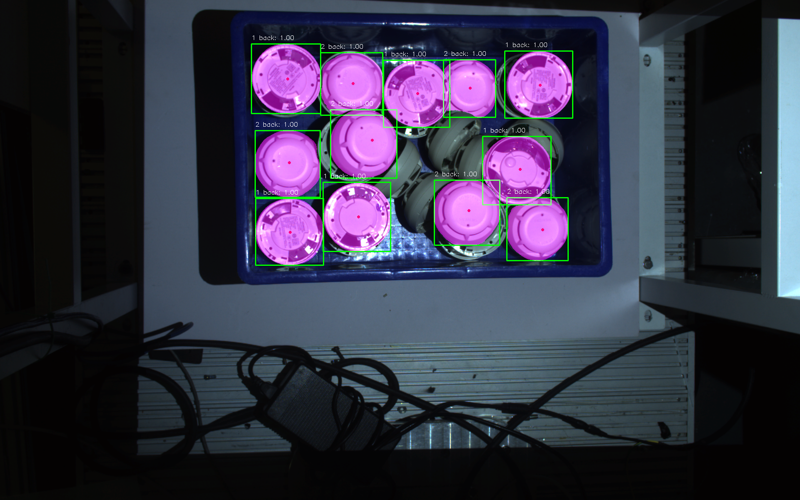

Python Linux/Jetson 代码示例
-----------------------------------

您可以使用我们给的 `Python示例代码 <https://daoairoboticsinc-my.sharepoint.com/:u:/g/personal/nrd_daoai_com/Ed6ajuVWvRRNu12zuP8Ha18BHTPYznA4P6bO8xtlBuEb4w?e=rGTCF7>`_ 里面包含了图片的读取，模型的读取，以及模型的预测 和输出绘制。

下载后，解压文件夹，如果您使用的是Docker Image, 请确保文件放置在 /home/appuser/workdir 下，也就是启动时的本地目录下。

然后运行以下命令就可以运行python脚本，并使用提供的示例模型和图片做模型的预测，结果会输出在同文件夹中的 output_with_masks_classes_scores.png 文件。

.. code-block:: python

    python3 example.py

您可以通过更改example.py中的文件读取路径来使用不同的图片和深度学习模型。

.. code-block:: python

    MODEL_ZIP = 'kp1.zip'
    IMG_PATH = 'kp.png'

您也可以从一个新的python文件开始，那么首先需要导入 daoai_vision 库，也就是我们的DaoAI World Python SDK

.. code-block:: python

    import daoai_vision as dv

以下的库可能也会对您有帮助

.. code-block:: python

    import cv2
    import numpy as np
    import matplotlib.pyplot as plt

读取模型

.. code-block:: python

    MODEL_ZIP = 'kp_fast_model.zip' #DaoAI world 模型文件路径
    DEVICE = 'gpu'  # 硬件选项: cpu 或 gpu 使用cpu的话模型预测速度会显著慢于gpu
    model = dv.get_model(model_zip=MODEL_ZIP, device=DEVICE) 

读取图片，和模型预测

.. code-block:: python

    IMG_PATH = 'test_image.png' #读取的图片路径
    results = model.infer(IMG_PATH) #模型 调用预测功能 

预测结果

.. code-block:: python

    boxes     = results.boxes     # [N][x1,y1,x2,y2] ：两个点组成的边界框
    classes   = results.classes   # [N] 模型类别索引值
    labels    = results.labels    # [N] 模型类别字符串， 可以用 labels[classes[i]] 来访问对应结果的类别字符串
    scores    = results.scores    # [N] 预测的置信度
    masks     = results.masks     # [N][H][W] 模型的掩膜像素
    keypoints = results.keypoints # [N][x, y, score] 模型的关键点
    sem_masks = results.sem_seg   # 像素掩码

之后您可以按照需要使用这些结果。

绘制bounding box

.. code-block:: python

    # 绘制 bounding boxes
    if(boxes is not None):
        for box in boxes:
            cv2.rectangle(img, (int(box[0]), int(box[1])), (int(box[2]), int(box[3])), (0, 255, 0), 2)

绘制keypoints

.. code-block:: python

    if keypoints is not None:
        for obj in keypoints:
            for kp in obj:
                if float(kp[2]) > 0.5:  
                    cv2.circle(img, (int(kp[0]), int(kp[1])), 2, (0, 0, 255), 2)

绘制掩膜，类，和置信度

.. code-block:: python

    # 绘制 masks、classes 和 scores
    for i in range(len(boxes)):
        if masks is not None:
            mask = masks[i]

            # 将 mask 缩放到图像大小
            mask_resized = cv2.resize(mask.astype(np.uint8), (img.shape[1], img.shape[0]))
            mask_rgb = np.zeros_like(img)
            mask_rgb[mask_resized > 0.5] = (255, 0,255)  # 设置 mask 的颜色
            # 绘制 mask
            img = cv2.addWeighted(img, 1, mask_rgb, 0.5, 0)

        cls = classes[i]
        score = scores[i]
        label = labels[cls]

        # 获取当前检测框的坐标
        bbox = boxes[i]
        x1, y1, x2, y2 = int(bbox[0]), int(bbox[1]), int(bbox[2]), int(bbox[3])

        # 绘制 class 和 score
        text = f'{cls} {label}: {score:.2f}'
        cv2.putText(img, text, (x1, y1 - 10), cv2.FONT_HERSHEY_SIMPLEX, 0.5, (255, 255, 255), 1)

使用示例代码的预测结果：

    
