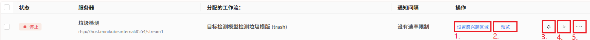

Deployment Interface
====================

On the deployment interface, you can create, manage, and delete your surveillance cameras, and assign a detection workflow.

    .. image:: images/deployment.png
        :scale: 80%

Create a New Device
--------------------

Click **Create Device** on the right-hand side.

    .. image:: images/create_device.png
        :scale: 80%

Enter the device name, RTSP video stream address, and select a detection workflow.
Then click **Create** to complete the setup.

Device Management
------------------

Once the device is created, it will appear in the list.

1. Set Region of Interest (ROI):
    .. image:: images/roi.png
        :scale: 80%

    Draw a region on the video feed and save it.
    Any detection results outside this region will be filtered out. Only results within the defined region will be retained.

    .. note::
        After defining the ROI, make sure the first module in the assigned workflow is the ROI module.

2. Preview:
    Click to preview a single frame of the video stream to ensure the stream is connected.

    .. image:: images/preview.png
        :scale: 80%

3. Notifications:
    Toggle to enable or disable push notifications.

4. Run:
    Click to **Start/Stop** running the device.

5. Settings:
    Modify device configurations.

    .. image:: images/setting.png
        :scale: 80%

    You can update the name, RTSP stream address, workflow, notification toggle, and notification interval.
