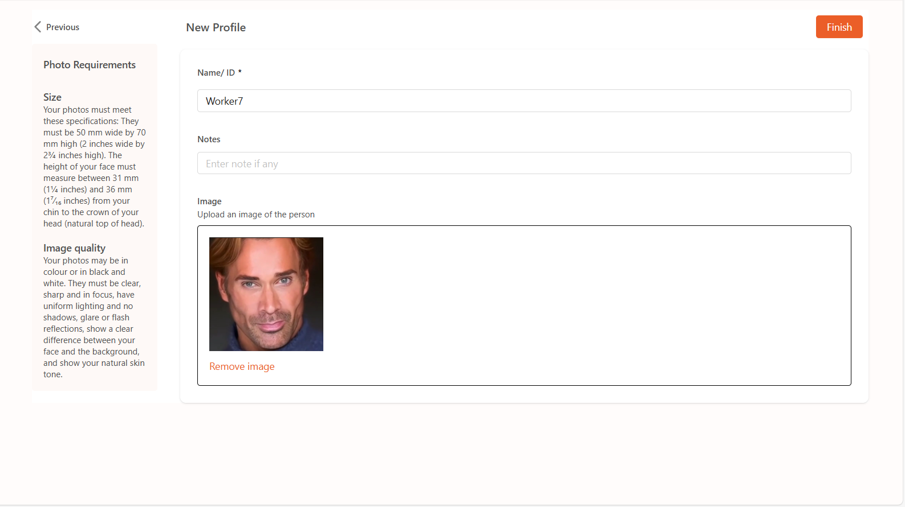

Register Face Identity
======================

On the DaoAI World settings page, you can click on the **Face Identity Library**.

    .. image:: images/facial.png
        :scale: 80%

Register a New Profile
----------------------

Click **Face Recognition** on the left menu to access the face library management module.  
Click **Register New Profile** to open the following page:

Field Descriptions
----------------------

- **Name/ID** (Required): Enter a unique identifier for the individual (e.g., name, employee ID)
- **Notes** (Optional): You may add descriptions such as team, role, etc.
- **Photo** (Required): Supports the following image upload methods:

  1. Drag and drop a face image into the upload box  
  2. Click **Select File** to upload from local storage  
  3. Or click **Use Camera** to take a live photo via USB camera

Photo Requirements
----------------------

To ensure effective recognition, uploaded photos must meet the following standards:

**Image Quality**

- The image must be clear and in focus, not blurry  
- Both color and black-and-white images are supported  
- Background should be clear, without glare or shadows  
- Avoid strong light or backlighting; ensure facial features are well distinguished from the background  
- The face should be fully visible and facing the camera directly

Important Notes
----------------------

- Each individual only needs to register once; the system will automatically extract and store facial feature vectors  
- Using a high-resolution camera is recommended to improve recognition accuracy  
- To delete a registered profile, go back to the face library main page and click on the person’s avatar to manage
