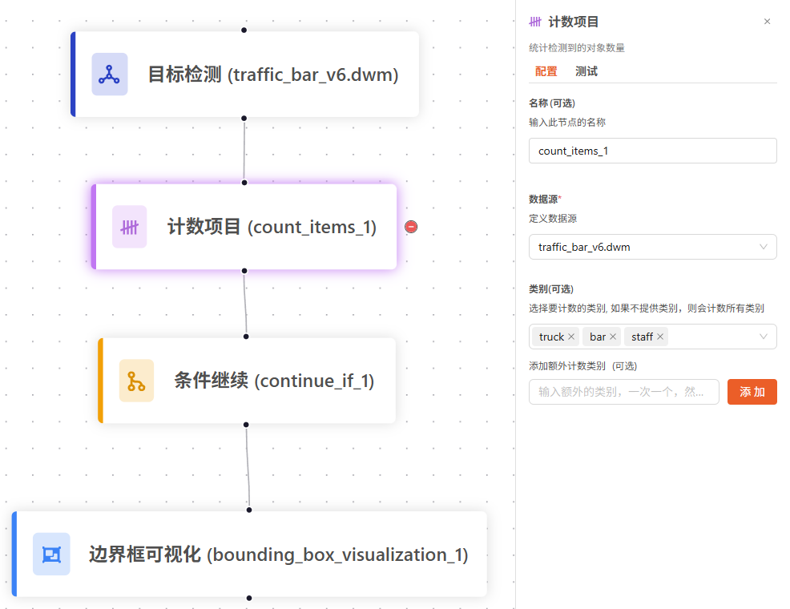
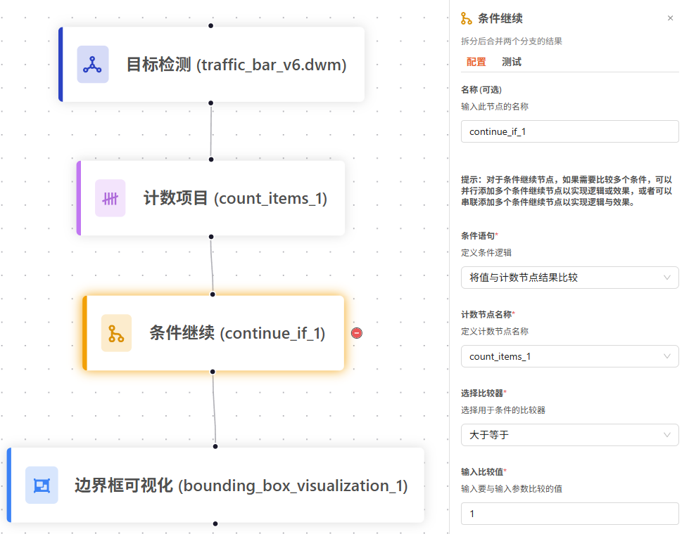
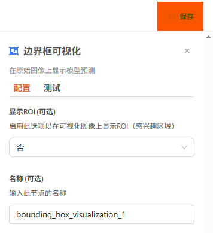
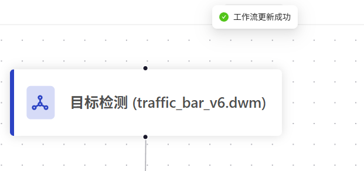
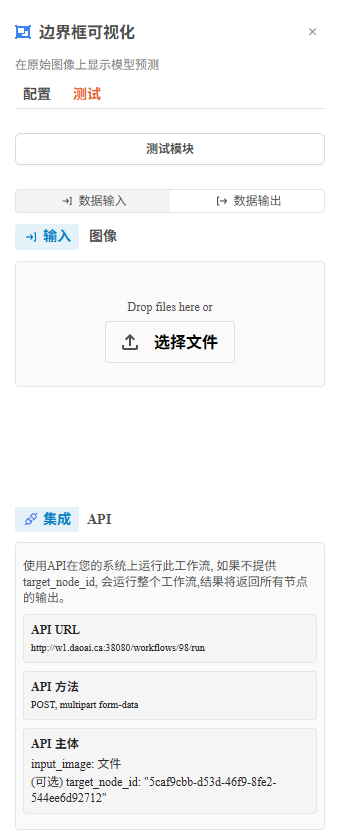
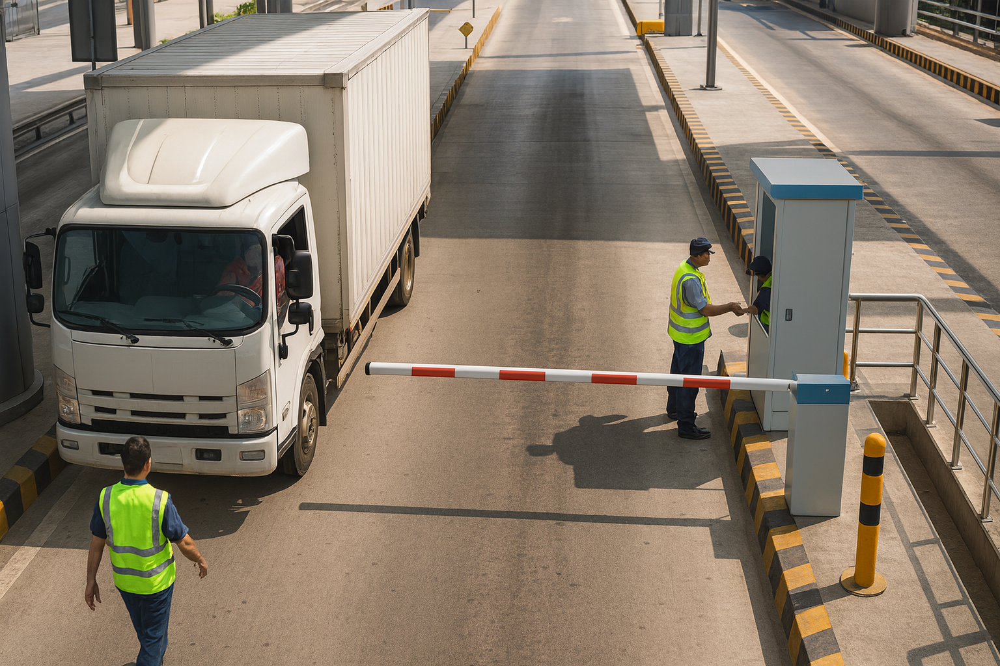
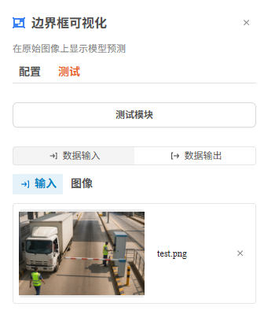
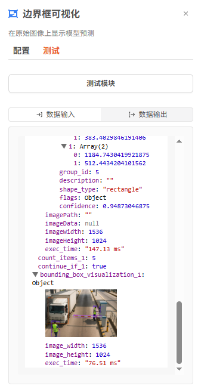
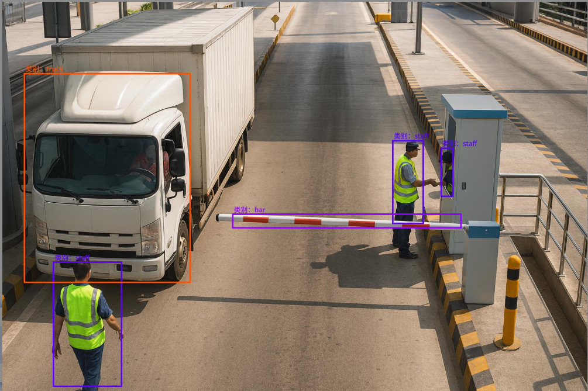

测试工作流
==================================

测试工作流功能允许您验证配置的工作流是否能正确处理输入数据。本文档将以收费站场景为例，演示如何测试一个包含目标检测模型的工作流，该模型用于检测卡车、工作人员和栏杆。

前置条件
--------

.. note::
   您需要具备管理员权限才能使用工作流测试功能。

.. note::
   在开始测试之前，请确保您已经创建了包含可视化模块的工作流。

1. 搭建工作流
-------------

1.1 创建工作流
~~~~~~~~~~~~~~

1. 登录天眼系统。
2. 点击左侧导航栏中的 **"工作流"**。
3. 点击右上角的 **"创建工作流"** 按钮。

1.2 配置目标检测模型
~~~~~~~~~~~~~~~~~~~~

在收费站场景中，我们需要检测以下目标：

- **卡车**: 标出通过的卡车
- **工作人员**: 检测收费站工作人员的位置
- **栏杆**: 识别栏杆的位置

1. 从模块库中选择 **"目标检测模型"** 模块
2. 配置模型参数：

   - 模型类型：选择已训练的目标检测模型, 在这里是我们训练好的traffic_bar_v6.dwm模型
   - 置信度阈值：建议设置为 0.5
   - 最大对象数：50（默认值）

    .. figure:: images/od_set_up.png
        :width: 50%
        :align: center

1.3 计数项目模块
~~~~~~~~~~~~~~~~~~

计数项目模块用于对上一节点（目标检测）的输出结果按类别进行统计，将计数结果输出为变量，供后续逻辑判断或显示使用。

参数配置示例：

- 名称: ``count_items_1``
- 数据源: traffic_bar_v6.dwm
- 类别：卡车、人员、栏杆

1.4 条件继续模块
~~~~~~~~~~~~~~~~~~

条件继续模块用于基于计数结果或其他变量进行条件判断，决定工作流是否继续向下执行。

参数配置示例：

- 名称: ``continue_if_1``
- 条件语句: 将值与计数节点结果比较
- 计数节点名称: ``count_items_1``
- 选择比较器: 大于等于
- 输入比较值： 1

1.5 添加可视化模块
~~~~~~~~~~~~~~~~~~

为了查看检测结果，需要添加可视化模块：

1. 从模块库中选择 **"边界框可视化"** 模块
2. 配置可视化参数：

   - 显示ROI(感兴趣的区域)：否(此案例中不需要显示感兴趣的区域)
   - 名称：输入此节点的名称
   - 显示时间戳：否(如需用到时间戳可以开启)
   - 可视化: 定义要在通知消息中可视化的节点
   - 类别: 选择要计数的类别(在这里是truck, person, bar)

    .. figure:: images/bb_set_up.png
        :width: 50%
        :align: center

2. 保存工作流
-------------

.. warning::
   每次对工作流做改动后都需要手动保存。

2.1 保存操作
~~~~~~~~~~~~

完成工作流配置后，点击右上角的 **"保存"** 按钮

    

2.2 保存状态提示
~~~~~~~~~~~~~~~~

保存成功后，系统会显示保存状态提示：

    

3. 上传测试图片
---------------

3.1 进入测试界面
~~~~~~~~~~~~~~~~

1. 选择已保存的工作流
2. 点击 **"测试"** 按钮进入测试界面

    

3.2 上传测试图片
~~~~~~~~~~~~~~~~

点击 **"选择文件"** 按钮或拖拽图片到上传区域

4. 查看检测结果
---------------

4.1 运行测试
~~~~~~~~~~~~

1. 上传图片后，点击 **"测试模块"** 按钮
2. 系统将自动运行工作流处理图片
3. 处理完成后，结果将显示在输出界面

    

4.2 查看可视化结果
~~~~~~~~~~~~~~~~~~

在输出界面查看返回的可视化图片：

    
    
模型返回 JSON 说明
-------------------

以下为一次目标检测推理返回的 JSON 示例（按你最新结构），并对关键字段进行说明：

.. code-block:: json

    {
      "traffic_bar_v6.dwm": {
        "version": "4.5.7",
        "flags": {}
      },
      "shapes": [
        {
          "label": "staff",
          "points": [[132.9599, 682.8488], [314.4040, 1011.9858]],
          "group_id": 1,
          "description": "",
          "shape_type": "rectangle",
          "flags": {},
          "confidence": 0.99853515625
        },
        { "label": "staff", "points": [[1023.2889, 363.4403], [1106.1980, 583.8493]], "group_id": 2, "shape_type": "rectangle", "confidence": 0.998046875 },
        { "label": "bar",   "points": [[603.0879, 556.6309], [1205.7865, 595.2965]], "group_id": 3, "shape_type": "rectangle", "confidence": 0.99755859375 },
        { "label": "truck", "points": [[56.0131, 187.1249],  [494.8903, 738.9020]],  "group_id": 4, "shape_type": "rectangle", "confidence": 0.99560546875 },
        { "label": "staff", "points": [[1150.1404, 383.4030],[1184.7430, 512.4434]], "group_id": 5, "shape_type": "rectangle", "confidence": 0.94873046875 }
      ],
      "imageWidth": 1536,
      "imageHeight": 1024,
      "exec_time": "147.13 ms",
      "count_items_1": 5,
      "continue_if_1": true,
      "bounding_box_visualization_1": {
        "output_image": "click to preview",
        "image_width": 1536,
        "image_height": 1024,
        "exec_time": "76.51 ms"
      }
    }

字段说明
--------

核心字段
~~~~~~~~

- traffic_bar_v6.dwm.version: 模型版本号（用于确认部署与训练版本是否一致）。
- imageWidth / imageHeight: 输入图像的分辨率（像素）。
- exec_time: 模型推理耗时（毫秒）。
- count_items_1: 计数模块输出的对象总数（此处为 5）。
- continue_if_1: 条件继续模块输出（true 则继续后续节点）。

检测结果 shapes
~~~~~~~~~~~~~~~

- shapes: 推理得到的检测框列表；每一项包含：
- label: 预测的类别（如 truck、staff、bar）。
- points: 边界框左上角与右下角像素坐标，格式 [[x1, y1], [x2, y2]]。
- shape_type: 形状类型（此处为 rectangle）。
- confidence: 置信度，范围 0-1。
- group_id: 当前图像内对象编号（仅用于区分对象，非跨图唯一）。
- description / flags: 可选的描述与标记字段。

可视化输出 bounding_box_visualization_1
~~~~~~~~~~~~~~~~~~~~~~~~~~~~~~~~~~~~~~

- bounding_box_visualization_1: 边界框可视化节点输出：
- output_image: 渲染后的结果图（前端可点击“预览”查看）。
- image_width / image_height: 可视化结果图尺寸。
- exec_time: 可视化渲染耗时（毫秒）。

.. tip::
   建议使用多张不同类型的测试图片来全面验证工作流的鲁棒性和准确性。

.. tip::
   定期保存工作流配置，避免因意外情况导致配置丢失。