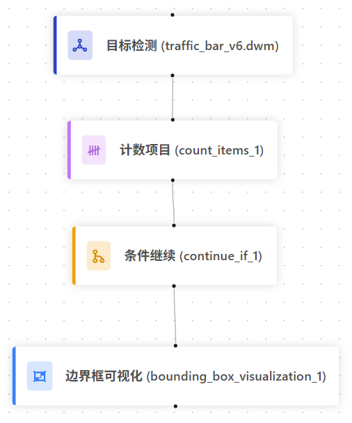
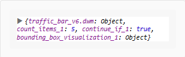
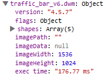
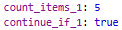
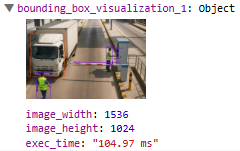

测试工作流
==================================

测试工作流功能允许您验证配置的工作流是否能正确处理输入数据。本文档将以收费站场景为例，演示如何测试一个包含目标检测模型的工作流，该模型用于检测卡车、工作人员和栏杆。

前置条件
--------

.. note::
   您需要具备管理员权限才能使用工作流测试功能。

.. note::
   在开始测试之前，请确保您已经创建了包含可视化模块的工作流。

1. 搭建工作流
-------------

.. 1.1 创建工作流
.. ~~~~~~~~~~~~~~

.. 1. 登录天眼系统。
.. 2. 点击左侧导航栏中的 **"工作流"**。
.. 3. 点击右上角的 **"创建工作流"** 按钮。

.. 1.2 配置目标检测模型
.. ~~~~~~~~~~~~~~~~~~~~

.. 在收费站场景中，我们需要检测以下目标：

.. - **卡车**: 标出通过的卡车
.. - **工作人员**: 检测收费站工作人员的位置
.. - **栏杆**: 识别栏杆的位置

.. 1. 从模块库中选择 **"目标检测模型"** 模块
.. 2. 配置模型参数：

..    - 模型类型：选择已训练的目标检测模型, 在这里是我们训练好的traffic_bar_v6.dwm模型
..    - 置信度阈值：建议设置为 0.5
..    - 最大对象数：50（默认值）

..     .. figure:: images/od_set_up.png
..         :width: 50%
..         :align: center

.. 1.3 计数项目模块
.. ~~~~~~~~~~~~~~~~~~

.. 计数项目模块用于对上一节点（目标检测）的输出结果按类别进行统计，将计数结果输出为变量，供后续逻辑判断或显示使用。

.. 参数配置示例：

.. - 名称: ``count_items_1``
.. - 数据源: traffic_bar_v6.dwm
.. - 类别：卡车、人员、栏杆

.. .. figure:: images/count_set_up.png
..     :width: 50%
..     :align: center

.. 1.4 条件继续模块
.. ~~~~~~~~~~~~~~~~~~

.. 条件继续模块用于基于计数结果或其他变量进行条件判断，决定工作流是否继续向下执行。

.. 参数配置示例：

.. - 名称: ``continue_if_1``
.. - 条件语句: 将值与计数节点结果比较
.. - 计数节点名称: ``count_items_1``
.. - 选择比较器: 大于等于
.. - 输入比较值： 1

.. .. figure:: images/continue_if_set_up.png
..     :width: 50%
..     :align: center

.. 1.5 添加可视化模块
.. ~~~~~~~~~~~~~~~~~~

.. 为了查看检测结果，需要添加可视化模块：

.. 1. 从模块库中选择 **"边界框可视化"** 模块
.. 2. 配置可视化参数：

..    - 显示ROI(感兴趣的区域)：否(此案例中不需要显示感兴趣的区域)
..    - 名称：输入此节点的名称
..    - 显示时间戳：否(如需用到时间戳可以开启)
..    - 可视化: 定义要在通知消息中可视化的节点
..    - 类别: 选择要计数的类别(在这里是truck, person, bar)

..     .. figure:: images/bb_set_up.png
..         :width: 50%
..         :align: center

这里用一个收费站场景的示例工作流来演示如何测试工作流。

搭建一个如图所示的工作流：

通过计数项目和条件继续来可视化图中出现的卡车、工作人员和栏杆。

如何搭建请参考前一章节 :ref:`创建与编辑工作流指南`

.. note::
    点击需要测试的工作流，测试结果会运行到当前模块为止。例如，如果点击了计数项目模块，测试结果仅会返回计数的结果，不会运行到条件继续和边界框可视化模块。

2. 保存工作流
-------------

.. warning::
   每次对工作流做改动后都需要手动保存。

2.1 保存操作
~~~~~~~~~~~~

完成工作流配置后，点击右上角的 **"保存"** 按钮

.. figure:: images/save.png
    :width: 30%
    :align: center
    

2.2 保存状态提示
~~~~~~~~~~~~~~~~

保存成功后，系统会显示保存状态提示：

.. figure:: images/save_success.png
    :width: 30%
    :align: center
    

3. 上传测试图片
---------------

3.1 进入测试界面
~~~~~~~~~~~~~~~~

1. 选择已保存的工作流
2. 点击 **"测试"** 按钮进入测试界面

.. figure:: images/test_page.png
    :width: 30%
    :align: center
    

3.2 上传测试图片
~~~~~~~~~~~~~~~~

点击 **"选择文件"** 按钮或拖拽图片到上传区域

.. figure:: images/test.png
    :width: 50%
    :align: center

.. figure:: images/insert_test.png
    :width: 30%
    :align: center

4. 查看检测结果
---------------

1. 上传图片后，点击 **"测试模块"** 按钮
2. 系统将自动运行工作流处理图片
3. 处理完成后，结果将显示在输出界面

下图为将测试结果全部收纳后的结果：

    
这里因为我们有四个模块，所以返回结果对应有四个部分：

1. traffic_bar_v6.dwm: 目标检测模块的输出
2. count_items_1: 计数项目模块的输出
3. continue_if_1: 条件继续模块的输出
4. bounding_box_visualization_1: 边界框可视化模块的输出

4.1 查看模型返回结果
~~~~~~~~~~~~~~~~~~

在输出界面查看返回的结果，下面按节点输出逐步解析：

1. traffic_bar_v6.dwm: 目标检测模块的输出
~~~~~~~~~~~~~~~~~~~~~~~~~~~~~~~~~~~~

该层级展示了模型本次推理的信息：

- 模型名称与版本：traffic_bar_v6.dwm，用于确认部署与训练产物是否一致。
- 推理输入：来自测试图片的像素矩阵(1536×1024)。
- 推理输出（shapes）：模型检测到的各类目标及其边界框，包含 label、points、confidence 等关键字段。

下面对shapes进行解读，我们这里拿shape[0]示范。

2. 单个 shape 解读示例
~~~~~~~~~~~~~~~~~~~~~~~~~~
.. list-table::
   :widths: 50 50
   :align: center
   :header-rows: 0

   * - .. figure:: images/od_shapes.png
          :width: 100%
          :align: center

          Shapes中所有元素
     - .. figure:: images/od_shape_0.png
          :width: 100%
          :align: center

          第一个(单个)元素展示

单个元素内容解析：

.. code-block:: json

    {
      "label": "staff",
      "points": [[132.9599, 682.8488], [314.4040, 1011.9858]],
      "group_id": 1,
      "shape_type": "rectangle",
      "confidence": 0.99853515625
    }

 - label: 预测类别（示例为 staff）。
 - points: 边界框左上与右下角像素坐标，格式 [[x1, y1], [x2, y2]]（此例为 [132.9599, 682.8488] 与 [314.4040, 1011.9858]）。
 - group_id: 当前图中的对象编号（用于区分同类不同目标）。
  - description / flags: 可选的描述与标记字段，供业务侧附加信息使用。
 - shape_type: 形状类型，目标检测为 rectangle。
 - confidence: 置信度（0–1），越接近 1 越可信。本例为 0.9985。

4.2 & 4.3 计数模块和条件继续模块
~~~~~~~~~~~~~~~~~~~~~~~~~~~~~~~~

- count_items_1: 计数项目模块输出的总数
- continue_if_1: 条件继续模块输出，true 表示继续执行后续节点

4.4 边界框可视化
~~~~~~~~~~~~~~~~~~~~~~~~~~~~~~~~

- output_image: 可点击预览的渲染图
- image_width / image_height: 渲染图尺寸
- exec_time: 可视化渲染耗时

4.5 返回结果展示
~~~~~~~~~~~~~~~~~~~~~~~~~~~~~~~~

.. figure:: images/test_result.png
    :width: 70%
    :align: center

4.6 Json返回结果整体示例
-------------------

以下为一次目标检测推理返回的 JSON 示例：

.. code-block:: json

    {
      "traffic_bar_v6.dwm": {
        "version": "4.5.7",
        "flags": {}
      },
      "shapes": [
        {
          "label": "staff",
          "points": [[132.9599, 682.8488], [314.4040, 1011.9858]],
          "group_id": 1,
          "description": "",
          "shape_type": "rectangle",
          "flags": {},
          "confidence": 0.99853515625
        },
        { "label": "staff", "points": [[1023.2889, 363.4403], [1106.1980, 583.8493]], "group_id": 2, "shape_type": "rectangle", "confidence": 0.998046875 },
        { "label": "bar",   "points": [[603.0879, 556.6309], [1205.7865, 595.2965]], "group_id": 3, "shape_type": "rectangle", "confidence": 0.99755859375 },
        { "label": "truck", "points": [[56.0131, 187.1249],  [494.8903, 738.9020]],  "group_id": 4, "shape_type": "rectangle", "confidence": 0.99560546875 },
        { "label": "staff", "points": [[1150.1404, 383.4030],[1184.7430, 512.4434]], "group_id": 5, "shape_type": "rectangle", "confidence": 0.94873046875 }
      ],
      "imageWidth": 1536,
      "imageHeight": 1024,
      "exec_time": "147.13 ms",
      "count_items_1": 5,
      "continue_if_1": true,
      "bounding_box_visualization_1": {
        "output_image": "click to preview",
        "image_width": 1536,
        "image_height": 1024,
        "exec_time": "76.51 ms"
      }
    }

.. tip::
   建议使用多张不同类型的测试图片来全面验证工作流的鲁棒性和准确性。

.. tip::
   定期保存工作流配置，避免因意外情况导致配置丢失。