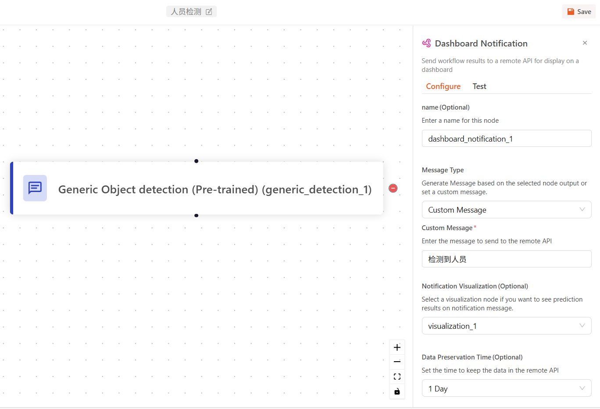

创建与编辑工作流指南
==================================

天眼系统通过可视化工作流管理视频流分析任务。本文档将指导您如何创建、编辑并使用工作流。

前置条件
--------

.. note::
   您需要具备管理员权限才能使用工作流相关功能。

一、创建工作流
----------------

1. 登录天眼系统。
2. 点击左侧导航栏中的 **“工作流”**。
3. 点击右上角的 **“创建工作流”** 按钮，或选择 **“模板”** 标签页，从现有模板中快速开始。

.. figure:: images/create_workflow.png
   :width: 30%
   
   图 1: 工作流创建页面

.. note::
    创建后，系统将跳转进入工作流编辑界面。

二、工作流编辑界面说明
------------------------

.. figure:: images/workflow.png
   :width: 80%

**主要功能**

- **返回**：退出当前编辑页。
- **添加模块**：插入新的模块。
- **重命名**：更改工作流名称。
- **保存**：保存当前流程。
- **缩放控制**：支持缩放、窗口适配与模块锁定。
- **拖拽与连接**：鼠标拖动画布查看流程图，通过黑点连接模块。

三、模块类型概览
------------------

模块是构建工作流的基础，分为以下六类：

.. figure:: images/nodes.png
   :width: 20%

- **模型**： **目标检测**、 **混合模型**、 **分类**、 **混合模型** 、 **人脸识别** | 详见 :ref:`五、模型模块说明`
- **数据处理**：结果统计、过滤、整理。| 详见 :ref:`六、数据处理说明`
- **逻辑判断**：条件控制流。| 详见 :ref:`七、逻辑判断说明`
- **数据转换**：格式、坐标等转换。
- **可视化**：边界框、结果叠加等。
- **通知触发**：向仪表板或外部系统推送结果。

四、模块操作
--------------

**添加模块**

点击 **“添加模块”**，选择所需模块，即可添加至画布。

**删除模块**

点击模块并选择右侧 **“-”** 图标。

.. figure:: images/delete_node.png
   :width: 20%

**重新连接模块**

点击连接线右侧的 **“-”** 图标删除连接。

.. figure:: images/delete_edge.png
   :width: 20%

拖动模块底部黑点连接到目标模块。

.. figure:: images/reconnect_nodes.png
   :width: 20%

五、模型模块说明
------------------

.. figure:: images/node_models.png
   :width: 30%

**目标检测模块**

用于加载训练模型，对画面帧做目标检测。

.. figure:: images/add_model.png
   :scale: 80%

.. figure:: images/import_model.png
   :scale: 80%

**混合模型模块**

结合检测与分类，适合多类物体识别任务。

**人脸检测模块**

预训练模型，无需训练。需先注册人脸身份，详见 :ref:`注册人脸身份`。

**通用目标检测模块**

输入英文标签，系统自动检测对应目标。

.. note::
   当前仅支持英文标签。

六、数据处理说明
-------------------

- **数据处理**：如“计数项目”模块，计算检测出的物体数量。

七、逻辑判断说明
-------------------

- **逻辑判断**：如“条件继续”模块，用于设置分支逻辑。

其他模块说明
-------------------

- **数据处理**：如“计数项目”模块，计算检测出的物体数量。
- **逻辑判断**：如“条件继续”模块，用于设置分支逻辑。
- **可视化**：如“边界框可视化”模块，将检测框显示在画面中。
- **通知**：如“仪表板通知”模块，结果将以卡片形式推送至仪表板。

.. figure:: images/workflow_nodes.png
   :scale: 80%
