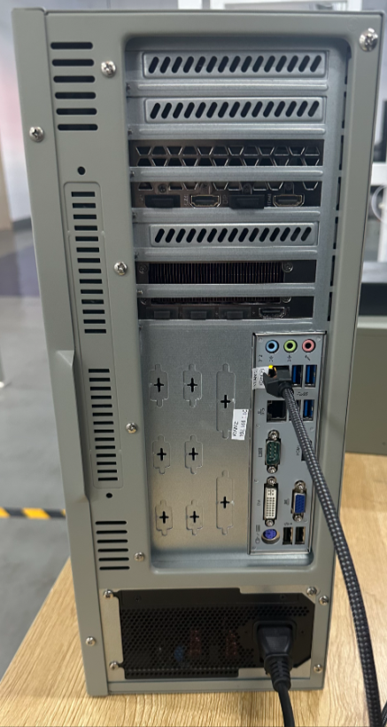
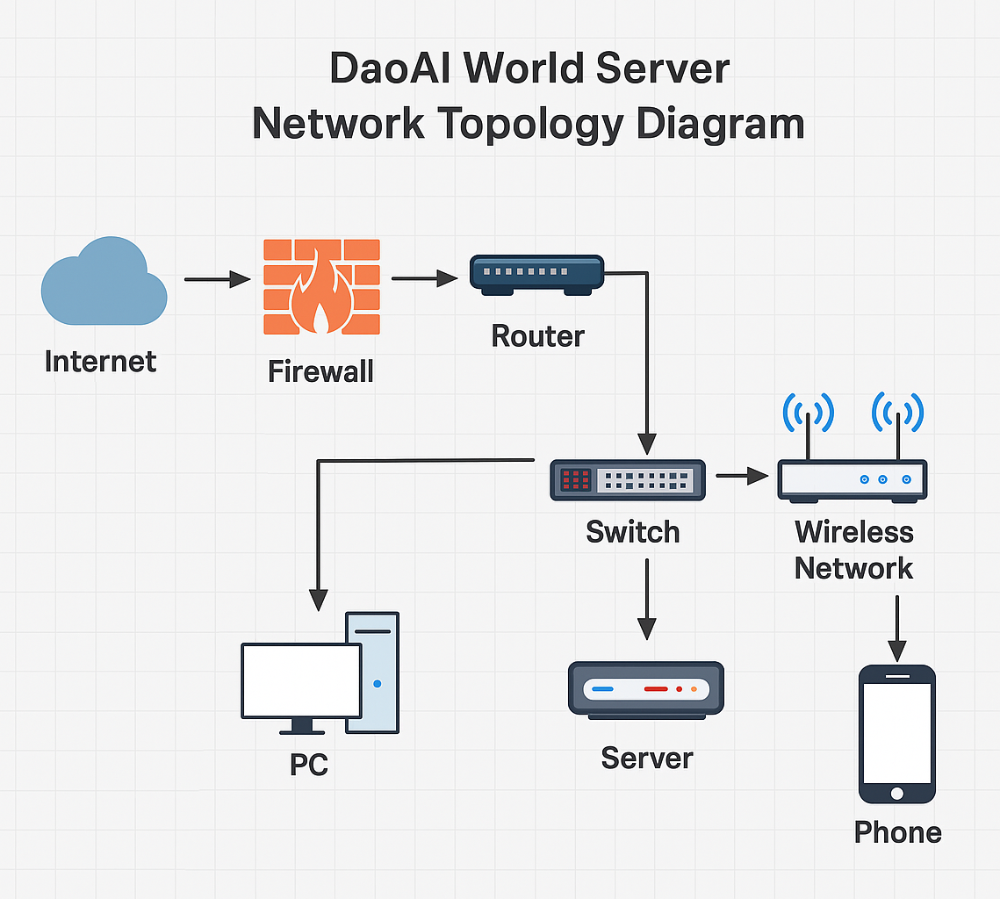
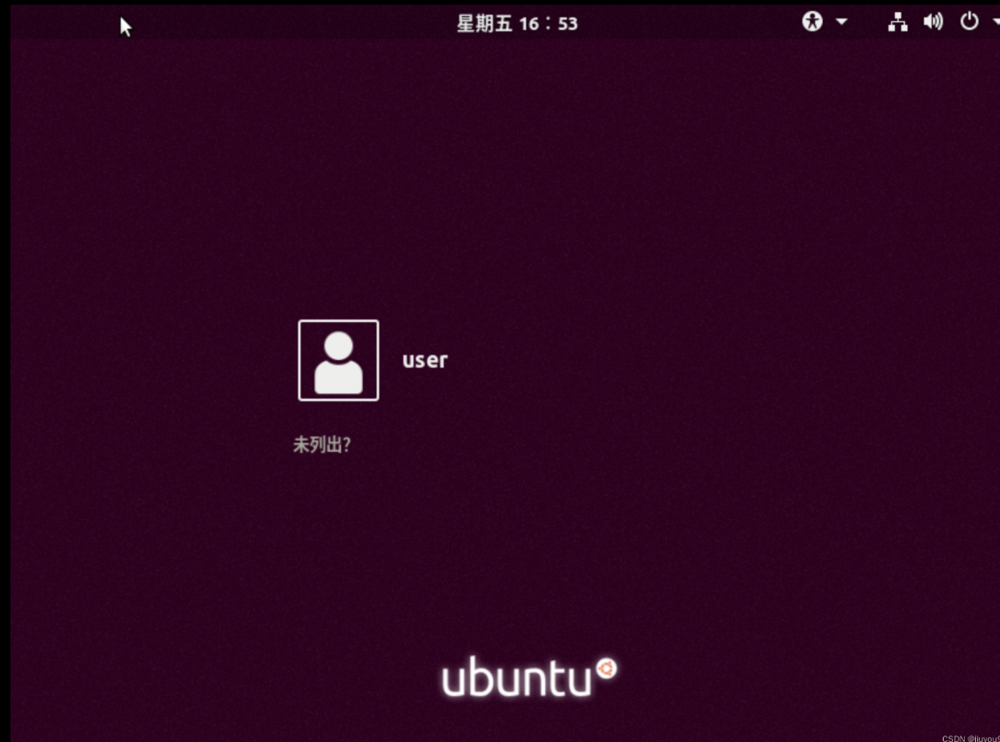
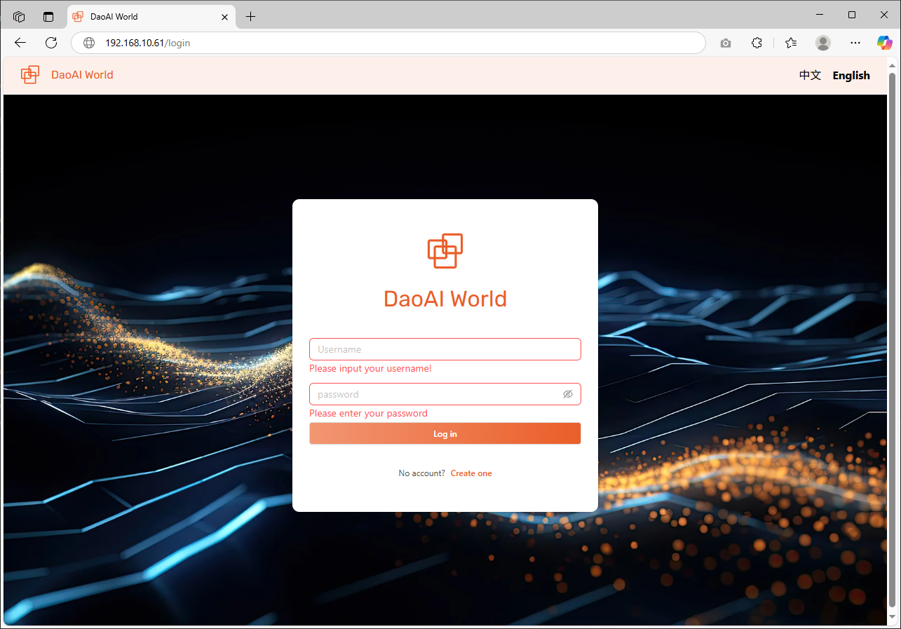

DaoAI World 部署和使用指南
===========================

本指南将帮助您在收到服务器后完成电源和网络连接，并通过查看本机 IP 地址，从局域网设备和本机浏览器中访问 DaoAI World 应用。

部署 DaoAI World 服务器需要以下 5 个步骤：

- :ref:`1. 服务器准备`
- :ref:`2. 开机并登录操作系统`
- :ref:`3. 查看本机 IP 地址`
- :ref:`4. 局域网其他设备访问`
- :ref:`5. Ubuntu 桌面版本地浏览器访问`

1. 服务器准备
==============

1.1 检查配件
~~~~~~~~~~~~~

- 确认收到以下配件：
  - 服务器主机
  - 电源线
  - 网线
  - 相关说明书

- 确保服务器完好无损。

1.2 连接电源和网线
~~~~~~~~~~~~~

- 将电源线插入服务器电源接口，并连接到电源插座。
- 使用网线将服务器网口连接至局域网交换机或路由器，并检查网口灯是否正常亮起。

    
    图例：服务器外观及电源和网线连接示意图

.. note::
    网口灯闪烁表示网络连接正常。

1.3 其他准备工作
~~~~~~~~~~~~~

- 确保局域网内的路由器或交换机已正常运行。
- 如果需要远程管理，请记录服务器的序列号联系北京微链技术支持人员。

    图例：局域网拓扑连接示意图

---

2. 开机并登录操作系统
=======================

2.1 开机
-----------------

- 按下服务器电源按钮，启动服务器。

2.2 登录 Ubuntu 桌面
~~~~~~~~~~~~~

- 如果服务器连接显示器和键盘：输入管理员账户信息登录 Ubuntu 桌面。  
  默认用户名：dwuser  
  默认用户密码：dwuser

- 如果未连接显示器，可通过 SSH 访问服务器（需提前了解到服务器在局域网中的 IP 地址）。

    图例：Ubuntu 登录界面示意图

3. 查看本机 IP 地址
====================

3.1 方法一：通过 Ubuntu 命令行终端查看
~~~~~~~~~~~~~~~~~~~~~~~~~~

- 按 Ctrl + Alt + T 打开终端。
- 输入以下命令：ifconfig
- 在输出结果中找到名称为 eno1 的网卡 IP 地址，例如：inet 192.168.10.61/24
- eno1 网卡的 IP 地址即为服务器的 IP 地址，我们将在下一步访问 DaoAI World。

3.2 方法二：通过局域网路由器查看
~~~~~~~~~~~~~~~~~~~~~~~~~~

- 登录局域网路由器管理界面，查看设备列表以获取服务器的 IP 地址。
- 登录路由器管理页面，例如在浏览器中输入 192.168.1.1 进入管理页面。
- 在 DHCP 列表中，找到设备名为 welinkirt 的设备，查看其 IP 地址。

    
    图例：路由器管理页面

---

4. 局域网其他设备访问
======================

4.1 确保其他设备连接同一局域网
~~~~~~~~~~~~~~~~~~~~~~~~~~

- 确保您的电脑、手机等设备与 DaoAI World 服务器处于同一局域网中。

4.2 通过浏览器访问 DaoAI World
~~~~~~~~~~~~~~~~~~~~~~~~~~

- 在局域网设备的浏览器中输入服务器 IP 地址，例如：http://192.168.10.61。
- 如果成功，您将看到 DaoAI World 登录页面。

    图例：DaoAI World 登录界面

4.3 登录并使用 DaoAI World
~~~~~~~~~~~~~~~~~~~~~~~~~~

- 可以使用默认的 DaoAI World 账户进行登录管理：  
   - 默认用户名：dwuser  
   - 默认用户密码：dwuser123

- 登录后，您可以进行训练流程、数据管理、模型管理等操作。

---

5. Ubuntu 桌面版本地浏览器访问
==============================

5.1 打开浏览器
~~~~~~~~~~~~~~~~~~~~~~~~~~

在 Ubuntu 桌面，点击左下角的应用菜单，找到并打开浏览器（例如 Chrome）。

5.2 输入服务器地址
~~~~~~~~~~~~~~~~~~~~~~~~~~

在浏览器地址栏输入：127.0.0.1  
您将看到 DaoAI World 登录页面。

---

6. 常见问题
===========

6.1 正常显示登录页面，但无法成功登录
~~~~~~~~~~~~~~~~~~~~~~~~~~~~~~~~~~~~~~~

如果登录无响应，请按以下操作进入排查流程：

1. **在浏览器页面点击 F12，打开开发者工具**

   .. figure:: images/F12.png
      :scale: 30%
      :alt: 浏览器开发者工具截图
      :figclass: shadow
      :name: f12-screenshot

      图例：按 F12 打开开发者工具。

2. **打开网络（Network）标签，查看名称为 Login 的请求**

   .. figure:: images/login_error.png
      :scale: 30%
      :alt: 登录请求失败截图
      :figclass: shadow
      :name: login-error-screenshot

      图例：以上为 Network 标签中 Login 请求的信息。

3. **查看名称为 (Login) 的标签，并判断请求 IP 地址是否正确**

   .. figure:: images/login_info.png
      :scale: 50%
      :alt: 登录信息截图
      :name: login-info-screenshot
      :figclass: shadow

      图例：以上为 Network 标签中 Login 请求的详细信息，其中请求 URL 理应为您的浏览器访问地址。

**注：**  
- 请确保 login 请求的 URL 和您当前浏览器访问的 **局域网地址** 保持一致。  
- 如果显示为 172.xxx.xxx.xxx 这样的 **IP 地址**，这可能是由于以下原因：  
  - **网络问题**：设备未和 DW 服务器处于同一局域网中。  
  - **服务器未启动**：请检查服务器电源是否正常开启。  
  - **服务未开启**：DW 平台的后端服务地址未成功启动，请联系技术支持团队排查。

**解决办法：**  
- 请尝试重启 DW 离线版服务器，后端地址会自动更新。  
- 请在 F12 页面，网络（Network）标签中选择 "禁用缓存"，并刷新页面，稍后再次尝试登录。  
- 请再次检查网络连接是否正常，如有问题，请联系技术支持团队排查。

---

6.2 我该如何固定我的服务器地址？
~~~~~~~~~~~~~~~~~~~~~~~~~~

如果您有固定服务器 IP 的需求以便于长期使用，请按照以下操作在路由器中设置静态 IP 地址。

1. **登录路由器管理界面**

   打开浏览器，在地址栏输入路由器的管理 IP 地址（例如 192.168.1.1、192.168.0.1 或者其他根据您的路由器设置的 IP 地址）。  
   输入管理员账号和密码（通常在路由器的背面贴纸上，或者您设置时配置的用户名和密码）。

2. **找到 DHCP 设置部分**

   登录后，进入路由器的管理界面。  
   寻找 **网络设置**、**LAN 设置** 或者 **DHCP 设置** 等选项。具体位置可能不同，通常会在 **高级设置** 或 **局域网（LAN）设置** 中找到 DHCP 配置选项。

3. **启用静态 IP 分配（DHCP 静态租赁）**

   在 DHCP 设置页面，找到一个叫做 **DHCP 静态租赁**、**静态 IP 分配** 或类似名称的选项。  
   - 点击 **添加静态租赁** 或 **添加 DHCP 保留** 按钮。  
   - 输入您希望为设备分配的 **静态 IP 地址**，例如 192.168.1.100。  
   - 在 **设备 MAC 地址** 框中，输入您要为其分配静态 IP 地址的 **MAC 地址**。  
   - 在有些路由器中，您可以通过选择已连接设备列表中的设备来自动填入其 MAC 地址。

4. **保存并应用设置**

   完成静态 IP 分配后，保存设置并使其生效。  
   路由器可能会要求重启或者自动应用更改。

5. **验证静态 IP 是否生效**

   - 重启设备（例如计算机、手机等），或者断开并重新连接到网络。  
   - 在设备上检查其 IP 地址，应该能够看到您分配的静态 IP 地址。

**示例步骤（以 TP-Link 路由器为例）**

- 登录到路由器管理页面（通常是 http://192.168.0.1 或 http://tplinkwifi.net）。  
- 输入用户名和密码（默认为 admin/admin，除非您更改过）。  
- 点击 **DHCP** 或 **网络设置**。  
- 找到 **地址预留** 或 **静态 DHCP**。  
- 输入设备的 **MAC 地址** 和您希望分配的 **IP 地址**。  
- 保存设置并重启设备。

**注意事项**  
- **MAC 地址唯一性**：确保为每个设备设置一个唯一的 IP 地址，以避免冲突。  
- **IP 地址范围**：确保您分配的静态 IP 地址位于路由器的 DHCP 范围内，但不要与路由器自动分配的其他 IP 地址重叠。

---

6.3 部分操作需提供管理员密码
~~~~~~~~~~~~~~~~~~~~~~~~~~

在目前版本中，因安全考虑，系统部分敏感指令要求输入管理员密码才能执行。（目前考虑到数据隐私，我们暂时不能为您提供管理员密码。）

**解决办法：**  
- 请联系技术支持团队，以便为您提供支持。  
- 尝试使用 dwuser 账户，进行执行操作。

---

感谢您选择 DaoAI World，如有任何问题，请随时联系技术支持团队获取帮助。  
或者发送邮件至 support@daoai.com