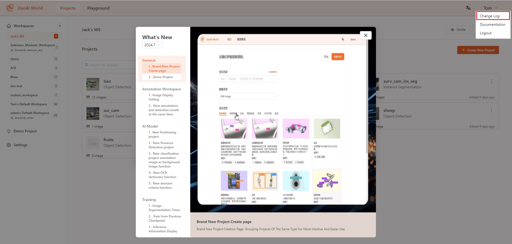

Release Notes
===================

.. contents:: 
    :local:

Version 2.24.6.0 Updates:
------------------------------------

- Added DWM model type.
- Added custom training label feature, allowing you to remove unwanted training labels with one click.
- Added display of remaining training time to help you better manage the time required for training.
- Added search and filter functions for datasets, allowing you to search by file name or filter by training set, test set, or validation set.
- Added custom label color options, enabling you to change the color display of labels and annotation outlines.
- Added automatic/manual dataset management options, allowing you to choose any image for training, testing, or validation sets, or let it be automatically assigned.
- Added functionality to collect images through a 2D industrial camera. Download the DaoAI Preview software and connect via LAN to collect camera data in real-time for annotation or inference.
- Added three edge modes for smart annotation: Simple, Normal, and Copy, each corresponding to different edge details.
- Added drag-and-drop functionality for label selectors. Previously, this window might obstruct the annotation area; now it can be freely dragged to avoid blocking during annotation.
- Added high-resolution image slicing annotation feature, allowing you to annotate after slicing images, which helps in annotating finer details.
- Added high-resolution image slicing preprocessing, which slices images instead of compressing them, preserving complete image details during training.
- Added shortcut key hints for annotation, helping users quickly learn the annotation shortcuts.
- Added confidence adjustment in the dataset prediction page, allowing for better evaluation of model performance at different confidence levels during validation.

Detailed information can be viewed in the Change Log at the top right corner of our website.

