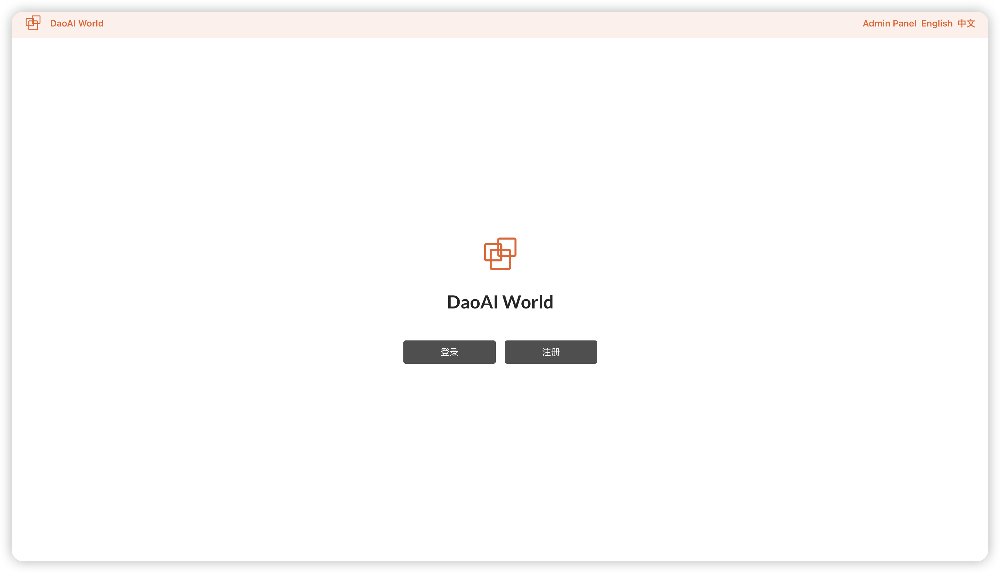

发布说明
============

.. contents:: 
    :local:

2.24.6.0 版本更新说明：
--------------------------

- 新增了DWM模型类型
- 新增了自定义训练标签功能，可以一键去掉不想要训练的标签
- 新增了训练剩余时间显示，可以帮助您更好的掌握训练所需的时间
- 新增了数据集的搜索和筛选功能，可以根据文件名进行搜索，或者训练集，测试集，验证集进行筛选
- 新增了自定义标签颜色，现在可以随意更改标签以及标注轮廓的颜色显示
- 新增了自动/手动数据集管理方式，可以选择任意图片加入训练，测试或者验证集，也可以自动分配
- 新增了通过2D工业相机收集图像的功能，需要下载DaoAI Preview软件，并通过局域网连接，即可实时采集相机的数据，用于标注或者推理
- 新增了智能标注的三种边缘模式，简单，正常，和复制。对应不同的边缘细节
- 新增了标签选择器的拖拽功能，以往该窗口可能会阻挡标注区域，现在可以自由拖拽，避免标注时的遮挡
- 新增了高分辨率图像切片标注功能，可以将图片的切割后再标注，这样能更好的标注图片中的细节
- 新增了高分辨率图像切片预处理，可以将图片的切割代替压缩，在训练时保留完整的图像细节
- 新增了标注快捷键的提示，帮助用户快速的了解标注快捷键
- 新增了推理工作区的置信度调节，再查看验证集时可以更好的查看模型的在不同置信度的表现

细节信息可以通过我们网页右上角的更新日志查看

