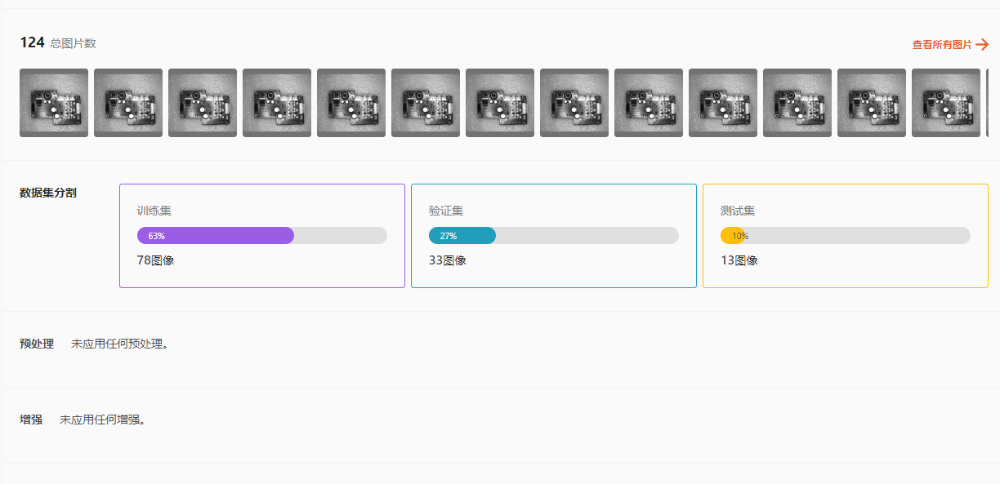
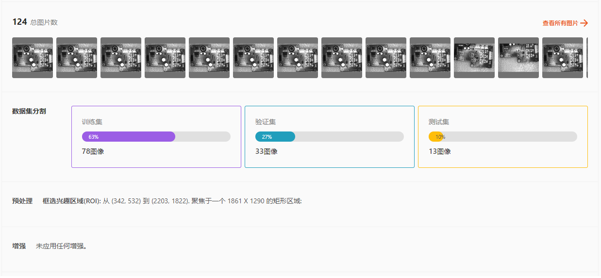
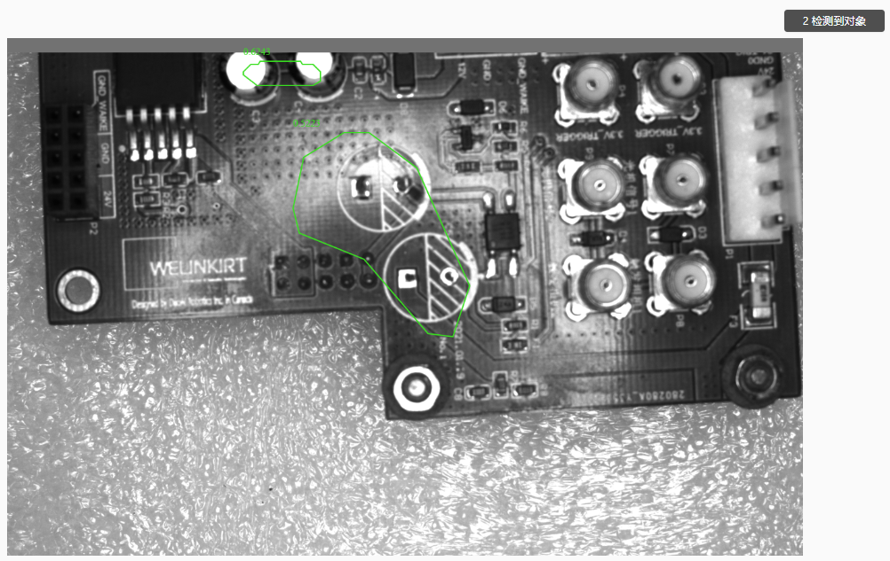
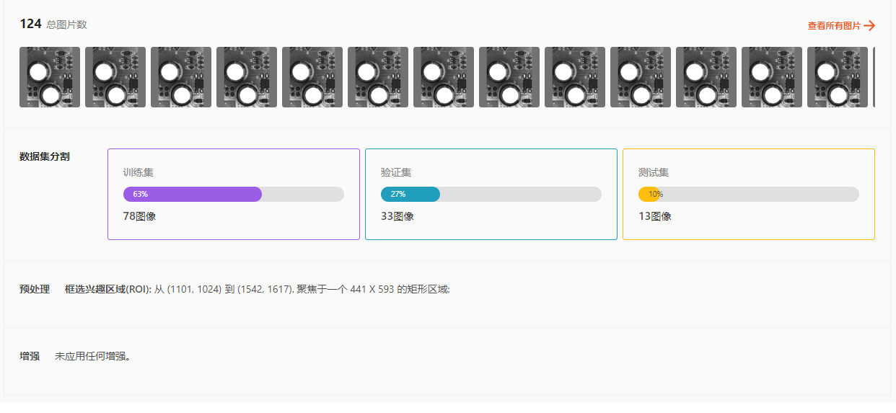
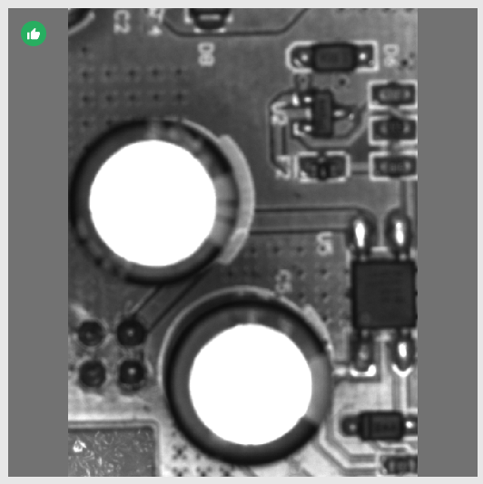
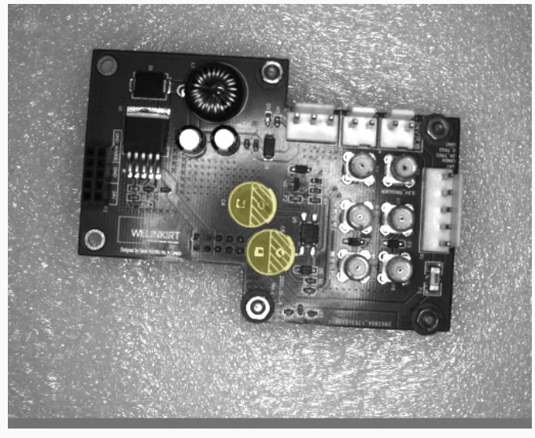
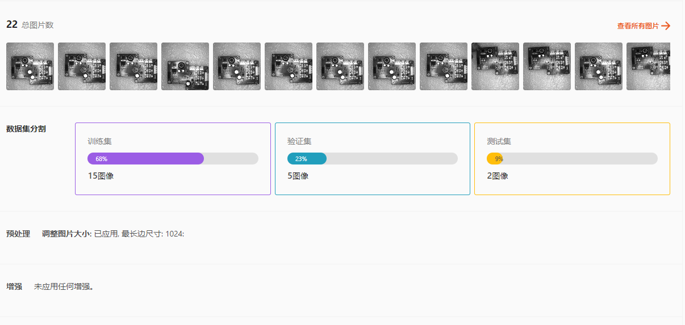

项目实例
==============

本章将通过展示实际项目示例，帮助您了解在真实场景中如何选择模型及标注方法。

.. contents::
    :local:

饮料分拣
-----------

在这个项目中，有各种饮料，分布在4个箱子里，我们需要分类饮料的种类以及抓取他们，只要知道一个物体的大致位置，吸嘴夹具就可以抓起物体。

    .. image:: images/snacks.png
        :scale: 100%

分析图片后 我们可以知道：

1. 总共有5种饮料，不需要区分正反等特殊状态： 则我们需要5种标签
2. 抓取时不需要区分方向，正反等：不需要使用关键点模型或者方向判断的模型。

所以简单的实例分割就可以满足我们的需求。

    .. image:: images/snack_label.png
        :scale: 60%

这里分别使用了5个标签，分别对应5种饮料，然后使用多边形标注了饮料朝上的一个面，只标注了能够抓取，不被遮挡的物体。

.. note::
    
    由于物体侧边在用3d相机拍摄时，点云部分的形状不固定，并且容易出现噪声，从而影响检测的质量。

    只标注上面的一个面就可以在匹配时只处理上方的点云，不用去处理侧边容易出现噪声的部分。

训练并部署后，我们就可以轻松识别所有可以抓取的饮料。

烟感器抓取
-----------

在这个项目中，需要抓取烟感器并且正面和反面需要使用对应的抓取动作才可以成功抓起，而且需要和物体对应旋转夹具才可以成功抓起。

    .. image:: images/smoke.png
        :scale: 100%

分析图片后 我们可以知道：

1. 烟感器需要区分正反：需要2个标签，用于区分正面和反面
2. 抓取时需要区分旋转：则需要使用关键点，并添加至少2个点，来区分物体旋转姿态。

使用关键点模型就可以满足我们的需求。

    .. image:: images/smoke_label.png
        :scale: 100%

标注时，使用了2个标签，区分正反，然后找到了2处相对独特的特征来标注关键点，并且只标注可以抓取的物体。

.. note::
    关键点如果标注在特征重复的区域，或者没有特征的区域，则预测效果不佳。

训练并部署后，我们就可以轻松识别所有可以抓取的烟感器，其正反面，和旋转姿态。

仪表监测
-------------

在这个项目中，需要从不同角度检测图片中的仪表的读数。

    .. image:: images/meter.png
        :scale: 100%

分析图片后 我们可以知道：

1. 需要读取指针在图表中的精确位置：需要可以提供精确位置的模型： 实例分割 或 关键点检测
2. 仅需要判断指针的位置，不存在正反面等特殊姿态：只需要一个标签

由于关键点检测的标注更复杂一些，所以使用实例分割模型。

    .. image:: images/meter_label.png
        :scale: 60%

这里使用多边形标注出指针的位置

训练并部署后，我们就可以轻松识别场景中的指针位置，并使用其它检测算法，判断指针的角度和读数。

镜头检测
-------------

在这个项目中 检测镜头的状态，质量是否合格。是否存在缺陷。

    .. image:: images/lens.png
        :scale: 100%

分析图片后 我们可以知道：

1. 镜片位置一致，存在部分缺陷图片：可以使用缺陷检测或者语义分割模型

由于这里我们不需要区分缺陷的类型，所以缺陷检测可以满足我们的需求。

    .. image:: images/lens_bad.png
        :scale: 70%

    .. image:: images/lens_good.png
        :scale: 80%
        
使用多边形标注出缺陷区域，或者标注为正常。

.. note::
    缺陷检测是使用正常图片进行训练的，需要确保数据集中有半数以上的图片都属于正常标签。

训练并部署后，我们就可以轻松识别镜片的状态，质量是否合格，缺陷位置等等。

组装检测
-------------

在这个项目中 我们需要检测以下工件是否正确的组装：是否有全部的螺丝：4个

    .. image:: images/shanghengliang.png
        :scale: 100%

分析图片后 我们可以知道：

1. 图像中有若干螺丝孔，有些没有安装螺丝，需要检测安装螺丝的有无或者数量

对象检测模型可以满足我们的需求。

    .. image:: images/shanghengliang_label.png
        :scale: 70%
        
使用边界框框出没有安装螺丝的孔。

训练并部署后，我们就可以轻松识别是否有为安装的孔，以及有几个螺丝未安装。

异常检测：PCB零件损坏/缺失
--------------------------

在这个项目中 我们需要检测以下工件是否正确的组装：PCB板上是否有安装2个电容。

.. image:: images/pcb_board.png
        :scale: 25%

分析图片后，我们第一反应可能会想要使用异常检测模型：因为我们的应用是寻找PCB板上的异常、缺陷。

这里我们比较三种模型：异常检测模型、语义分割模型和目标检测模型。

.. hint::
   目标检测模型也是可以用作检测缺陷和异常的，异常部分就是目标检测模型的 **"目标"** 。

1. 异常检测模型，通常用于检测物体的异常和缺陷。

- **v1** : 对于异常检测模型，我们第一个版本的模型没有使用任何预处理和数据加强。一共124张图像，78图像作为训练集。

测试结果如下：

.. image:: images/anomaly_v1_pcb_result.png

异常检测模型过多的把物体表面的区域识别成缺陷，造成这个结果的原因是：PCB板的背景和其他零部件造成了不少的干预。相对于正常的工件，模型检测出很多区域，跟没有缺陷的图像有区别，所以定义该区域为缺陷。

- **v2** : 第二版本的模型添加了ROI预处理，把大部分的背景去除掉，只留下PCB板本体，没有数据加强。同样的124张图像，78图像作为训练集。

测试结果如下：

异常检测模型仍然把PCB板表面和电容相似的区域识别成缺陷，造成这个结果的原因是：PCB板上的轮廓和图像比较复杂。相对于正常的工件，模型检测出很多区域，跟没有缺陷的图像有区别，所以定义该区域为缺陷。

- **v3** : 第三版本的模型添加了ROI预处理，并且图像只扣出电容部分，没有数据加强。一共124张图像，78图像作为训练集。

训练图像如下：

测试结果如下：

.. image:: images/anomaly_v3_pcb_result.png

v3 模型的识别效果总体来说会比前面的 v1 和 v2 好，但是还是能看到异常检测的局限性。同样是容易受到背景的影响，和PCB板上其他部件的影响。

**异常检测的局限性**

- 对于异常检测模型的应用，此模型适合于检测单个目标的表观缺陷，尽量只包含要检测的目标，避免其他目标的变化造成干扰，也会被检测为异常。并且模型会在后台将所有数据缩小到256 x 256,在原始异常缺陷比较小的情况下，进一步缩小，模型更加检测不出来。

2. 语义分割模型，通常用于检测物体多种类别的缺陷和分割。语义模型是否能够克服异常检测模型的不足？

.. hint::
    语义分割模型是逐像素预测，意味着模型对于背景或者其他目标的干扰会比较少。

.. image:: images/semantic_seg_training.png

- **v4** : 第四版本为语义分割模型添加了调整图像大小预处理，没有数据加强。一共124张图像，86图像作为训练集。

测试结果如下：

语义分割模型很好的找出异常区域，成功克服了背景和PCB板上的干扰，达成了我们的需求。

3. 目标检测模型，可以把异常标注为我们需要的目标，从而让模型寻找是否存在异常，并且能够统计异常的数量。

.. warning::
    使用目标检测模型来用于异常检测，通常异常的形状比较规则(方形或者像本案例：圆形)，不需要识别出分割的区域，否则还是需要使用语义分割模型。

对于此案例，目标检测模型相对于语义分割模型的优点在于： 

a. 目标相对简单，不需要识别异常的分割形状； 
b. 目标检测不是逐像素检测，可以使用更少的数据获得相似的效果。

- **v5** : 第四版本为目标检测模型添加了调整图像大小预处理，没有数据加强。一共22张图像，15图像作为训练集。

测试结果如下：

.. image:: images/obj_detection_v5_pcb_result.png

目标检测模型很好的找出异常区域，成功克服了背景和PCB板上的干扰，达成了我们的需求。更关键的是，只需要语义分割模型的1/5的数据，却能跟语义分割模型的效果媲美。

**总结**

- 由此可以给出结论：在不增加额外需求的前提下，这个项目应用上，目标检测是最适合这个应用的模型。但是，如果在项目持续发展的时间线下，此PCB板上将来会有新的检测需求，而且新的检测目标为不规则的分割区域：那么选择语义分割模型的话能够更好的兼容将来可能出现的需求。最后，异常检测模型在这种干扰较多的物体上，并不能获得很好的检测结果。

异常检测：PCB板的焊点异常检测
----------------------------

.. image:: images/handian.png
    :scale: 30%

在这个项目中 我们需要检测以下PCB板上的点焊是否正确，并且分析工件上是否存在连焊(两个焊点连接)和多焊(锡量太大)两种异常。

- 首先，根据上方案例 :ref:`异常检测：PCB零件损坏/缺失` 我们可以排除掉异常检测模型，因为图像中含有大量的干扰点，异常检测模型不太适合。

- 然后，我们也可以排除掉目标检测模型，因为异常成不规则的区域，无法很好地使用目标检测。

- 那么问题来了，语义模型是否是唯一选择？

使用语义模型可以很好的分辨是否存在异常，异常出现的时候也能很好识别异常的种类：

.. image:: images/semantic_seg_training_handian.png

语义分割模型添加了调整图像大小预处理，没有数据加强。一共75张图像，52图像作为训练集。

测试结果如下：

.. image:: images/semantic_seg_handian_result.png

语义分割模型的结果相当不错。可是，我们可以看看有没有更好的模型选择？比如：实例分割模型。我们可以把不同的异常标注为不同类别的分割区域，使用实例分割模型去识别。

.. image:: images/instance_seg_training_handian.png

实例分割模型添加了调整图像大小预处理，没有数据加强。一共32张图像，22图像作为训练集。

测试结果如下：

.. image:: images/instance_seg_handian_result.png

实例分割模型的结果也是相当不错，相对于语义分割模型来说，实例分割模型只用了更少的数据，训练出相似的效果。由于语义模型是逐像素检测，需要较多的无异常数据进行训练，所以实例分割模型在这能占优。