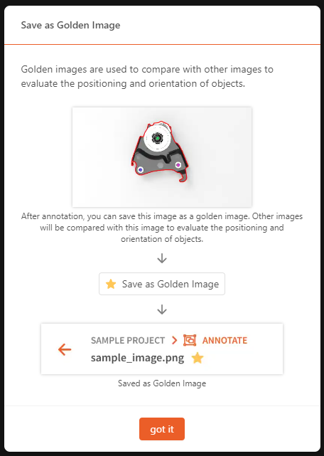

Positioning
==========================================

**Positioning** can detect objects in an image, mark their positions, and infer the movement and rotation within the image.

    .. image:: Images/pos.png
        :scale: 100%

|

After completing the model annotations, refer to the video in the :ref:`Training` section to create dataset versions and train/deploy the model.

Use Case Scenarios
------------------------------------------

**Positioning** works on a single object. That is, the dataset should contain only one type of object.

**Positioning** requires a golden image as the learning target and uses key points to assist in determining the object's rotation.

**Positioning** learns and determines whether the object has movement  or rotation based on the golden image.

Annotation Methods
------------------------

If you have a pre-trained model, you can use the assisted annotation tool, allowing the deep learning model to help with annotations. You can then verify and correct the annotations as needed.

    .. image:: Images/suppor_anno.png
        :scale: 100%

First, annotate the outer contours of the objects.

    .. image:: Images/pos_obj.png
        :scale: 75%

Use the polygon tool(green) or smart polygon tool(red) to annotate the outer contours of the objects.

    .. image:: Images/pos_mask.png
        :scale: 75%

After the outer contour mask is annotated, the system will automatically enter key point annotation mode. You will need to click on the positions of the key points in sequence to complete the annotation.

    .. image:: Images/pos_kp.png
        :scale: 75%

If there is no object in the scene, please mark it as null.

    .. image:: Images/pos_null.png
        :scale: 100%

Positioning requires  **golden image** as the standard. You need to set one golden image; otherwise, the dataset cannot be fully annotated.

    .. image:: Images/pos_golden_image.png
        :scale: 75%

Notes
------------

1. Use descriptive labels when naming the tags. Descriptive labels significantly reduce the likelihood of annotation errors and facilitate the practical application of the model. Non-descriptive labels are loosely connected to the annotated object, increasing the chance of mistakes and making it harder to quickly determine the accuracy of model predictions.
2. Each tag group in positioning detection must include a polygon and one or more keypoints. If there are no keypoints in a tag group, the training task may fail.
3. For each annotated polygon, there should be at least 3 keypoints associated with that label. When choosing keypoints, select ones that are representative of the object and easy to identify. Geometric features like circular points, corners, or the center of an object are ideal choices. In general, look for geometric or texture features, or any other shape or pattern characteristics. Avoid selecting flat points with no special features or feature points that are too close to the polygon's edges. Also, avoid using keypoints that form a straight line, as this can reduce the ability to recognize tilt angles.
4. Do not annotate objects whose keypoints are obscured by other objects, as the missing keypoints in the tag-keypoint combination will cause the training to crash.
5. Similar to segmentation, only annotate the top-layer keypoint-tag set in each image and avoid annotating objects that are obscured by other objects.
6. Positioning model must have a set golden image; otherwise, it cannot be trained properly.
7. Positioning model project allows only one golden image. Setting a new golden image will overwrite the existing one.

Practice
----------
Download the `practice data <https://daoairoboticsinc-my.sharepoint.com/:f:/g/personal/nrd_daoai_com/EkNGNFG9C1ZCkejjwLZ4WOsBUQuhkn6apK4MSej2z1DfQA?e=ZOoc8v>`_ with positioning.zip

After unzipping, you will get 11 images and annotation (.json) files. Please upload only the images to DaoAI World for annotation practice. Later, you can upload both images and annotation files to compare the results.