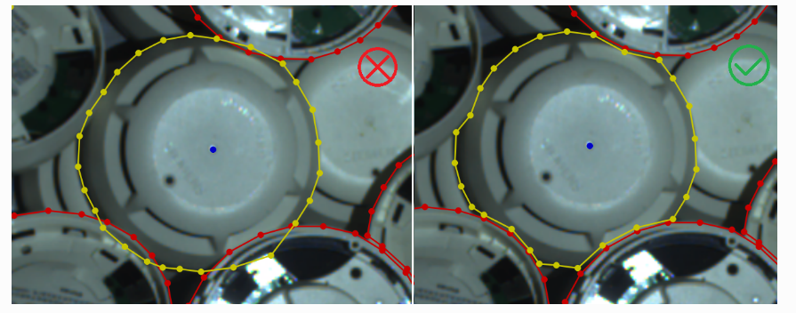

分割实例检测
==============================

在 **分割实例** 检测中，模型会定位图像中的对象并生成精准的定位边界。在现实应用中， **分割实例** 常用作识别不规则外形的物体。

    .. image:: Images/insseg.png
        :scale: 100%

模型选择情景
------------------------------

**分割实例** 可以用以检测图像中一个或多个不同物体的数量及位置。模型适合在需要对物体进行简单的分割，分类，定位处理时使用。

在 **分割实例** 中，可以通过只建立一个物体标签来进行单一种类物品的识别，如：在大量混合物体中寻找并分离处某一特定种类的物体。
也可以同时建立并学习多种物体的标签，从而达到将多种物体分割识别的效果。

标注方法
------------

如果有已经训练过的模型，可以使用辅助标注工具，让深度学习模型来帮助您标注，然后您再检查以及纠正标注。
    .. image:: Images/suppor_anno.png
        :scale: 100%

使用多边形工具，或者智能多边形工具，标注物体的外轮廓。

    .. image:: Images/segAnno4.png
        :scale: 100%

重复标注场景内的所有物体，如果场景内没有物体，请标注为空。

注意事项
------------------

1. 标签命名时，使用描述性的标签。使用描述性的标签能够大幅度减小标记错误的概率，同时方便后续模型的实际应用。非描述性的标间因为与被标注物体之间关联性小，容易出现标注错误，同时在使用训练好的模型时，也难以快速分辨模型预测结果是否准确。

2. 如果只有一种要检测的对象（即只有一个标签），则可以对部分被遮挡的对象进行标注（通常不超过30%）。但请注意，在标注多边形时，避免将那些重要几何特征被其他对象遮挡的对象包括在内。

3. 如果有多种要检测的对象（包括同一对象的不同侧面），请标注未被其他对象遮挡或仅位于顶层的对象，并尽量保持对象的完整性。

4. 在标注多边形时，应标注图像中实际的边界，而不是使用虚拟边界标注对象。如果对象的一部分被其他对象遮挡，请标注可见的部分，而不要标注被遮挡的部分。

