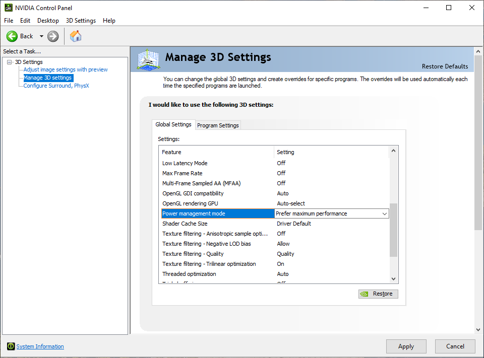
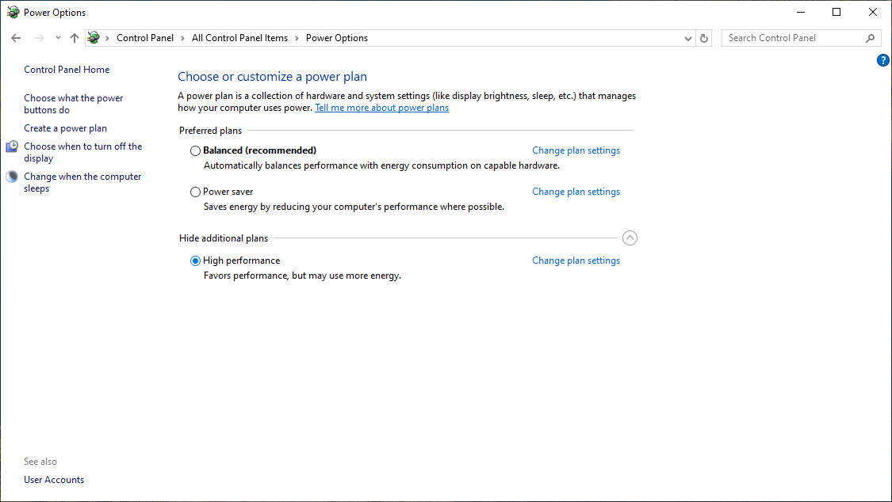

Frequently Asked Questions
============================

.. contents::
    :local:

C# SDK Fails to Load via Reflection?
------------------------------------

If the C# SDK fails to load via reflection, first ensure that system thread resources are sufficient.
Excessive concurrent threads may exhaust the thread pool, causing the reflection mechanism to fail.
It is recommended to control the number of threads appropriately or adjust the .NET thread pool settings to ensure stable and reliable reflection-based loading.

Uploaded images appear completely black in the annotation page
---------------------------------------------------------------

    .. image:: images/invalid_images.png
        :align: center
        :scale: 50%

    When uploading images, DaoAI World checks and validates the data. Some images may fail to upload (as shown above). This might be due to corrupted images. You are advised to re-capture the images or try the following:

Attempt to repair the corrupted data
~~~~~~~~~~~~~~~~~~~~~~~~~~~~~~~~~~~~~~~~

    Use the **XnView MP**  image tool, which you can download from the following link: `XnView MP <https://daoairoboticsinc-my.sharepoint.com/:u:/g/personal/nrd_daoai_com/EWlgNZq_aBNFuomgwXGDx_QBzG2SBuqYFRd724qvd1TJXw?e=33ebHp>`_ 

    Extract the files, find the **XnView MP**  executable, and double-click to run it.

    .. image:: images/xnviewmp_exe.png
        :align: center
        :scale: 50%

    Go to ``File`` -> ``Open`` to select the corrupted image.

    .. image:: images/xnviewmp_open_file.png
        :align: center
        :scale: 50%
    
    Go to ``File`` -> ``Save As`` and save the image to a new location.

    .. image:: images/xnviewmp_save_as.png
        :align: center
        :scale: 50%

    Upload the saved image again.

    .. image:: images/xnviewmp_upload_success.png
        :align: center
        :scale: 50%

    
    
Model inference fails when the object is at the edge
----------------------------------------------------
    
    If you find that the model fails to match the object and produces an error when the object is at the edge:

    .. image:: images/roi_fail.png
        :align: center
        :scale: 50%

    Check whether the ROI (Region of Interest) setting was applied during model training and if the object appears outside the ROI.

    .. image:: images/roi_fail_setting.png
        :align: center
        :scale: 70%

    
    Since the ROI preprocessing trims background areas and keeps only the area of interest, when an object is outside the ROI, it is considered part of the background and gets trimmed, resulting in no prediction.

    To resolve this issue, consider:

    1. Updating the ROI area by redefining the ROI to ensure it covers the area where the object may appear. Then, retrain the model.
    2. Removing the ROI preprocessing and retraining the model.

    This will allow you to correctly predict objects at the image's edge.

    .. image:: images/roi_fail_result.png
        :align: center
        :scale: 50%

Model inference fails due to different image resolutions
------------------------------------------------------------
    
    If the model fails during inference, check whether the resolution used during inference matches the resolution of the training data.

    In general, models can tolerate some changes in resolution. However, if an ROI preprocessing step is involved, the ROI will be based on the original image resolution.

    However, if an ROI preprocessing step is added, the ROI will be cropped based on the **original image resolution**.

    If you use a much lower resolution image for inference than the one used during training, the entire image may be cropped by the ROI, leading to inference failure.

    For example, if the training images have a width of 8000 pixels and the ROI preprocessing crops 1000 pixels off each side, using a 1000-pixel wide image for inference will result in the ROI cropping out the entire image, causing inference to fail.

    .. image:: images/res_fail.JPG
        :align: center
        :scale: 50%

    Ensure you use images with the same resolution as the training set when testing and inferring.

Why does model inference slow down after a long idle interval?
~~~~~~~~~~~~~~~~~~~~~~~~~~~~~~~~~~~~~~~~~~~~~~~~~~~~~~~~~~~~~~~

On certain systems, when the model's ``inference()`` function is called continuously, the execution is fast (e.g., under 70 milliseconds). However, if there's a long delay (e.g., 5–10 seconds) between inference calls, the inference time can significantly increase (e.g., over 300 milliseconds).

This slowdown is caused by the GPU entering a low-power state due to inactivity.

To resolve this issue, apply the following settings:

1. **NVIDIA Control Panel:**
   - Open `NVIDIA Control Panel` → `Manage 3D Settings`.
   - Locate the setting `Power management mode` and change it to **Prefer maximum performance**.

2. **System Power Options:**
   - Open `Control Panel → Power Options`.
   - Select the **High performance** power plan.

Example settings are shown below:

These settings will prevent the GPU from entering low-power states, ensuring consistent inference performance even after idle periods.

