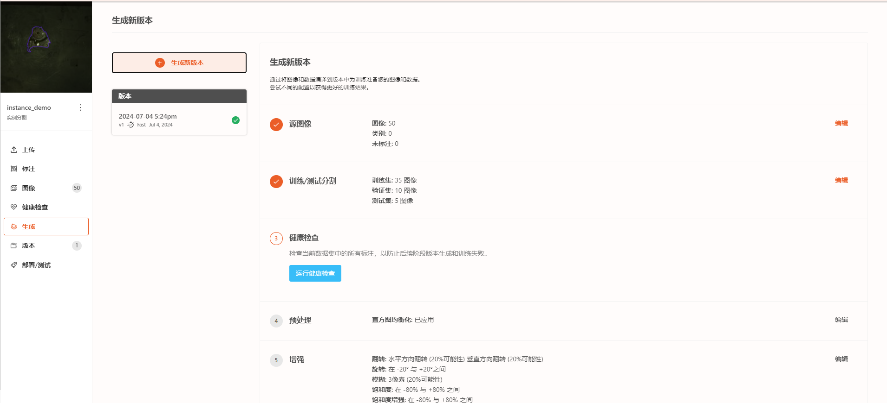
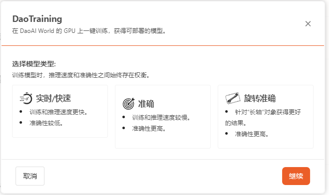
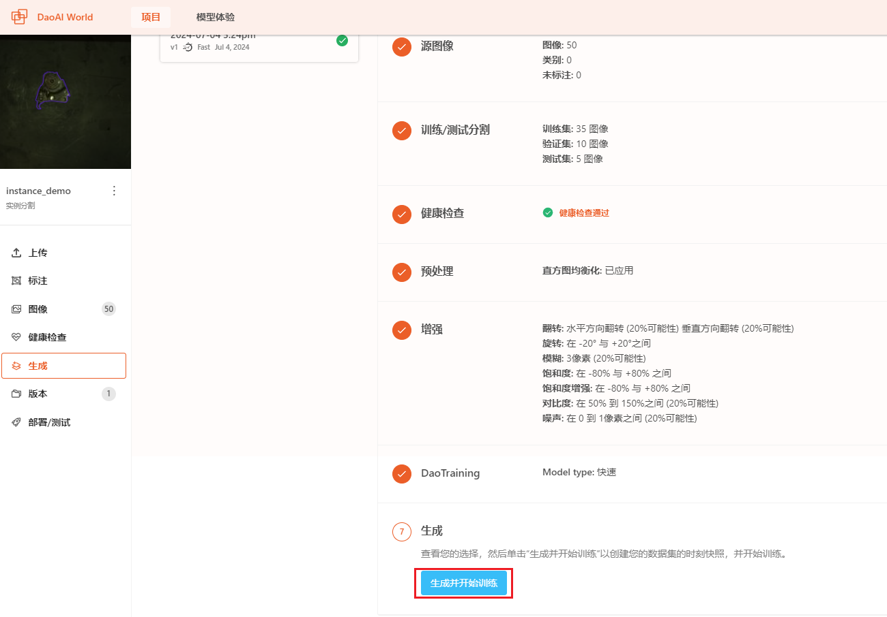
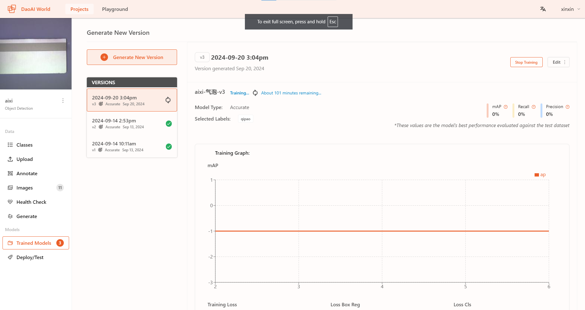

训练
=====================

在完成训练集创建之后，您可以开始在DaoAI World上训练您的模型。

对于每一个模型类型，我们都提供多种训练模式。可以按照模型使用场景及需求选择合适的训练模式。

- **快速模式：**

  使用快速模式训练得到的模型，模型使用时识别速度更快，但是准确率可能会有所下降。

  在使用场景对识别速度要求较高，但是对准角度的要求不高时，可以使用快速模式训练模型。 

- **准确模式：**
使用准确模式训练得到的模型，在使用时识别物体的准确率更高，但是识别速度较慢。

在使用场景对精确度要求较高时，可以使用准确模式训练模型。

- **旋转准确模式：** 

使用旋转准确模式训练得到的模型，在识别物体时准确度较高，同时对于被识别物体出现旋转的情况，也能够保持较高的识别准确度。

在使用场景对精度要求较高，并且被识别物体可能出现旋转的情况时，可以使用旋转准确模式训练模型。

在选择了一个模式后，点击生成并开始训练，然后您的项目将会开始训练。

各模型提供的训练模式
------------------------------

.. list-table::
   :header-rows: 1

   * - 模型类型
     - 快速模式
     - 准确模式
     - 旋转准确模式
   * - 实例分割检测
     - √  
     - √  
     - √  
   * - 关键点检测
     - √  
     - √  
     - √  
   * - 异常检测
     - √  
     - √  
     - 
   * - 分类检测
     - √  
     - √  
     - 
   * - 目标检测
     - √  
     - √  
     - 
   * - 旋转目标检测
     - √  
     - √  
     - 
   * - 语义分割
     - √  
     -  
     - 
   * - OCR
     - √  
     - 
     - 

训练图
------------

训练过程中，您可以看到模型的实时训练结果图。

如何训练出好的模型？
------------------------------------

首先，什么是“好的模型”呢？
~~~~~~~~~~~~~~~~~~~~~~~~~~~~~~~~~~~~~~~~~

- 好的模型应该是识别结果正确的模型，是一个稳定的模型，可以处理更多复杂情况的模型，更应该是一个可以按照用户的目的完成识别的模型。

根据上述的这几点，我们怎么才能训练出一个好的模型？这个页面会给你一些基本的概念，有什么东西你是需要提前去思考的，详细的内容可以在每个章节底下找到。

你需要选取哪一种模型以达到你的目标？
~~~~~~~~~~~~~~~~~~~~~~~~~~~~~~~~~~~~~~~~~

深度学习功能非常强大，但是每个模型的专注强项也不一样，你需要先从你的使用上考虑，你需要什么样的识别结果？你可以询问一下自己，从实际出发，回答以下问题：

#. 如果你需要的是识别多种物体，需要所有物体的精确位置，不需要精确的物体方向，那么很大几率你需要的是 :ref:`实例分割检测` 。
#. 如果你需要的是识别多种物体，需要所有物体的精确位置，而且物体方向信息非常重要，那么很大几率你需要的是 :ref:`关键点检测` 。
#. 如果你只需要的是单种物体的状态，检查物体是否存在异常，不需要物体的精确位置和方向信息，那么很大几率你需要的是 :ref:`异常检测` 。
#. 如果你需要的是当前物体的种类，不需要物体的精确位置和方向信息，那么很大几率你需要的是 :ref:`分类检测` 。
#. 如果你需要的是识别多种物体以及数量，不需要所有物体的精确位置和方向信息，那么很大几率你需要的是 :ref:`目标检测` 。
#. 如果你需要的是识别多种物体以及数量，而且物体方向信息非常重要，那么很大几率你需要的是 :ref:`旋转目标检测` 。
#. 如果你只需要的是单种物体的状态，检查物体是否存在异常，并且需要知道异常的种类，那么很大几率你需要的是 :ref:`语义分割` 。
#. 如果你需要提取图片中的文字，那么很大几率你需要的是 :ref:`OCR` 。

应该怎么去标注？
~~~~~~~~~~~~~~~~~~~~~~~~~~~~~~~~~~~~~~~~~

标注会影响你的模型最终的效果，一个好的模型是需要有好的标注作为基础。

* 标注的时候尽量仔细，不要出现漏标、错标的情况；这些错误会影响模型的识别，要注意。

应该添加什么预处理和数据增强方法？
~~~~~~~~~~~~~~~~~~~~~~~~~~~~~~~~~~~~~~~~~

当物体和背景的颜色或者对比度比较相似时，不论是模型还是人，都很难判断物体和背景的边界。

* 使用直方图均衡化：增强图像对比度，突出物体的边界。

思考：哪些模型 **不可以** 使用直方图均衡化呢？

    * 物体检测模型：物体检测模型并不是说完全不可以使用直方图均衡化，然而是因为物体检测模型标注的方式：方框工具；标注的物体是存在于方框内，但方框内并不是完全只有物体，还会有部分的背景存在于方框中。
    那么在使用直方图均衡化预处理时，并没有很好的把背景和物体分割出来。所以直方图均衡化预处理在物体检测模型上没有很好的效果。

添加翻转增强方式时，有什么需要注意的呢：

* 使用翻转对添加水平或垂直翻转时，需要注意你的物体是否会存在镜面翻转的该物体？

    * 当物体是非对称物体时，翻转在一定程度能提高模型的效果。但是要注意的是，这个物体是否会以翻转的情况出现？
    * 举个例子：模型需要检查印刷的文字是否有缺失。实际中是不会出现镜面翻转的文字，那么这个翻转增强就不可以使用在该模型上；
    * 当物体是非对称而且左右/上下方向是识别的重要信息，那也不可以使用翻转增强：很多金属零件是有方向区别的，可能零件A水平翻转就成为了零件B。这些情况下都是不可以使用翻转增强的。

.. note::
    所以，在添加任何预处理或者数据增强方法时，用户需要仔细考虑清楚实际的情况。

应该使用什么训练模式？
~~~~~~~~~~~~~~~~~~~~~~~~~~~~~~~~~~~~~~~~~

首先，部分模型是不支持旋转准确模式的。其次，我怎么去选择？

答案是在于项目本身的要求：是否对于识别的时间有严苛要求？是否对于识别的准确率有严苛要求？

#. 当项目对于识别时间要求很严苛，允许的识别时间很短，那么你应该选用快速模式；
#. 当项目对于识别的准确率有很高的要求，允许的容错很少，那么你应该选用准确模式；