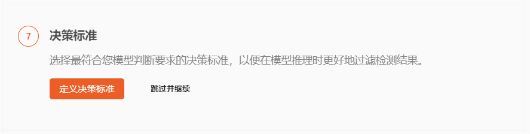
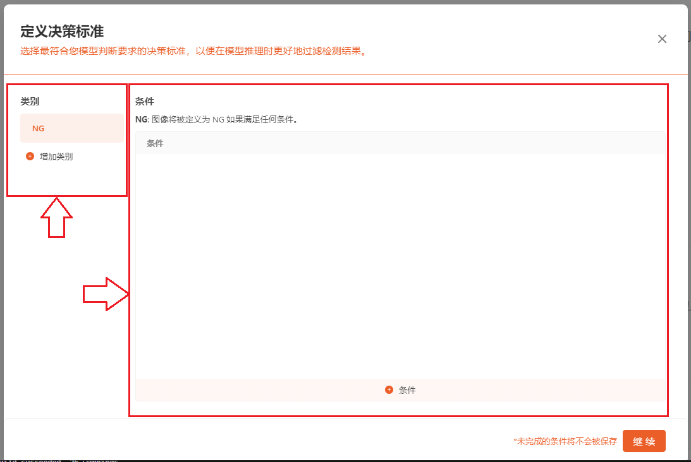
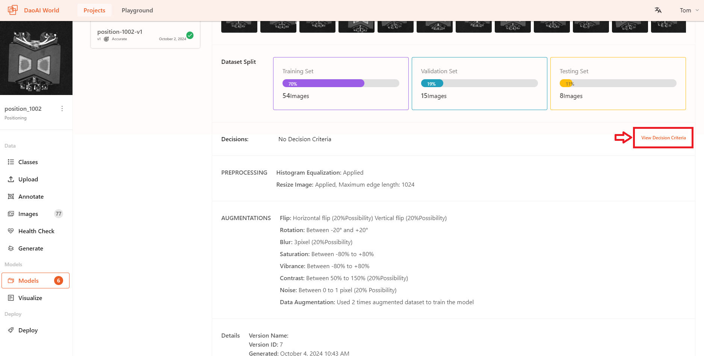
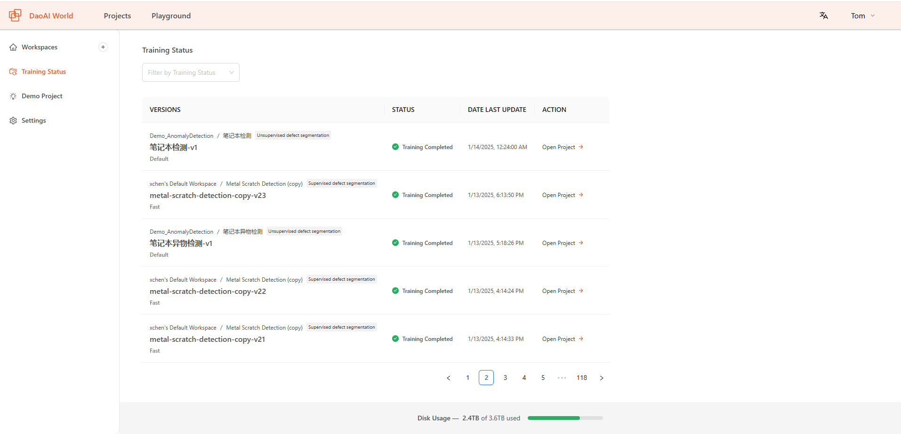

Train
=====================

.. raw:: html

    

        <video width="50%" height="auto" controls>
            <source src="http://docs.welinkirt.com/static/videos/dw_deploy-v6.mp4" type="video/mp4">
        </video>
    

|

Generate New Versions
--------------------------
        
        **Generating New Versions** generate a training set from labeled images for training deep learning models. 
        In this feature, you can divide the dataset into training and testing sets, and apply preprocessing and data augmentation operations. 

        Different training datasets will have different versions. By examining the results of these versions, you can compare how different images, preprocessing, and data augmentation affect the training outcome.

        
        **How to Generate a New Version**

        click on **Generate** in the sidebar of the DaoAI World project interface. On this page, you can assign the ratio of training/testing sets (optional, typically following the default 7:2:1 principle). Before adding preprocessing and data augmentation, you need to generate a Health Check, which will detect labeling issues in the dataset, such as incorrect or missing labels.

        .. image:: images/create_training.png
            :scale: 60%
            :align: center

        **Rebalance Train/Test Split**

        You can also rebalance the ratio of training, validation, and test sets. To do this, go to Allocate **Training/Test Set** and click the **Rebalance** button.

        .. image:: images/balance.png
            :scale: 60%
            :align: center

        After the Health Check is done and passed (i.e., there are no invalid annotations in the dataset), you can add preprocessing and data augmentation for your training. In some training projects, the system will automatically enable certain preprocessing and data augmentation features, which you can choose to disable or add other preprocessing and data augmentation functions.

        .. image:: images/default_preprocess.png
            :scale: 60%
            :align: center
    

preprocessing
--------------------
        

        Using data Preproccessing to improve model performance.
 
        .. note::
            Preprocessing ensures that your dataset uses a standard format (e.g., all images are the same size). This step standardizes the dataset for consistency, enhancing the accuracy of the trained model.
 
        **Preprocessing** applies to all images in the **training set**, **validation set**, and **test set** (while **augmentation** applies only to the **training set**).

 
        DaoAI World offers the following preprocessing options:

         * **ROI**
            The Region of Interest (ROI) will crop the image, and you can also choose the desired dimensions for scaling.
            
            ROI allows you to extract specific areas from images or datasets, enabling targeted analysis and focused examination of relevant information.

            In the pop-up page, adjust the areas of ROI in both horizontal and vertical dimensions to define the range. This range will be displayed as a rectangular area on the image and applied to all images.

            .. image:: images/roi.png
                :width: 600
                :align: center

         * **Histogram Equalization**
            Histogram equalization is a technique used to enhance image contrast. It works by redistributing pixel intensity values across the entire spectrum, improving the visibility of details and ensuring a more balanced and stretched histogram. Histogram equalization can help AI models better extract feature values.

            .. image:: images/histogram.png
                :width: 600
                :align: center

        
         * **Resize Image**
            Larger images may contain more detailed information but can result in slower processing speeds. By appropriately adjusting the image size, a balance can be found that allows the model to retain important features while reducing computational load, thus improving model performance.

            .. image:: images/resize.png
                :width: 600
                :align: center

        * **High Resolution Image Slicing**
            For ultra-high-resolution images, traditional training methods typically require compressing the images, which can lead to a loss of detail. The **High Resolution Image Slicing** addresses this by cutting the image into smaller chunks instead of compressing it. This approach preserves the complete image information while effectively handling large image data, thereby improving detection accuracy for large images.

            .. image:: images/img_cut.gif
                :width: 600
                :align: center     

Augmentation
----------------------

        Using Augmentation to improve model performance.

        Augmentation applies transformations to existing images, increasing the number of images and diversity in the dataset. This ultimately helps the model become more accurate across a wider range of use cases.

        DaoAI World supports the following data augmentation features:

            .. image:: images/augmentation.png
                :width: 600
                :align: center

        .. note::
            We recommend starting by creating a project without using data augmentation methods. This way, you can evaluate the quality of the original dataset.
            If you added data augmentation methods but the dataset's performance did not meet expectations, you wouldn't have a baseline to compare the model's performance against.

            If your model performance is poor without using data augmentation, you may need to investigate dataset rebalance, dataset size, or other methods. 
            If you have a dataset and have successfully trained a model without data augmentation, you can add data augmentation to further improve model performance.
        

        **Add Augmentation Step**

        To use Augmentation features, go to the creation interface in DaoAI World. Then click Augmentation to add specific augmentation methods to your data.

        .. image:: images/zengqiang.png
            :width: 600
            :align: center

        **Augmentation Type**

        Here are the data augmentation features supported by DaoAI World. You can customize these methods for data augmentation.

        #. **Flip**
            * Add horizontal or vertical flips to reduce the model's sensitivity to a specific direction.
            * Flipping images can significantly improve model performance.
            * You can choose to add horizontal or vertical flipping separately and select the probability of flipping.

            .. image:: images/flip.png
                :width: 600
                :align: center

        #. **Rotation**
            * By rotating the training data, you help the model adapt to different angles.
            * It helps the model detect objects when the camera or object is not aligned parallel.
            * You can adjust the maximum rotation angle using a slider.

            .. image:: images/rotation.png
                :width: 600
                :align: center

        #. **Scale**
            * By changing the position and size, you help the model adapt to shifts in the object and camera positions.
            * You can use the slider to toggle the maximum scaling ratio.

            .. image:: images/scale.png
                :width: 600
                :align: center

            
        #. **Shear**
            * By altering the perspective, you can help the model adapt to the pitch and skew of the camera and object.
            * You can toggle the maximum shear ratio using a slider; the shear transformation will be applied in all four directions simultaneously.

            .. image:: images/shear.png
                :width: 600
                :align: center
        
        #. **Translate**
            * Translate changes the position of objects within the image, helping to increase the diversity of training samples and reduce overfitting.
            * You can toggle the maximum displacement ratio using a slider.

            .. image:: images/translate.png
                :width: 600
                :align: center

        #. **Blur**
            * Adding random Gaussian blur helps the model adapt to different camera focus levels.
            * When your objects might be out of focus or the model's edges are not sharp, adding blur can improve model performance.
            * You can toggle the maximum pixel value and probability of the blur using the slider.

            .. image:: images/blur.png
                :width: 600
                :align: center
            
        #. **Hue**
            * In AI image training, adding hue adjustments can help improve the model's ability to generalize under different lighting conditions and color variations.
            * You can slide to toggle the intensity of the hue.

            .. image:: images/hue.png
                :width: 600
                :align: center

        #. **Saturation**
            * In the training, adding saturation adjustments can help the model more easily recognize and learn key features in the images, thereby improving its accuracy.
            * You can toggle the saturation intensity by sliding the control.

            .. image:: images/saturation.png
                :width: 600
                :align: center

        #. **Vibrance**
            * Adding vibrance enhancement during image training can help the model more easily recognize and learn key features in the images, thereby improving the model's accuracy.
            * You can adjust the intensity of vibrance enhancement using the slider.

            .. image:: images/vibrance.png
                :width: 600
                :align: center

        #. **Contrast**
            * By changing the image contrast, you help the model adapt to different lighting conditions.
            * You can adjust the maximum value and probability of contrast.

            .. image:: images/contrast.png
                :width: 600
                :align: center
        
        #. **Noise**
            * Adding noise helps the model adapt to camera artifacts.
            * You can adjust the maximum pixel value and probability of noise.

            .. image:: images/noise.png
                :width: 600
                :align: center

        #. **Mosaic**
            * Mosaic can serve as a form of data augmentation by generating training image variants with varying levels of mosaic distortion. This increases the diversity of your data and improves the model's generalization ability.
            * You can adjust the possibility of mosaic distortion.

            .. image:: images/mosaic.png
                :width: 600
                :align: center

Setup Training Config
----------------------

After generating the dataset, you can start training your model on DaoAI World.

.. image:: images/train.png
  :scale: 60%

For each model type, we offer different training modes. You can choose the appropriate training mode based on the model's use case and requirements.

.. image:: images/train_type.png
  :scale: 100%

- **Fast:**

  Models trained using the Fast mode will have faster recognition speeds, but accuracy might decrease.

  When the application requires higher recognition speed but has less stringent requirements for precision, you can use the Fast mode to train the model.

- **Accurate:**
    
When the application scenario requires higher precision, you can use the Accurate mode to train the model. 

Models trained in Accurate mode will have higher recognition accuracy, though the recognition speed may be slower.

- **Rotated Accurate:** 

When using the Rotation Accurate mode for training, the model achieves higher accuracy in object recognition and maintains high recognition accuracy even when the objects are rotated.

In scenarios where high precision is required and the objects being recognized may be rotated, you can use the Rotation Accurate mode for training the model.

After selecting the mode, click **Continue** to proceed to the next step.

- Select training labels:
    Before starting the training, you can make a final check to confirm that the selected training labels are correct. If the data has been imported from other projects, there might be cases of label errors. In such cases, you can choose to delete incorrect labels to ensure that they are not included in the training.
        .. image:: images/train_label.png
            :scale: 100%

- Train from Previous Checkpoint：
    Before starting the training, user can choose to start from one of your previous training runs to speed up training and improve accuracy. If you already successfully trained a model on this project, ``Train from Previous Checkpoint`` is the best option. If you are training a model for the first time or if you want to start from scratch, ``Train from Base Model`` is the best option.
    
        .. image:: images/train_checkpoint.png
            :scale: 100%

Decision Criteria
-----------------

Some models support decision criteria, which are used to determine whether an image meets a certain standard. Only **Supervised Defect Segmentation** , **Unsupervised Defect Segmentation** , **Object Detection** , **Positioning** , and **Presence Detection** models support this feature. These models can output a **Not Good** or **NG** result for images.

The decision criteria interface is as follows: on the left side, you can see the categories, where you can add new categories, delete, or edit existing ones; on the right side, you can find the conditions for the selected category, where you can add, delete, or modify the current conditions.

- ``NG`` standard:
    For most quality inspections, it is required that the system outputs a determination of whether an object meets the standards. The ``NG/Not Good`` criteria are widely used in quality control. Here, you can set the specific conditions for ``NG`` , including **combined overall movement**, **combined movement along X direction** , **combined movement along Y direction** , **angle of rotation** , and so on.
        .. image:: images/ng_condition.png
            :scale: 100%
            
    On the left side, click ``+ More Category`` to add a category (green), and click the ``-`` next to the category to delete it(red). On the right side, click ``+ Condition`` to add a condition (green), and click the ``-`` next to the condition to delete it(red).
        .. image:: images/ng_add_delete.png
            :scale: 100%
    
    As shown in the image below, these are the ``NG`` conditions that can be added for the positioning model.
        .. image:: images/ng_condition_detailed.png
            :scale: 100%

    Different models have various conditions that can be set according to their specific requirements.
        .. image:: images/ng_other_condition.png
            :scale: 100%

Generate
-----------------

You can select the **Max Argumentation Size** , ranging from ``2X ~ 5X`` , you can adjust the number of times the image is argumented.

.. image:: images/start_train.png
  :scale: 80%

available Training modes by model
-----------------------------------

.. list-table::
   :header-rows: 1

   * - Model Type
     - Super Fast
     - Fast
     - Accurate
     - Rotated accurate
   * - Supervised Defect Segmentation
     -  
     - √  
     - √ 
     -  
   * - Object Detection
     - √  
     - √  
     - √  
     - √  
   * - Positioning
     -   
     - √  
     - √  
     - √  
   * - Presence Checking
     - 
     - √
     - √
     - 
   * - Classification
     -   
     - √
     - √
     -       
   * - OCR
     -  
     -  
     - √
     - 
   * - Instance Segmentation
     - √
     - √
     - √
     - √
   * - Keypoint
     - √
     - √
     - √
     - √

Unsupervised defect detection offers three training methods: **Default, Normal, and High Precision**.

- **Default Mode**:  
  Uses a single resized image for training. While this method is fast, it may result in information loss.  
  Recommended for small images or cases where the defect area is large.

- **Normal Mode**:  
  Splits the image into **512×512** patches for training.  
  This method takes longer but preserves all information.

- **High Precision Mode**:  
  Further divides the image into **256×256** patches, providing finer detail at the cost of increased training time.

These modes apply only to **pixel-level, whole-image training**.  
For **pixel-level (region-based) and image-level (both region-based and whole-image)** training, only **Default Mode** is available.

Live Training Graphs
------------------------

During the training process, you can view the real-time training result graphs of the model.

.. image:: images/train_graph.png
    :scale: 60%
    :align: center

You can view the estimated remaining training time and the real-time training accuracy.

View Decision Criteria
------------------------

After training is completed, you can still modify the model's decision criteria.

How to train a good model?
------------------------------------

But First, what is a **good model**?
~~~~~~~~~~~~~~~~~~~~~~~~~~~~~~~~~~~~~~~~~

- A good model should be one that correctly identifies results and stable, can handle more complex situations, and fulfills the user's intended recognition purposes.

Based on these points, how can you train a good model? This page will provide some basic concepts and things you need to consider in advance. Detailed content can be found at the bottom of each section.

Which model should you choose to achieve your goals?
~~~~~~~~~~~~~~~~~~~~~~~~~~~~~~~~~~~~~~~~~~~~~~~~~~~~

Deep learning is very powerful, but each model has its strengths and specializations. You need to start by considering what kind of recognition results you need for your use case. You can ask yourself the following questions from a practical perspective:

#. If you need to recognize **multiple objects** and require **precise locations** for all objects, but do not need precise object orientation, you are likely looking for: :ref:`Instance Segmentation`.
#. If you need to recognize **multiple objects**, require **precise locations** for all objects, and the **orientation information** of the objects is very important, you are likely looking for: :ref:`Keypoint Detection`.
#. If you only need to check the state of a **single type** of object to detect anomalies, without needing precise location and orientation information, you are likely looking for: :ref:`Unsupervised Defect Segmentation`.
#. If you need to **identify the type** of the current object without needing precise location and orientation information, you likely need :ref:`Image Classification`.
#. If you need to identify **multiple objects** and their quantities without requiring precise location and orientation information for each object, you likely need :ref:`Object Detection`.
#. If you need to identify **multiple objects** and their **quantities**, and object **orientation information** is very important, you likely need :ref:`Rotated Object Detection`.
#. If you only need to check the **status of a single type of object**, identify if it is defective, and need to know the **type of defect**, you likely need :ref:`Supervised Defect Segmentation`.
#. If you need to extract text from images, then you are likely to need :ref:`OCR` 。

How to annotate?
~~~~~~~~~~~~~~~~~~~~~~~~~~~~~~~~~~~~~~~~~

Annotation will affect the final performance of your model. A good model requires high-quality annotations as its foundation.

* When annotating, be as careful as possible and avoid missing or incorrect labels; these errors will impact the model's recognition, so be careful.

What kinds of preprocessing and augmentation should we apply?
~~~~~~~~~~~~~~~~~~~~~~~~~~~~~~~~~~~~~~~~~~~~~~~~~~~~~~~~~~~~~~~~~~~~~~~~~~~~~~~~~~

When the color or contrast between the object and the background is similar, both models and humans can struggle to discern the boundaries between them.

* Use histogram equalization: Enhance the image contrast to highlight the boundaries of the object.

Consideration: what models should **NOT** apply histogram equalization?

    * Object detection models: Object detection models are not completely incompatible with histogram equalization. However, the issue arises due to the way object detection models annotate objects: with bounding boxes. These boxes may contain both the object and some background, which could be affected by histogram equalization.
    Therefore, when using histogram equalization as a preprocessing step, it doesn't effectively separate the background from the object. As a result, histogram equalization preprocessing does not perform well with object detection models.

When adding flip augmentation, here are some points to consider:

* When using flips for horizontal or vertical augmentation, you need to consider whether your objects might appear as mirrored versions.

    * When the object is asymmetrical, flipping can improve the model's performance to some extent. However, you should consider whether the object might appear in a flipped state.
    * For example, if the model needs to check for missing printed text, and mirror-flipped text does not occur in practice, then flipping augmentation should not be used for that model.
    * When the object is asymmetrical and the left/right or top/bottom direction is important information, flipping augmentation should not be used: Many metal parts have directional distinctions, and part A might become part B when flipped horizontally. In such cases, flipping augmentation is not suitable.

.. note::
    So, when adding any preprocessing or data augmentation methods, users need to carefully consider the actual situation.

What training mode should be used?
~~~~~~~~~~~~~~~~~~~~~~~~~~~~~~~~~~~~~~~~~

Firstly, some models do not support the rotation accuracy mode. Secondly, how should you choose?

The answer depends on the project requirements: Are there strict time requirements for recognition? Are there strict accuracy requirements for recognition?

#. When the project has strict requirements on recognition time and allows very short recognition times, you should choose the fast mode.
#. When the project has high accuracy requirements and allows very little tolerance, you should choose the accurate mode.

Training Status
------------------------------------

On the **Training Status** page, you can view the history and current status of all training tasks. The page displays detailed information for each training task, including training progress, status, start time, and completion time, making it easier to track and manage the model training process.

