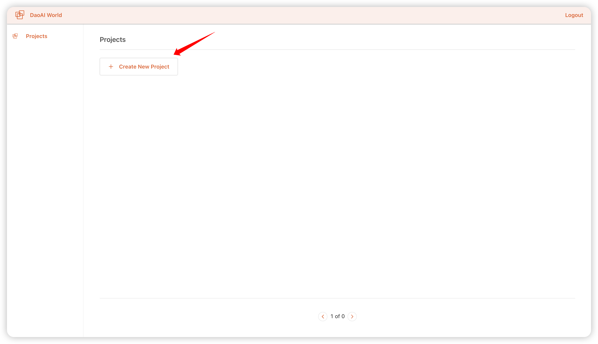
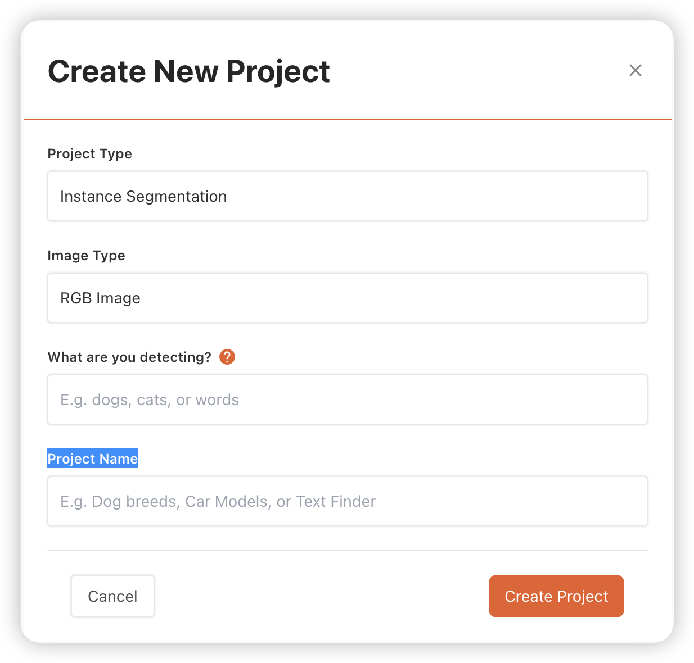
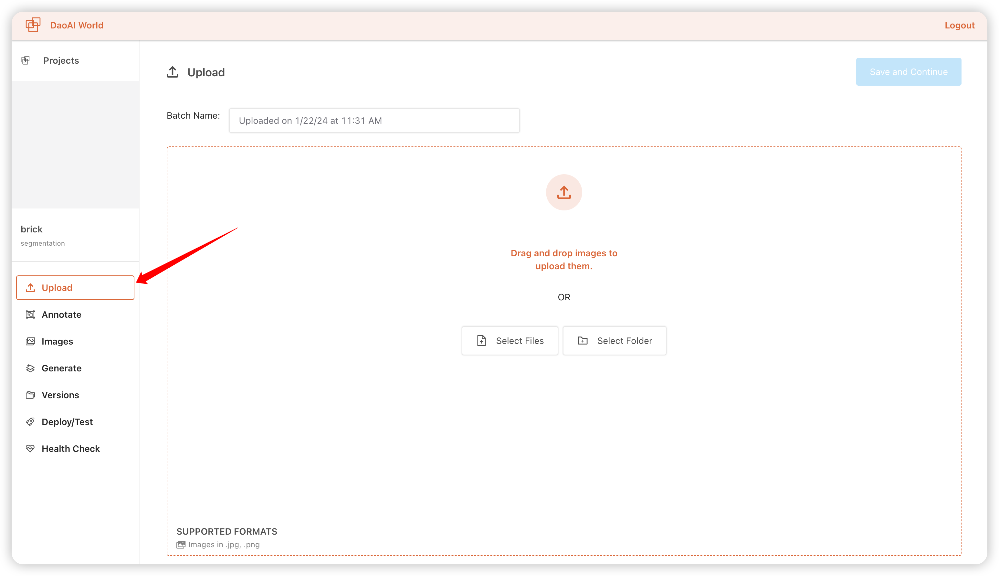
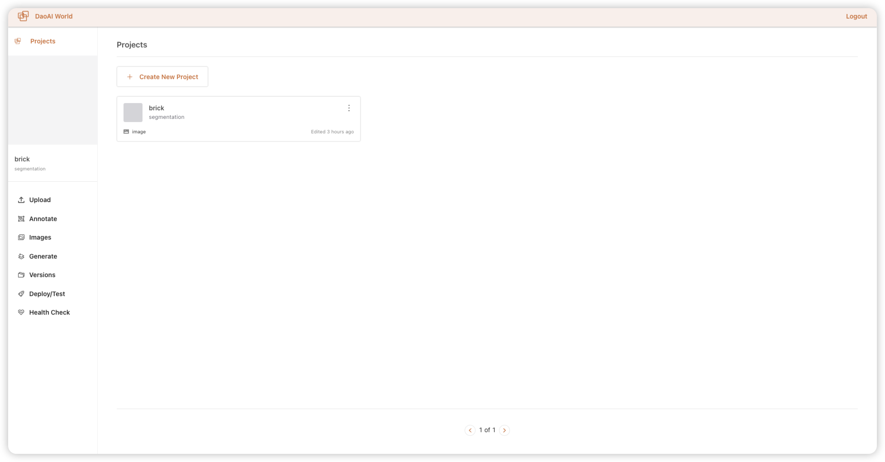

* [Create a project](#create-a-project)
    * [Project in DAOAI_World](#project-in-daoai_world)
    * [Create a project](#create-a-project)
* [UpLoad Data](#upload-data)
    * [How to upload data](#how-to-upload-data)

# Create a project

## Project in DAOAI_World

A project houses the images and annotations for your project. All projects exist within one [workspace](). Once images are annotated, they can generate a version, which is a copy of your images and annotations at the time, augmented and processed with the configuration you select.  

A project has a name, a type (ex: object detection) and an annotation group. For more information, take a look at the process of [creating a project](./index.md).

## Create a project

First, go to the  DaoAi World's MAIN SCREEN. Then, click "Create New Project":

You will be asked to specify:

1. **Project Type** Here is a brief summary of each project type:

    1. **Instance Segmentation**: To the pixel level, find the location of objects in an image.

    2. **Keypoint Detection**: Find the location of objects and their keypoints in an image. Commonly used for determining the pose of an object.

2. **Image Type** Now only support RGB format images 

3. **What are you detecting?** The type of subject you are detecting.

    * Choose this by filling in the blank.

    * "I will able the _____ in the image"

    * Example: car, cat or pipe

4. **A project name**: The name of your project.

**Then, click "Create Project"**

# UpLoad Data 

You can upload images or upload images and annotations for instance segmentation and  Keypoint Detection.

## How to upload data

1. the screen of UpLoad:

    1. If you want to upload some picture, click "Select Files"

    2. If you have a folder of pictures need to upload, click "Select Floder".

    To upload data, first create a project if you do not have one already. When you first create a project, you will be asked to upload images:

    

2. Supported Data Types
    * JPG, PNG images
    * Annotationed image and annotation data for json

3. Continue to upload data:

    If you have any others images and annotations need to upload. Click "Upload more images", continue to upload images.

# Manage Batches
红色文本